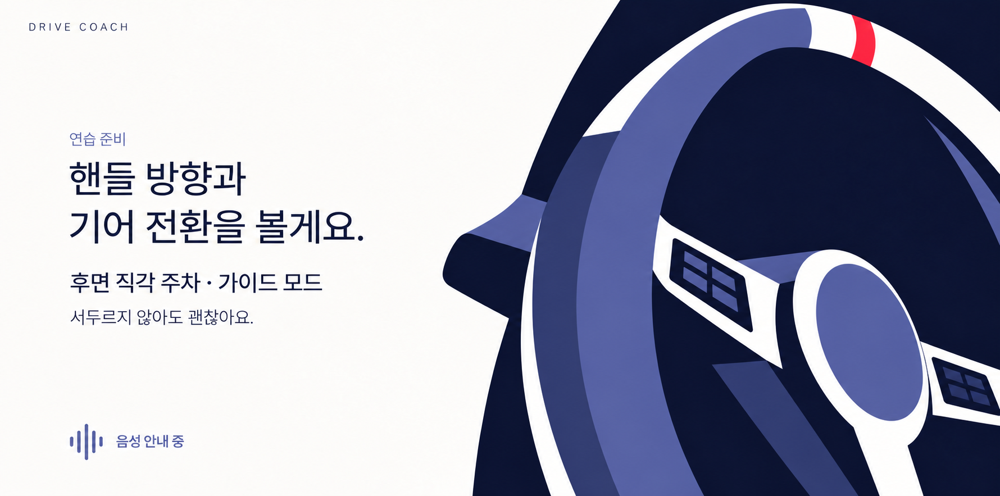
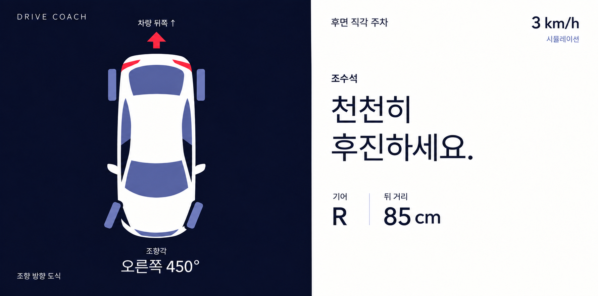
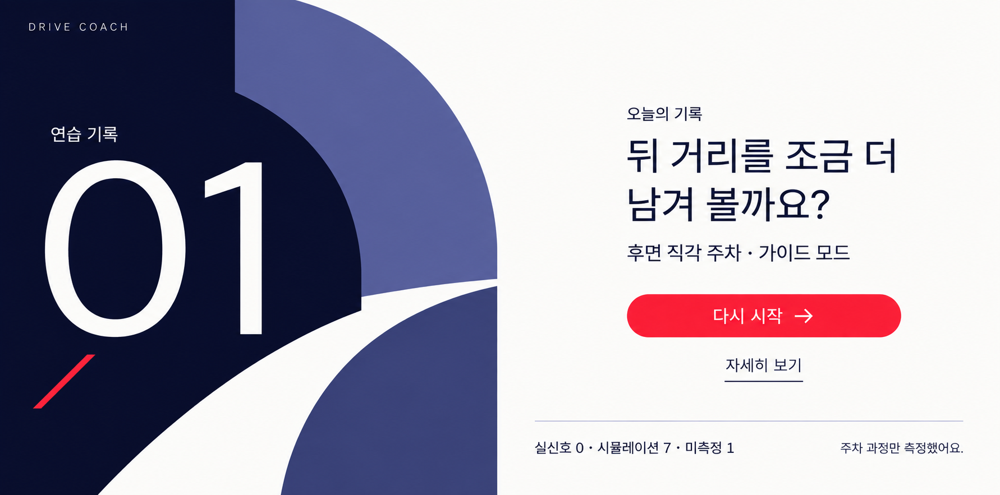
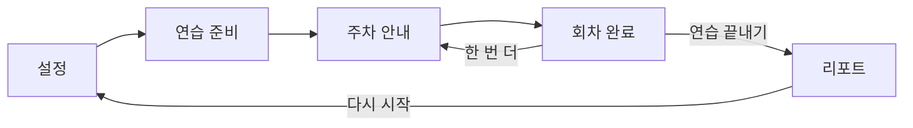

# 기하학 포스터 — 앱 UI 디벨롭 제안

2026-09-26 · 현재 사용자 디벨롭 기준

**사용자가 마음에 들어 한 최초 기하학 포스터 설정 화면을 그대로 기준으로 삼았다.** 이후 컬러 확장안의 종이 겹침·기존 흑백 차량 도식은 채택하지 않고, 큰 색면·과감한 크롭·비대칭 구도 자체를 앱의 시각 규칙으로 발전시켰다.

핵심 제안은 **그래픽은 크게, 한 화면의 행동은 적게**다. 남색·흰색·보랏빛 면으로 공간을 나누고, 시작·재시작의 빨간 버튼이 다음 행동을 분명히 하게 한다. 굵은 제목이나 여러 카드로 위계를 만들지 않는다.

## 대표 화면

이번에는 레이어 구성 보드 자리를 **실제 연습 준비 화면**으로 바꾸었다. 설정·준비·안내·리포트의 대표 페이지로 디자인이 실제 앱 흐름에 이어지는지 비교한다. 기존의 회차 완료 `Done` 단계는 없애지 않으며 아래 흐름 설계에 따로 명시했다.

| 화면 | 파일 | 실제 해상도 |
|---|---|---|
| 설정 — 선택한 원본 | [01-setup-v1.png](01-setup-v1.png) | 1782 × 883 px |
| 연습 준비 — 사용자 선호 B · 사선 단면 | [b-oblique-rim-v1.png](steering-alternatives/b-oblique-rim-v1.png) | 1780 × 883 px |
| 주차 안내 | [03-maneuver-v2.png](03-maneuver-v2.png) | 1782 × 883 px |
| 리포트 | [04-report-v1.png](04-report-v1.png) | 1782 × 883 px |

### 설정 — 선택한 원본

### 연습 준비

**현재 사용자 선호안은 B · 사선 단면이다.** 타원형 원근과 넓은 림 단면, 비대칭 크롭을 사용한 두 번째 안이다. [대안 A–D 비교](steering-alternatives/README.md)는 이력으로 보존한다.

사용자가 핸들이 너무 미니멀하다고 평가해 설정 화면 자동차의 묘사 밀도를 기준으로 디테일을 보강했고, 추가 형태 비교 후 B를 선호안으로 정했다. B는 림의 안쪽 면·측면과 조작부를 비스듬한 시점의 색면으로 구분한다. [초기 v1](02-briefing-v1.png)과 [디테일 보강 v2](02-briefing-v2.png)는 비교용으로 보존한다.

### 주차 안내

### 리포트

## 전체 흐름과 정보 배치

기존 [LessonPhase](../../../automotive/src/main/kotlin/com/moah/hackathon/feature/lesson/LessonPhase.kt)의 흐름을 유지하는 제안이다. 시안에서 새로 추가한 정보 계층과 ‘자세히 보기’는 디자인 제안이며 아직 앱 동작으로 구현하지 않았다.

| 상태 | 먼저 읽는 정보 | 다음 행동과 확장 | 그래픽의 역할 |
|---|---|---|---|
| 설정 | 오늘 연습할 과제·모드 | 시작. 과제·모드 바꾸기는 정차 상태에서 별도 선택 화면으로 펼침 | 왼쪽의 크게 잘린 자동차가 앱의 첫 인상을 형성 |
| 연습 준비 | 이번에 볼 조작 한 문장 | 기존 브리핑 상태 전환 시점에 이어짐. 버튼을 더하지 않고 음성 안내 상태를 표시 | 오른쪽의 크게 잘린 스티어링휠은 조작의 상징. 실시간 조향값이 아님 |
| 주차 안내 | 지금 해야 할 코칭 한 문장 | 현재 이동 상태에서는 터치 행동 없음. 정차 후 완료 확인은 기존 상태 조건에 맞춰 노출 | 남색 영역은 차량 방향, 흰 영역은 지시·기어·거리. 실제 주차 위치를 그리지 않음 |
| 회차 완료 | 한 회차에 대한 짧은 피드백 | 한 번 더 / 연습 끝내기. 이번 대표 이미지에는 별도 페이지를 추가하지 않음 | 흰 바탕과 작은 색면으로 정돈. 리포트와 같은 카드나 표를 반복하지 않음 |
| 리포트 | 다음 연습에서 조정할 점 한 문장 | 다시 시작 / 자세히 보기. 숙련·안전, 회차 기록, 신호 누락 설명은 상세 기록에서 확인 | 왼쪽의 ‘01’은 예시의 연습 횟수를 표현하는 큰 타이포그래피. 점수·성공 등급이 아님 |

주차 안내의 예시는 기존과 같은 **3 km/h, R, 오른쪽 450°, 뒤 거리 85 cm**다. 차량의 뒤가 화면 위, 앞이 아래이며 앞바퀴의 아래쪽 끝이 화면 왼쪽을 향한다. 스티어링휠 입력 450°를 타이어 회전각으로 그리지 않았다. 이동 중 점수·완료 버튼은 보이지 않는다.

리포트의 **실신호 0 · 시뮬레이션 7 · 미측정 1**, **주차 과정만 측정했어요**는 기본 화면에 남긴다. 실제 차량 위치나 주차 성공을 측정했다고 표현하지 않는다.

## 시각 규칙

| 항목 | 제안 |
|---|---|
| 색면 | 흰 여백 + 큰 남색 덩어리. 보랏빛은 형태·구획 보조. 빨강은 작은 행동·방향 포인트 |
| 형태 | 자동차의 곡선, 스티어링휠의 원, 큰 숫자 옆의 원호를 같은 곡선 계열로 묶음 |
| 구도 | 화면마다 반복 카드 대신 그래픽 영역과 읽는 영역을 나눔. 설정의 좌측 크롭을 준비 화면에서는 우측 크롭으로 변주 |
| 선·재질 | 매끈한 면과 명료한 경계. 종이 섬유, 찢어진 모서리, 손그림 윤곽, 겹친 기록장, 입체 카드 그림자는 사용하지 않음 |
| 제목 | 읽기 쉬운 기본 고딕 Regular 400 중심. 필요한 숫자·값만 Medium 500. 큰 색면과 여백이 강조 역할을 담당 |
| 주 행동 | 정차 상태의 시작·재시작에 빨간 버튼 하나. 부 행동은 가벼운 텍스트 |
| 상태 정보 | 버튼처럼 보이지 않는 짧은 라벨. 상태값은 글자·아이콘으로도 구분 |
| 기능 화면 | 현재 행동과 관련 없는 배경 그래픽은 줄이고 텍스트·도식을 우선 |

제안 색상 토큰은 `#070827`(남색), `#FCFCFA`(흰 바탕), `#5B60A1`(보랏빛), `#E5E6F0`(옅은 구분선), `#F52D48`(강조)다. 이는 프롬프트·구현 방향의 지정값이며 생성 이미지에서 픽셀을 측정한 결과는 아니다.

2560×1268 기준 구현의 글자 크기 출발점은 메인 문장 72–88sp, 본문 40sp, 보조 정보 최소 32sp, 주요 수치 80–96sp다. 실제 차량 화면에서 재검토해야 한다. 이미지의 글자는 특정 폰트를 정확히 렌더링한 견본이 아니며, 폰트 파일을 도입하거나 앱의 기본 폰트를 변경하지 않았다.

## 이미지별 검토

| 이미지 | 확인한 점 | 남은 고려사항 |
|---|---|---|
| 설정 | 사용자가 선택한 원본을 동일하게 복사. 과감한 차체 크롭과 색면 대비를 기준으로 보존 | 선택된 과제 행이 상대적으로 진해 보임. 구현 시 굵기를 정돈할 수 있음 |
| 준비 | 사용자 선호 B는 설정 자동차의 색면·원근과 이어지는 사선 구도. 림 측면·스포크·중앙 패드·조작부가 드러나며 한글 문구와 그림의 겹침 없음 확인 | 스티어링휠과 내부 버튼은 고정 그림이다. 실제 조작 버튼이나 실신호 조향각 표시로 연결한 상태가 아님 |
| 주차 안내 | 전용 색면으로 도식과 문장을 나눔. 화살표·바퀴 네 개·기어·조향·뒤 거리의 대응 확인 | v1에서 오른쪽 아래에 생성된 장식 도로 형태를 v2에서 제거해 이동 중 화면의 정보 집중도를 높임 |
| 리포트 | 종이 기록장 없이 큰 회차 숫자와 피드백 중심으로 재구성. 측정 출처와 범위 유지 | 왼쪽 그래픽의 크기는 의도적으로 큼. 누적 회차가 늘었을 때 숫자 길이에 따른 축소 규칙 필요 |

이번 검토는 생성 시안의 시각·내용 확인이다. 실제 디스플레이 명암비, 운전석 시인성, 터치 크기, 장시간 사용성, 주행 중 상태 전환을 검증한 결과는 아니다.

## 제작·보존

내장 `image_gen`으로 생성했다. 이전 흑백 종이 화면은 생성 입력에 넣지 않았고, **최초 기하학 포스터 설정 한 장만** 스타일 기준으로 사용했다. 주차 안내 수정은 해당 새 시안만 입력으로 사용했다. 준비 v2의 입력 순서는 준비 v1(수정 대상) → 설정 v1(묘사 밀도·색면 스타일 참고)이다.

| 파일 | 프롬프트 / 원본 |
|---|---|
| 설정 | [최초 원본](../pinterest-concepts/02-geometric-poster-v1.png), [최초 생성 프롬프트](../pinterest-concepts/02-geometric-poster-v1-prompt.txt) |
| 준비 v1 | [전체 프롬프트](02-briefing-v1-prompt.txt) · [보존 이미지](02-briefing-v1.png) |
| 준비 v2 | [핸들 디테일 수정 프롬프트](02-briefing-v2-prompt.txt) |
| 준비 B — 현재 선호안 | [전체 프롬프트](steering-alternatives/b-oblique-rim-v1-prompt.txt) · 입력: 준비 v1(배치) → 설정 v1(스타일·묘사 밀도) |
| 주차 안내 v1 | [전체 프롬프트](03-maneuver-v1-prompt.txt) · [보존 이미지](03-maneuver-v1.png) |
| 주차 안내 v2 | [국소 수정 프롬프트](03-maneuver-v2-prompt.txt) |
| 리포트 | [전체 프롬프트](04-report-v1-prompt.txt) |

[이전 확장 초안](../pinterest-concepts/full-sets/README.md)은 사용자 피드백과 함께 보존한다. 앱 코드·API는 변경하지 않았다. 이미지에서 글자·도형을 분리한 실제 에셋이나 동작하는 화면을 만든 단계는 아니다.

파일 확인: 설정 복사본과 최초 원본의 SHA-256 일치, PNG 실제 해상도·문서 링크 확인. 저장소의 빌드·단위 테스트 명령은 성공했고 전체 69개 작업이 UP-TO-DATE였다. 이는 새 디자인의 실제 앱 사용성 검증을 뜻하지 않는다.
