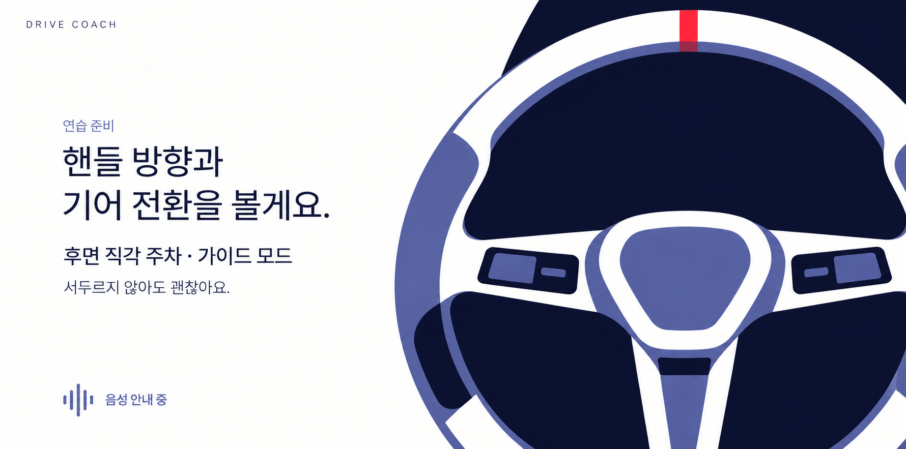
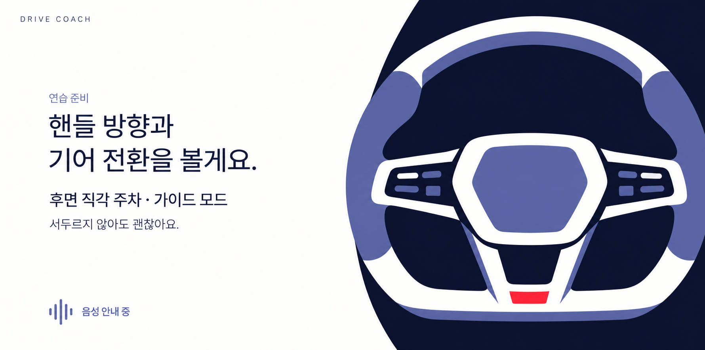
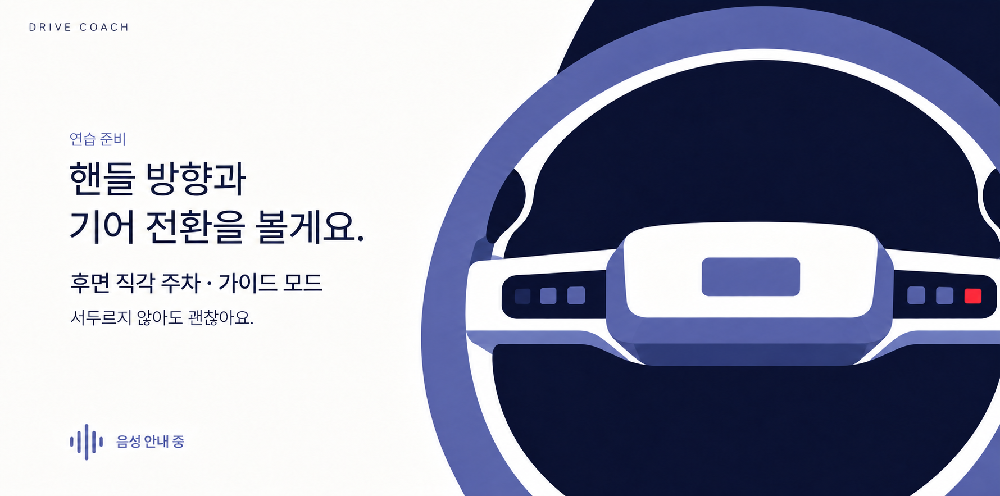

# 연습 준비 — 핸들 대안 4종

2026-09-26

사용자가 디테일을 보강한 핸들 외에 추가 시안을 요청해, 같은 화면 문구와 색상 체계 안에서 형태·시점·크롭이 다른 대안을 제작했다. **현재 사용자 선호안은 두 번째 B · 사선 단면이다.** “두 번째가 좋은 거 같아”라는 피드백을 반영했다. 실제 앱 적용이나 최종 폰트 확정을 뜻하지 않는다.

공통 기준은 [최초 설정 자동차](../01-setup-v1.png)의 묘사 밀도다. 큰 윤곽과 색면이 먼저 읽히고, 림의 구조·스포크·중앙 패드·작은 조작부가 다음으로 보이도록 요청했다. 남색·흰색·보랏빛과 작은 빨간 포인트를 유지했다.

## 비교

| 안 | 특징 | 이미지 | 실제 해상도 | 전체 프롬프트 |
|---|---|---|---|---|
| A · 정면 3스포크 | 삼각형에 가까운 중앙 패드와 균형 잡힌 정면 구조 | [PNG](a-front-three-spoke-v1.png) | 1780 × 883 px | [TXT](a-front-three-spoke-v1-prompt.txt) |
| B · 사선 단면 | 타원형 원근과 넓은 림 단면, 강한 비대칭 구도 | [PNG](b-oblique-rim-v1.png) | 1780 × 883 px | [TXT](b-oblique-rim-v1-prompt.txt) |
| C · D컷 | 평평한 하단과 각진 중앙부, 명확한 형태 | [PNG](c-flat-bottom-v1.png) | 1780 × 883 px | [TXT](c-flat-bottom-v1-prompt.txt) |
| D · 가로 중앙 패드 | 넓은 수평 중앙 패드와 큰 하단 여백 | [PNG](d-wide-center-v1.png) | 1780 × 883 px | [TXT](d-wide-center-v1-prompt.txt) |

### A · 정면 3스포크

### B · 사선 단면

### C · D컷

### D · 가로 중앙 패드

## 제작 입력과 범위

- 내장 `image_gen`으로 각각의 전체 화면을 생성했다.
- 입력 1: [연습 준비 v1](../02-briefing-v1.png). 문구·타이포그래피·배치 참고이며 기존 핸들 형태를 유지하는 목표는 아니다.
- 입력 2: [설정 v1](../01-setup-v1.png). 자동차의 색면 표현과 디테일 밀도 참고.
- [앞선 핸들 v2](../02-briefing-v2.png)는 별도 비교 이력으로 보존했다.
- 왼쪽 문구와 음성 안내 표시를 공통으로 유지하도록 요청했다. 핸들의 내부 버튼은 그림 속 부품이며 앱의 터치 요소가 아니다.
- 실제 글꼴·UI 구현·움직임·조향값 연동은 포함하지 않는다. 앱 코드와 기존 이미지는 수정하지 않았다.

## 검토

| 안 | 확인한 차이 | 검토 의견 |
|---|---|---|
| A | 정면 대칭, 세 방향 스포크, 작은 조작부와 중앙 패드 | 구조가 가장 쉽게 읽힌다. 기존 원형 구도와 가까우면서 조작부 디테일을 유지한다. |
| B | 비스듬한 시점, 타원형 림, 눈에 띄는 안쪽·측면 색면 | 최초 설정 자동차의 원근과 과감한 크롭에 가장 잘 이어진다는 검토 의견이다. 그림이 다른 안보다 역동적으로 느껴진다. |
| C | 하단의 평평한 선과 열려 있는 아래 스포크, 각진 중앙 패드 | 형태가 또렷하고 상대적으로 전체 윤곽이 많이 보인다. 여백이 있는 정돈된 방향을 비교하기 좋다. |
| D | 가로로 넓은 중앙 패드, 좌우 조작부, 하단의 큰 빈 공간 | 수평 구도가 가장 강조된다. 중앙 패드의 시각적 무게가 크므로 차분한 인상을 원하는 경우의 대안이다. |

네 이미지에서 눈에 띄는 한글 오류·문구 겹침은 발견하지 못했다. 모두 조작부의 실제 기능이나 텍스트를 추가하지 않고 그림의 형태만 비교하도록 했다.

한글 문구와 그래픽의 겹침·잘림을 시각적으로 검토했다. 의도적인 핸들 크롭은 유지했다. 생성 과정상 픽셀 단위의 위치·글꼴 일치를 보장하는 비교본은 아니며, 실제 앱에서 글자와 이미지를 분리해 구현해야 한다. 각 파일명과 같은 이름의 `-prompt.txt`에 전체 프롬프트를 보존했다.
