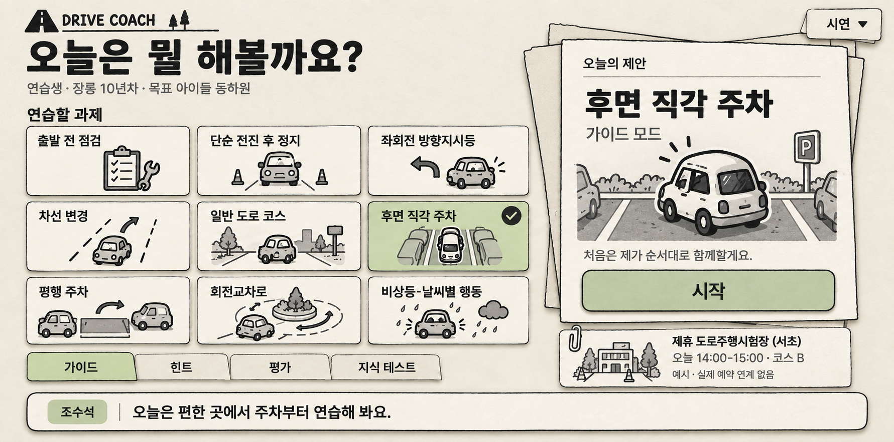
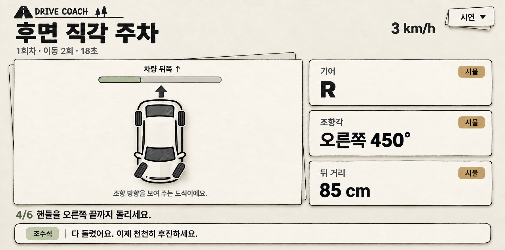
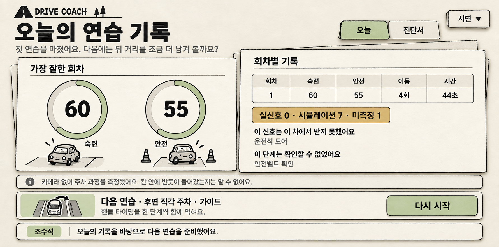
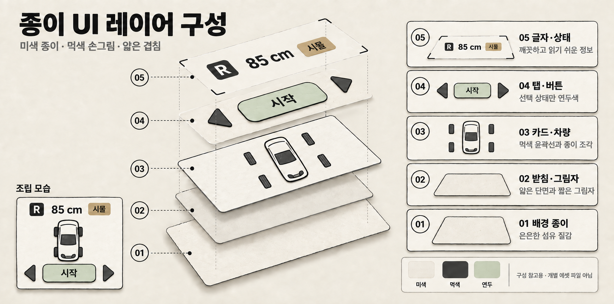

# TOEM 감성의 종이 UI 시안

2026-09-26 · 운전 연수 어시스턴트 / 가칭 DRIVE COACH

후속 피드백: 주차 안내와 레이어 구성은 유지하고, 설정·리포트의 그림 채움·정보량·제목 굵기를 줄인 [미니멀 대안 A/B/C와 폰트 추천](minimal-explorations/README.md)을 추가했다. **사용자는 흑백 테마 중 B ‘가벼운 대화’를 현재 선호안으로 선택했다.** 별도로 [Pinterest 컬러 컨셉](../pinterest-concepts/README.md)을 탐색한다. 아래는 1차 생성 결과다.

사용자가 선택한 **미색 종이·먹색 손그림 + 낮은 채도의 연두색 선택 표시**를 설정, 주차 안내, 리포트에 적용했다. 내장 `image_gen`으로 생성하고 결과를 직접 보며 수정했다. CLI/API 폴백은 사용하지 않았다. 앱 코드·API·실제 화면 동작은 변경하지 않았다.

## 1차 시안

| 화면 | 선택한 파일 | 실제 픽셀 크기 | 표현 의도 |
|---|---|---|---|
| 설정 | [01-setup-v2.png](01-setup-v2.png) | 1781 × 883 | 과제 카드와 추천 종이 묶음, 선택된 책갈피 |
| 주차 안내 | [02-maneuver-v2.png](02-maneuver-v2.png) | 1781 × 883 | 평면 종이 차량, 후진 방향, 큰 신호 정보 |
| 리포트 | [03-report-v1.png](03-report-v1.png) | 1781 × 883 | 겹친 기록장, 두 축의 평가, 측정 범위 고지 |
| 레이어 보드 | [04-layer-board-v3.png](04-layer-board-v3.png) | 1780 × 883 | 배경부터 정보까지 다섯 층의 조립 원리 |

설계 기준은 앱 콘텐츠 영역 **2560 × 1268**이며, 생성본은 약 2:1의 원본 PNG다. 위 크기는 PNG 헤더에서 확인한 실제 크기다. 2560px 납품본으로 표시하거나 확대·왜곡·크롭하지 않았다. 서로 다른 출력의 미세한 비율 차이는 생성 도구의 결과이며, 구현 레이아웃 치수로 사용하지 않는다. 차량 시스템 바는 포함하지 않았다.

이 문서의 '최종'은 이번 생성·검토 작업의 선택본을 뜻한다. 사용자 디자인 확정이나 실제 차량에서의 사용성 검증을 뜻하지 않는다. 이전 버전은 비교용으로 보존했다.

### 설정

### 주차 안내

### 리포트

### 레이어 구성

## 디자인 규칙

| 요소 | 기준 |
|---|---|
| 기본 종이 | 따뜻한 미색 `#F2EDDF`, 미세한 섬유 질감. 얼룩·구김은 강조하지 않는다. |
| 카드 면 | 크림색 `#FCF8EF`. 정보 영역은 질감을 약하게 유지한다. |
| 윤곽·본문 | 먹색 `#30332F`. 외곽선은 약간 불규칙하게, 한글과 숫자는 반듯하게. |
| 선택·긍정 상태 | 낮은 채도의 연두 `#B7C99B`. 선택된 과제·탭·주요 버튼에 제한한다. |
| 신호 상태 | 황토 `#C29B58`를 작은 표시로 사용하고 반드시 '시뮬' 등 텍스트를 병기한다. |
| 겹침 | 얇은 단면과 한두 장의 받침 종이. 앞면의 글자와 버튼은 기울이지 않는다. |
| 그림자 | 좌상단 조명에 따른 짧은 우하단 접촉 그림자. 긴 그림자·플라스틱 베벨은 피한다. |
| 그림체 | 단순한 차량 형태와 굵은 먹선. 그림은 과제 카드·차량 도식 안에 배치한다. |
| 글꼴 | 읽기 쉬운 한글 고딕. 생성된 제목의 굵기는 인상 참고이며 별도 폰트 파일은 포함하지 않는다. |

색상 값은 생성 프롬프트와 향후 구현을 위한 목표값이며, 생성 이미지의 모든 픽셀이 이 값과 일치한다는 뜻은 아니다. 목표값으로 계산한 먹색 대비는 기본 종이 10.95:1, 카드 면 12.08:1, 선택 연두 7.22:1이다. 이는 렌더링된 이미지 전체의 접근성 검사 결과가 아니다.

TOEM에서는 흑백 손그림과 단순한 형태를, 페이퍼 마리오에서는 재질·단면·겹침을 참고했다. 첨부 화면의 게임 캐릭터·로고·플랫폼 UI는 최종 시안에 넣지 않았다. 상단 DRIVE COACH와 도로 모양 심볼은 시안용 브랜드 표현이며 별도 로고 확정 산출물이 아니다.

## 화면별 검토

### 설정 — v2 선택

- **장점:** 9개 과제와 추천 카드가 구분되고, 선택 과제·가이드 탭·시작 버튼이 같은 색으로 연결된다. 종이 묶음과 작은 과제 그림에서 요청한 질감과 그림체가 잘 드러난다.
- **수정한 부분:** v1에 추가된 외곽 풍경·캐릭터·표지판 문구를 제거했다. 왼쪽 여백을 과제 카드에 돌려주고, 추천 카드 뒤 황토색 종이는 중립 크림색으로 바꿨다.
- **남은 구현 검토:** 과제 난이도·유형 보조 정보는 이번 시안에서 생략되어 있다. 실제 화면 적용 시 기존 데이터에 맞춰 복원한다. '비상등·날씨별 행동' 구분점은 생성본에서 하이픈처럼 보여 실제 문자열 리소스로 교정해야 한다. 예약 안내 등 작은 문구는 시스템 글꼴과 실제 최소 글자 크기로 재검증한다.
- **분리할 요소:** 종이 배경, 카드 표면·받침, 과제 그림, 선택 체크, 탭, 버튼, 텍스트. 시안을 하나의 배경 이미지로 붙이는 방식은 의도하지 않았다.

### 주차 안내 — v2 선택

- **장점:** 기어·조향각·뒤 거리가 크게 읽히며, 종이 재질보다 주차 정보가 먼저 보인다. 점수·감점·완료 버튼·확장 시연 패널이 없다.
- **검토한 상태:** 1회차 / 이동 2회 / 18초 / 3 km/h / R / 오른쪽 450° / 85 cm. 세 신호 모두 '시뮬'로 표시한다. 뒤 거리 바는 250 cm 기준 약 34% 표현이다.
- **수정한 부분:** 차 앞쪽이 화면 아래이므로 차량 기준 오른쪽은 화면 왼쪽이다. v1의 앞바퀴 기울기를 v2에서 반대로 수정했다. 뒤쪽은 위, 후진 화살표도 위를 향한다. 앞바퀴는 아래 두 개만 기울고 뒤바퀴는 수직이다.
- **남은 구현 검토:** 450°는 스티어링 휠 입력이고 타이어 회전량이 아니다. 그림의 타이어 각도는 방향을 설명하는 예시이며 실제 기구학 예측값이 아니다. 긴 자막, 신호 미측정, 정차, 잠금 상태는 이번 정적 시안에서 검증하지 않았다.
- **분리할 요소:** 차체, 앞바퀴 2개와 각각의 회전축, 뒷바퀴, 후진 화살표, 거리 바, 신호 카드·배지, 자막. 실제 주차 칸·차량 위치·카메라 화면을 아는 것처럼 그리지 않았다.

### 리포트 — v1 선택

- **장점:** 기록장 비유가 자연스럽고, 숙련·안전 두 축과 회차별 기록이 분리되어 읽힌다. 신호 미측정과 확인하지 못한 단계가 남아 있다.
- **검토한 값:** 숙련 60 / 안전 55. 회차 표는 1 / 60 / 55 / 4회 / 44초. 배지는 실신호 0 / 시뮬레이션 7 / 미측정 1이다. 미수신 신호는 '운전석 도어', 미확인 단계는 '안전벨트 확인'이다. 기존 캡처의 예시 상태를 사용했으며 새 주행 결과를 계산한 것이 아니다.
- **측정 범위:** 카메라 없이 주차 과정을 측정한다는 고지를 유지했다. 차량 그림은 과제 아이콘이며 실제 주차 위치나 반듯하게 주차했다는 판정이 아니다.
- **남은 구현 검토:** 하단 고지와 보조 문구는 실제 차량 화면에서 글자 크기와 명암을 확인해야 한다. 원형 게이지의 호 길이는 이미지 시안이므로 실제 값에서 도형으로 다시 그린다. 긴 목록과 여러 회차에 대한 레이아웃도 별도 검증이 필요하다.
- **분리할 요소:** 기록장 받침·앞면, 탭, 게이지 바탕·호·숫자, 표, 신호 배지, 다음 과제 그림, 버튼, 자막.

### 레이어 보드 — 최종 검토

- **장점:** 01 배경 → 02 받침·그림자 → 03 카드·차량 → 04 탭·버튼 → 05 글자·상태의 순서가 분해도와 범례에서 일치한다. 차량 부품과 정보 레이어를 분리해야 하는 이유를 한 장에서 확인할 수 있다.
- **수정한 부분:** v1의 입체 모형 같은 차와 주차 칸 선을 v2에서 평면 종이 차와 중립 배경으로 바꿨다. v2에서 겹쳐 보이던 바퀴를 v3에서 정리했다.
- **최종 확인:** 분해도와 03 범례는 바퀴 없는 차체 + 분리된 바퀴 4개, '조립 모습'은 차체에 붙은 바퀴 4개로 구분된다. 레이어 번호 01–05, 상태 텍스트, 색상 견본, 개별 에셋 파일이 아니라는 설명이 남아 있다.
- **남은 구현 검토:** 층간 간격과 투시 표현은 설명을 위한 과장이다. 실제 UI의 높이 값이나 픽셀 간격으로 옮기지 않는다.

보드의 '시작'과 삼각형은 종이 컨트롤 구성 예시다. 주차 중 화면에 추가할 버튼 명세가 아니다. 조립 원리를 보여 주는 한 장의 PNG이며, 투명 PNG 에셋 세트·PSD·편집 가능한 레이어 파일은 이번 산출물에 포함하지 않는다.

## 구현 시 분리 기준

| 층 | 역할 | 실제 적용 시 구분 |
|---|---|---|
| 01 배경 종이 | 전체 재질 | 낮은 대비의 종이 텍스처 |
| 02 받침·그림자 | 깊이 | 받침 형태와 짧은 그림자를 앞면 콘텐츠와 분리 |
| 03 카드·차량 | 의미 있는 형태 | 카드와 차량 그림을 분리하고 앞바퀴 회전축 확보 |
| 04 탭·버튼 | 선택·행동 | 정상·선택·누름 상태를 별도로 정의 |
| 05 글자·상태 | 실제 정보 | 한글·숫자·배지·자막은 Compose 텍스트·도형으로 렌더링 |

앱에 적용할 때는 기존 2560 × 1268 설계 공간과 최소 32sp 기준을 사용한다. 문구를 종이 에셋에 구워 넣지 않는다. 차량 속도에 따른 잠금, 정차 시 완료 버튼, 미측정 신호 표시, 큰 자막 같은 기존 동작 계약도 실제 UI 구현 단계에서 유지해야 한다. 이 작업에서는 구현하지 않았다.

## 참고 이미지와 프롬프트

첨부 파일은 바이트 그대로 보존했다.

- [TOEM 스팀 화면](../references/toem-steam-reference.png): 선·형태·분위기 참고.
- [페이퍼 마리오 영상 화면](../references/paper-mario-material-reference.png): 재질·레이어·접촉 그림자 참고.
- 기존 앱 정보 구성: [설정](../../screenshots/lesson/lesson-setup.png), [주차 안내](../../screenshots/lesson/lesson-maneuver.png), [리포트](../../screenshots/lesson/lesson-report.png).
- 문구와 화면 제약은 기존 화면 캡처, `AGENTS.md`, `docs/NEXT.md`, 연수 화면 핸드오프와 `ManeuverDisplayState`를 참조했다. 과거 Gift Drive 디자인 문서는 이번 생성 지시로 사용하지 않았다.

아래 텍스트 파일은 내장 생성 도구에 전달한 전체 프롬프트다. 입력 이미지는 표에 적힌 순서로 전달했다. v1 생성 후에는 출력 자체를 참조해 필요한 요소를 수정했다.

| 출력 | 전체 프롬프트 | 입력 이미지 순서 |
|---|---|---|
| 설정 v1 | [01-setup-prompt.txt](01-setup-prompt.txt) | TOEM → 페이퍼 마리오 → 기존 설정 캡처 |
| 설정 v2 | [01-setup-v2-prompt.txt](01-setup-v2-prompt.txt) | 설정 v1 |
| 주차 v1 | [02-maneuver-prompt.txt](02-maneuver-prompt.txt) | 설정 v2 → TOEM → 페이퍼 마리오 → 기존 주차 캡처 |
| 주차 v2 | [02-maneuver-v2-prompt.txt](02-maneuver-v2-prompt.txt) | 주차 v1 |
| 리포트 v1 | [03-report-prompt.txt](03-report-prompt.txt) | 설정 v2 → TOEM → 페이퍼 마리오 → 기존 리포트 캡처 |
| 보드 v1 | [04-layer-board-prompt.txt](04-layer-board-prompt.txt) | 설정 v2 → TOEM → 페이퍼 마리오 |
| 보드 v2 | [04-layer-board-v2-prompt.txt](04-layer-board-v2-prompt.txt) | 보드 v1 → 주차 v1 |
| 보드 v3 | [04-layer-board-v3-prompt.txt](04-layer-board-v3-prompt.txt) | 보드 v2 |

`image_gen` 기본 생성 경로에 원본을 남기고, 위 작업 폴더로 복사했다. 기존 버전은 덮어쓰지 않았다. PNG는 생성 도구 출력 그대로이며 별도 이미지 편집 코드나 벡터 대체물은 사용하지 않았다.

## 검증 범위

- **시각 검토:** 최종 4장을 직접 확인했다. 설정의 외곽 장식, 주차 도식의 조향 방향, 보드의 입체감과 바퀴 중복을 수정했다. 리포트 수치와 신호 구분은 기존 캡처와 대조했다.
- **파일 확인:** 최종 PNG 4개의 파일 존재·PNG 시그니처·실제 크기를 확인했다. 레퍼런스 2장은 원본과 SHA-256이 일치한다. 프롬프트 8개와 이전 버전 4개도 보존했다.
- **문서 확인:** 로컬 이미지·프롬프트 링크의 대상 파일을 확인했다. 생성본에 남은 작은 구분점 표현 차이와 실제 화면에서 재검증할 항목을 위에 기록했다.
- **저장소 기본 확인:** `.\\gradlew.bat assembleDebug testDebugUnitTest`는 종료 코드 0, `BUILD SUCCESSFUL`이었다. 69개 작업 모두 UP-TO-DATE로 기존 결과를 재사용했다. 이 결과는 새 종이 UI가 앱에서 동작한다는 검증이 아니다.
- **변경 범위:** 디자인 폴더의 이미지·프롬프트·검토 문서와 `docs/NEXT.md`의 인계 링크만 추가했다. 앱 코드·API·Gradle·테스트 코드는 변경하지 않았다.

실제 차량 디스플레이에서의 판독성, 터치 영역, 음성 동기화, 상태 전이, 성능, 야간 밝기, 접근성 트리는 검증하지 않았다. 이미지 시안의 시각 검토와 앱 실행 검증을 구분한다.
