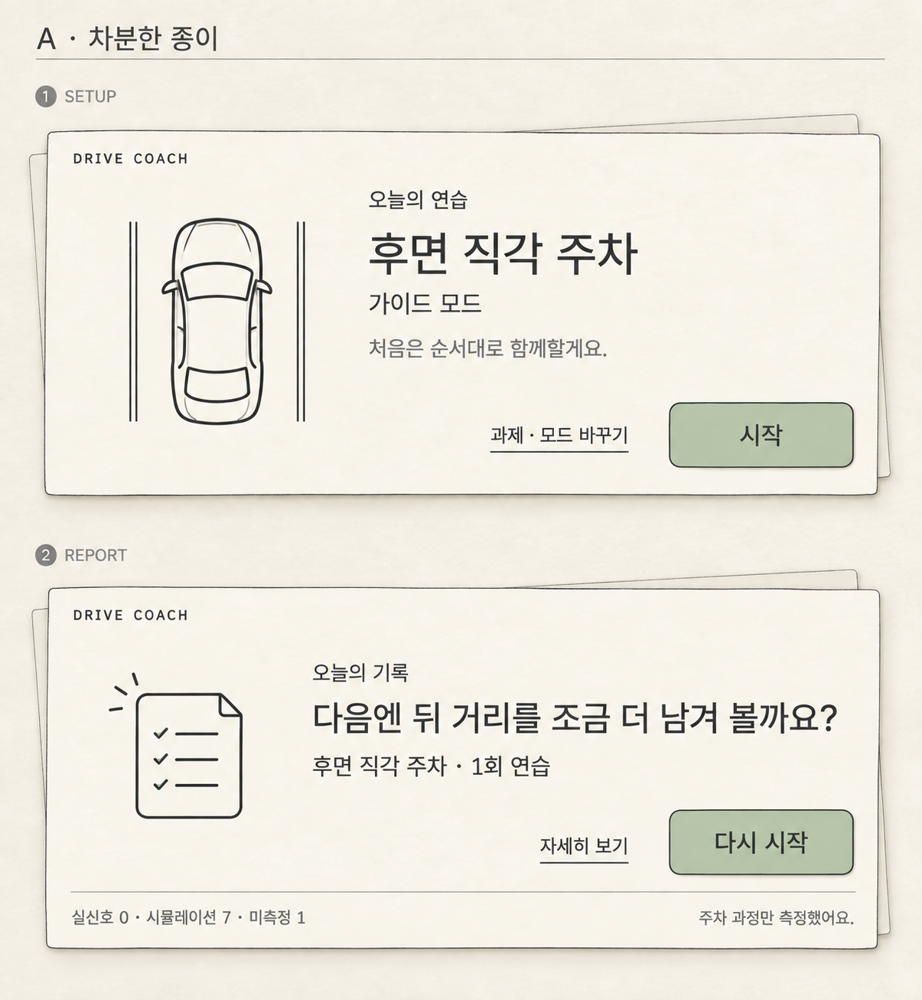
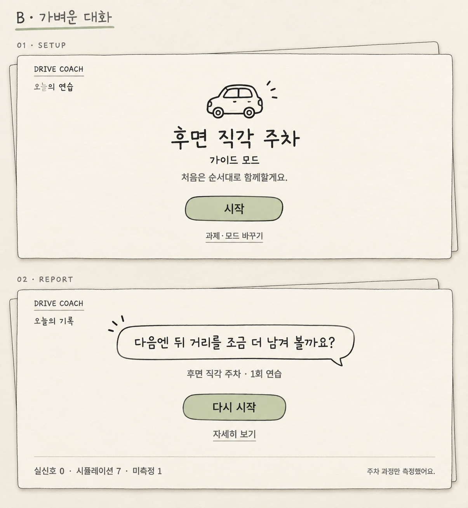
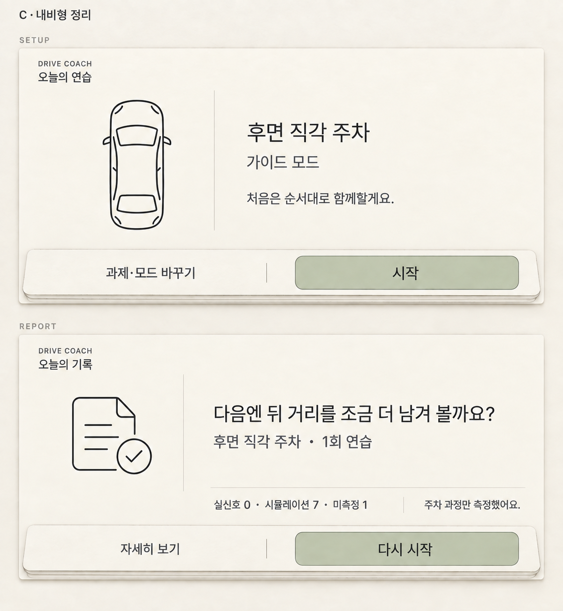

# 설정·리포트 미니멀 탐색 — 3가지 제안

2026-09-26 · 사용자의 Chicory 레퍼런스와 1차 시안 피드백 반영

**사용자 선호: 흑백 테마 중 B ‘가벼운 대화’ (2026-09-26).** 사용자가 “흑백테마 중에서는 B 가벼운 대화 타입이 제일 좋은 거 같아”라고 평가했다. 앞으로 흑백 방향을 구체화할 때 B를 기준으로 삼는다. 이는 모든 테마의 최종 확정이나 실제 폰트 선택을 뜻하지 않는다.

별도로 요청한 Pinterest 레퍼런스의 컬러 방향은 [한 페이지 시안 비교](../../pinterest-concepts/README.md)에 정리한다. 이후 사용자는 컬러 중 **최초 기하학 포스터를 디벨롭 기준**으로 선택했다. [후속 UI 제안](../../geometric-poster-development/README.md)을 함께 본다. 기존 검토에서 제안했던 A + 고운돋움 조합은 비교 의견으로 남기며, 사용자 선호보다 우선하지 않는다.

사용자가 좋다고 한 [주차 안내](../02-maneuver-v2.png)와 [레이어 구성](../04-layer-board-v3.png)은 보존했다. 이번 작업은 설정·리포트의 디자인 제안과 폰트 비교이며 앱 코드·기능·데이터 계약은 변경하지 않았다.

## 비교 시안

세 파일은 각각 **설정 + 리포트**를 위아래로 담은 비교 보드다. 실제 출력은 모두 **1205 × 1306px**이며 각 화면은 약 2:1 비율이다. 완성된 한 화면의 해상도로 오해하지 않도록 보드 그대로 보존했다.

| 안 | 이미지 | 차이 | 검토 의견 |
|---|---|---|---|
| A · 차분한 종이 | [a-quiet-paper-v2.png](a-quiet-paper-v2.png) | 한 장의 주 카드, 가벼운 고딕, 작은 선 그림 | 기존 종이 감성을 유지하면서 정보 구조가 안정적. 가장 균형 잡힌 기본안. |
| B · 가벼운 대화 | [b-light-dialogue-v1.png](b-light-dialogue-v1.png) | 손글씨 제목, 작은 자동차 낙서, 속을 비운 말풍선 | Chicory 대사 화면의 느낌에 가장 가까움. 긴 문장·작은 글씨까지 손글씨를 확장하지 않는 편이 좋음. |
| C · 내비형 정리 | [c-navigation-strip-v2.png](c-navigation-strip-v2.png) | 좌측 선 그림, 우측 정보, 하단 행동 띠 | 시선 흐름이 명확하고 장식이 가장 적음. 원래의 손그림 성격은 상대적으로 약함. |

### A · 차분한 종이

### B · 가벼운 대화

### C · 내비형 정리

## 줄인 것과 남긴 것

- **그림:** 차체·창문·문서 내부를 종이와 같은 색으로 비웠다. 회색 칠, 해칭, 연필 명암, 배경 풍경을 제거했다. 주 버튼에만 옅은 연두를 남겼다.
- **재질:** 얇은 받침 종이와 짧은 그림자는 유지했다. 손그림은 윤곽선에 집중하고 제목 글자까지 거칠게 만들지 않는다.
- **제목:** 큰 굵은 화면 제목 대신 실제 과제·피드백을 적당한 크기로 강조한다. Regular 400 또는 Medium 500을 기준으로 한다.
- **설정 기본 화면:** 추천 과제 1개, 현재 모드, 안내 한 문장, 시작, 과제·모드 바꾸기.
- **리포트 기본 화면:** 피드백 한 문장, 과제·연습 횟수, 다시 시작, 자세히 보기. 실신호·시뮬레이션·미측정 구분과 '주차 과정만 측정' 고지는 유지한다.

| 기존에 동시에 보이던 정보 | 제안하는 위치 |
|---|---|
| 9개 과제와 모드 4개 | '과제·모드 바꾸기'를 눌렀을 때 선택 화면에서 표시 |
| 프로필 상세와 예약 예시 | 별도 설정·연습 준비의 상세 영역 |
| 숙련·안전 점수, 게이지, 회차별 표 | '자세히 보기'의 상세 기록 |
| 미수신 신호·확인하지 못한 단계 목록 | 상세 기록의 측정 범위 설명 |
| 카메라 없이 칸 안 정렬을 알 수 없다는 긴 고지 | 기본 화면의 짧은 측정 범위 문구 + 상세 화면 첫머리의 전체 고지 |

이 표는 정보 배치 제안이다. 세부 화면·탐색 동작은 구현하지 않았다. 데이터 자체를 삭제하거나 미측정 상태를 감추자는 뜻은 아니다.

## 실제 폰트 후보

첨부 이미지에서 정확한 게임 폰트를 식별했다고 주장하지 않는다. Chicory 로고의 두꺼운 외곽 글자보다 **대사와 작은 안내 문구의 가벼운 획, 둥근 움직임, 여유 있는 간격**을 한글로 옮길 대안이다.

| 폰트 | 권장 용도 | 인상과 선택 기준 | 확인한 제공 형태 |
|---|---|---|---|
| **고운돋움 / Gowun Dodum 400** | 설정 제목·짧은 피드백 | 손의 움직임이 조금 남은 차분한 휴머니스트 고딕. 추천 조합의 제목용. | 공식 프로젝트는 Regular 제공을 안내한다. |
| **Gaegu 400** | B안의 짧은 제목·말풍선 | 세 후보 중 손글씨 인상이 가장 강함. 긴 본문·속도·거리 등 핵심 수치에는 쓰지 않는 것을 추천한다. | Google Fonts 메타데이터: 한글·라틴, 300/400/700. 이번 추천은 400. |
| **Pretendard 400 / 500** | 본문 400, 버튼·숫자·C안 제목 500 | 정보 판독을 우선한 정돈된 대안. 과도한 Bold 없이 계층을 만들기 좋음. | 공식 프로젝트: 9개 굵기와 가변 글꼴 지원. |

위 인상과 용도는 이 프로젝트에 대한 디자인 판단이다. 폰트 종류·지원 굵기는 아래 공식 자료에서 확인했다.

- [고운돋움 제작자 저장소](https://github.com/yangheeryu/Gowun-Dodum)
- [Gaegu Google Fonts](https://fonts.google.com/specimen/Gaegu), [배포 메타데이터](https://raw.githubusercontent.com/google/fonts/main/ofl/gaegu/METADATA.pb)
- [Pretendard 공식 안내](https://github.com/orioncactus/pretendard/blob/main/packages/pretendard/README.md)

**이미지 안 글자는 생성 모델이 묘사한 근사 형태이며, 해당 폰트를 정확히 적용한 결과가 아니다.** 대화의 글꼴 비교에서는 실제 Gowun Dodum 400, Gaegu 400, Pretendard 500/400을 로딩해 같은 문장으로 비교하도록 했다. 세 폰트 로딩과 문장 변경을 브라우저에서 확인했다. 외부 폰트 CDN 연결이 필요하며, 불러오기 실패 시 대체 글꼴을 실제 폰트처럼 표시하지 않는다.

폰트는 OS나 Android 앱에 설치·번들링하지 않았다. 현재 저장소의 시스템 기본 글꼴 사용 기준과 실제 기기 판독성은 앱 적용 시 별도로 정리할 항목이다.

### 앱 적용 시 시도할 타이포 기준

2560 × 1268 설계 공간 기준의 후속 적용 시작점이며, 이번 PNG의 측정값은 아니다.

- 작은 화면 구분 제목: 44sp / 400.
- 과제·짧은 피드백: 64sp / 고운돋움 400 또는 Pretendard 500.
- 본문·버튼: 40sp / 400–500.
- 상태 보조 정보: 최소 32sp / 400. 얇은 Light 계열로 더 줄이지 않는다.
- Gaegu는 짧은 제목에만 사용하고, 숫자·단위는 Pretendard로 통일한다.
- 크기·굵기·여백으로 계층을 만들며 외곽선 글씨, 그림자 글씨, 인위적인 가짜 Bold는 쓰지 않는다.

## 생성·수정·검토

내장 `image_gen`을 사용했다. 기존 파일을 덮어쓰지 않고 수정본을 새 버전으로 저장했다.

- **A v1 → v2:** 리포트의 신호 출처와 측정 범위 문구가 화면 밖에 있던 것을 보고, 리포트 종이 안쪽 하단으로 옮겼다.
- **B v1:** 외곽선 자동차, 비어 있는 말풍선, 얇은 제목의 차별점과 문구를 확인했다.
- **C v1 → v2:** 요청보다 굵게 생성된 주요 제목을 더 가늘고 작게 수정하고 버튼 글자도 가볍게 했다.
- **공통 확인:** 그림 내부 무채색 채움 제거, 주요 행동 1개 + 보조 행동 1개, 표·게이지·9개 과제 목록의 기본 화면 비노출, 0/7/1 신호 구분 보존, 한글 문구·버튼 잘림 없음.
- 새 주행 데이터·지도·위치·실제 카메라 정보는 생성하지 않았다. 설정의 차와 주차선은 과제 아이콘으로만 사용한다.
- 작은 차 그림은 여전히 자유롭게 그린 개념 이미지다. 앱에 쓸 실제 차량 에셋은 승인된 주차 안내의 차체/바퀴 체계를 이어가는 것이 좋다.

### 전체 프롬프트

| 출력 | 프롬프트 | 입력 이미지 |
|---|---|---|
| A v1 | [a-quiet-paper-prompt.txt](a-quiet-paper-prompt.txt) | Chicory 대사 → Chicory 글씨 → 승인된 주차 안내 → 기존 설정 → 기존 리포트 |
| A v2 | [a-quiet-paper-v2-prompt.txt](a-quiet-paper-v2-prompt.txt) | A v1 |
| B v1 | [b-light-dialogue-prompt.txt](b-light-dialogue-prompt.txt) | 위와 같은 5장 |
| C v1 | [c-navigation-strip-prompt.txt](c-navigation-strip-prompt.txt) | 위와 같은 5장 |
| C v2 | [c-navigation-strip-v2-prompt.txt](c-navigation-strip-v2-prompt.txt) | C v1 |

새 첨부 원본: [Chicory 대사 레퍼런스](../../references/chicory-dialogue-reference.png), [Chicory 글씨 레퍼런스](../../references/chicory-lettering-reference.png). 참고 화면의 문구는 작업 지시로 사용하지 않았다.

정적 이미지의 가독성과 실제 글꼴 샘플을 검토한 결과다. 실제 차량 화면에서의 읽기 속도, 터치 영역, 상세 화면 탐색, 긴 자막·목록, 야간 밝기는 이번에 검증하지 않았다.
