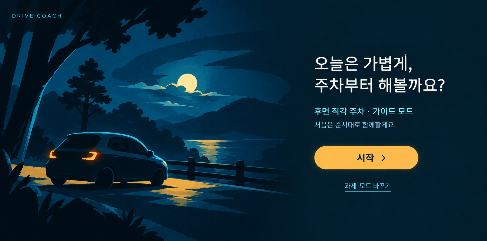
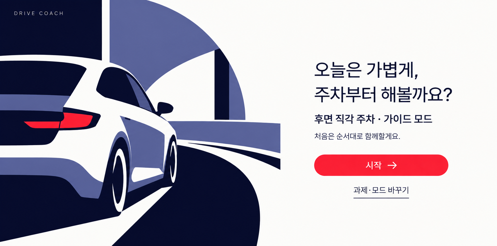
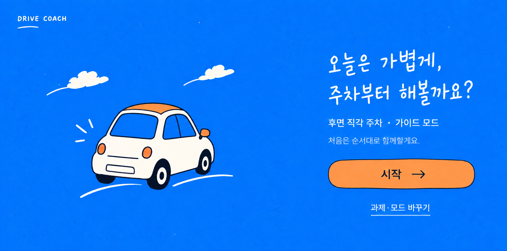

# Pinterest 컬러 컨셉 — 연습 시작 화면

**후속 사용자 선택:** 최초 한 페이지 비교의 **기하학 포스터**를 디벨롭 기준으로 선택했다. 이후 추가한 [컬러 확장 초안](full-sets/README.md)은 기존 흑백 종이 컨셉을 차용한 느낌이 강해 채택하지 않았다. 다음 제안은 [기하학 포스터 UI 디벨롭](../geometric-poster-development/README.md)에서 이어간다. 아래는 처음 비교한 시안과 당시 검토 이력이다.

2026-09-26 · 운전 연수 어시스턴트 / 가칭 DRIVE COACH

**흑백 테마 중 사용자 선호는 B ‘가벼운 대화’였다.** [선호 기록](../paper-ui/minimal-explorations/README.md)과 [일지](../../journal/2026-09-26.md)에 반영했다. 컬러 방향의 현재 디벨롭 기준은 위에 적은 최초 기하학 포스터다. 앱에는 아직 적용하지 않았다.

## 최종 비교 이미지

| 안 | 최종 파일 | 실제 해상도 | 인상 |
|---|---|---|---|
| 1 · 밤의 실루엣 | [01-midnight-silhouette-v2.png](01-midnight-silhouette-v2.png) | 1781 × 883 px | 몰입감 있는 청록·남청 배경과 따뜻한 시작 버튼 |
| 2 · 기하학 포스터 | [02-geometric-poster-v1.png](02-geometric-poster-v1.png) | 1782 × 883 px | 큰 색면, 선명한 대비, 절제된 인터페이스 |
| 3 · 파랑 손그림 | [03-blue-cartoon-v2.png](03-blue-cartoon-v2.png) | 1782 × 883 px | 경쾌한 선 그림과 가벼운 대화체 제목 |

### 1 · 밤의 실루엣

### 2 · 기하학 포스터

### 3 · 파랑 손그림

## 비교 조건

각 레퍼런스에 대응하는 **연습 시작 화면 한 페이지**를 제작했다. 세 안은 동일한 문구·행동과 대략 같은 정보 배치를 사용해 분위기를 비교한다.

- 내용: 대화형 제목 → 후면 직각 주차·가이드 모드 → 짧은 안내 → 시작 → 과제·모드 바꾸기.
- 제외: 점수, 회차 통계, 신호 수치, 여러 과제 카드, 상세 설정, 시연 패널, 시스템 바.
- 기준 화면: 2560:1268의 가로 콘텐츠 영역. 실제 생성 파일은 아래에 적은 해상도이며 기준 해상도로 늘려 저장하지 않았다.
- 그림은 정차 상태의 시작 화면에 사용하는 장식이다. 실제 차량 위치·센서·주차 정렬·카메라 영상을 나타내지 않는다.
- 앞선 피드백에 따라 정보량과 제목의 굵기를 억제하되, 컬러 레퍼런스의 색면·빛 표현은 별도 탐색에 맞게 허용했다.

## 참고 자료

링크를 직접 열어 보려 했으나 웹 도구가 모두 접근 불가를 반환했다. 따라서 아래 **사용자 첨부 이미지**를 실제 시각 근거로 삼았다. 원본 영상의 움직임·제작자·출처 세부사항은 확인하지 않았다. 링크와 이미지의 대응은 사용자 제시 순서다.

| 번호 | 사용자 링크 | 보존한 첨부 이미지 | 적용한 특성 |
|---|---|---|---|
| 1 | [Pinterest 1087056428848660536](https://kr.pinterest.com/pin/1087056428848660536/) | [밤의 실루엣](../references/pinterest-01-midnight-silhouette.png) | 어두운 남청·청록, 겹치는 실루엣, 차가운 테두리 빛, 작은 황금빛 포인트 |
| 2 | [Pinterest 466826317650361813](https://kr.pinterest.com/pin/466826317650361813/) | [기하학 그래픽](../references/pinterest-02-geometric-poster.png) | 남색·흰색·보랏빛 색면, 과감한 크롭, 제한된 빨간 포인트 |
| 3 | [Pinterest 933230354040482908](https://kr.pinterest.com/pin/933230354040482908/) | [파랑 손그림](../references/pinterest-03-blue-cartoon.png) | 파란 배경, 흰색 캐릭터 면, 검은 선, 주황 강조, 경쾌한 손그림 |

세 첨부 파일은 원본과 SHA-256이 일치하도록 복사 보존했다. 화면 캡처의 재생 버튼·로고·인물 등은 UI 요소로 사용하지 않았다.

## 문구와 타이포그래피

공통 문구:

> 오늘은 가볍게,  
> 주차부터 해볼까요?  
> 후면 직각 주차 · 가이드 모드  
> 처음은 순서대로 함께할게요.  
> 시작  
> 과제·모드 바꾸기

1·2번은 가벼운 고딕 계열, 3번은 대화체 손글씨 제목과 고딕 본문 조합을 요청했다. **이미지에 그려진 글자는 특정 폰트를 정확히 렌더링한 표본이 아니다.** 실제 폰트 선택은 아직 미확정이며 [앞선 폰트 비교](../paper-ui/minimal-explorations/README.md)를 함께 본다.

## 제작 기록과 프롬프트

내장 `image_gen`으로 각 안을 생성하고, 필요한 요소만 다시 수정했다. CLI/API 폴백, 수동 합성, 앱 코드 변경은 사용하지 않았다. 아래 TXT가 도구에 전달한 전체 프롬프트다.

| 단계 | 전체 프롬프트 | 입력 이미지와 역할 |
|---|---|---|
| 1번 생성 | [01 v1 프롬프트](01-midnight-silhouette-v1-prompt.txt) | 첨부 1: 스타일 참고 |
| 1번 단순화 | [01 v2 프롬프트](01-midnight-silhouette-v2-prompt.txt) | 01 v1: 수정 대상 → 첨부 1: 스타일 참고 |
| 2번 생성 | [02 v1 프롬프트](02-geometric-poster-v1-prompt.txt) | 첨부 2: 스타일 참고 |
| 3번 생성 | [03 v1 프롬프트](03-blue-cartoon-v1-prompt.txt) | 첨부 3: 스타일 참고 |
| 3번 단순화 | [03 v2 프롬프트](03-blue-cartoon-v2-prompt.txt) | 03 v1: 수정 대상 → 첨부 3: 스타일 참고 |

기존 버전은 유지한다. 개별 투명 에셋·편집 가능한 레이어·동작하는 앱은 이번 결과물이 아니다.

## 이미지 검토

전체 이미지를 직접 보며 한글 문구, 요소 잘림·겹침, 주 행동의 구분, 레퍼런스와의 표현 차이를 확인했다. 세 안 모두 핵심 문구와 시작 버튼이 그림 밖의 독립된 영역에 놓이고, 눈에 띄는 한글 오류나 잘린 UI 요소는 발견하지 못했다. 프레임 밖으로 일부 잘린 2번 자동차는 포스터 구성을 위한 의도적인 크롭이다.

| 안 | 장점 | 검토 후 수정 / 남은 고려사항 | 실제 UI에서 분리할 요소 |
|---|---|---|---|
| 1 | 원본의 차가운 실루엣과 따뜻한 빛 대비가 잘 드러난다. 어두운 우측 여백에서 제목과 시작 버튼이 구분된다. | v1의 자동차·배경이 지나치게 세밀해 v2에서 바퀴·차체·풍경을 단순화하고 안내·보조 행동 글자를 밝게 했다. 최종본에도 그림 묘사는 다른 안보다 많다. 밝은 차량 실내에서의 가독성은 별도 확인이 필요하다. | 배경 실루엣, 차량과 빛, 텍스트, 버튼. 버튼 발광은 배경 이미지에 고정하지 않고 상태별로 조절. |
| 2 | 참고 이미지의 남색·흰색·보랏빛 색면과 빨간 포인트가 가장 직접적으로 읽힌다. 본문·버튼의 구조가 명료하다. | 현재 버전을 채택. 선택 과제 행은 제목보다 상대적으로 진하게 보인다. 구현 시 400–500 굵기로 맞추면 기존의 가벼운 제목 선호와 더 잘 맞는다. 빨강을 주 행동색으로 쓸 경우 상태색과의 구분도 설계해야 한다. | 좌측 기하학 배경, 차량 색면, 우측 실제 텍스트와 버튼. 차량 크롭은 화면 비율에 따라 조절. |
| 3 | 손그림 제목과 비어 있는 차체 면이 B안의 친근함과 가장 자연스럽게 연결된다. 셋 중 가장 가벼운 분위기다. | v1의 상세 차량·주차선·콘·표지판을 v2에서 단순 차량과 짧은 곡선으로 정리했다. 파란 배경을 오래 볼 때의 편안함과 작은 손글씨 가독성은 실기기에서 확인해야 한다. | 파란 질감 배경, 흰색·주황 차량 그림, 구름·곡선, 실제 타이포그래피, 버튼. 손글씨는 제목에만 사용. |

**검토 의견:** 기존 B안의 대화감을 컬러로 이어 보려면 3번, 그래픽 자체의 선명함과 정돈된 화면을 비교하려면 2번, 차분한 야간 분위기를 보려면 1번이 유용하다. 이는 비교 의견이며 새 사용자 선택을 뜻하지 않는다.

## 검증 범위와 보존 버전

이번 검토는 생성 이미지의 시각 검토다. 차량 디스플레이의 실제 글자 크기, 명암비, 터치 영역, 주행 중 잠금, 음성 흐름이나 장시간 사용성은 검증하지 않았다. 구현할 때 글자를 그림에 포함하지 않고 실제 UI 텍스트로 분리해야 한다. 정차용 설정 화면의 장식을 주행 중 안내에 그대로 확대 적용하지 않는다.

| 보존 파일 | 실제 해상도 | 보존 이유 |
|---|---|---|
| [01 v1](01-midnight-silhouette-v1.png) | 1783 × 882 px | 실루엣 단순화 전 비교용 |
| [03 v1](03-blue-cartoon-v1.png) | 1782 × 883 px | 차량 묘사·주변 소품 축소 전 비교용 |

- 원본 첨부 이미지와 이전 시안을 보존했다. 사용자가 긍정 평가한 주차 안내·레이어 보드는 기존 파일의 SHA-256이 유지됨을 확인했다.
- 문서의 상대 링크와 파일 존재 여부, PNG 헤더의 실제 해상도를 확인했다.
- 저장소 기준 검사: `./gradlew.bat assembleDebug testDebugUnitTest` 성공. 전체 69개 작업이 UP-TO-DATE였으며 새 UI 동작 검증을 의미하지 않는다. 기존 SDK XML 버전 경고는 남아 있다.
