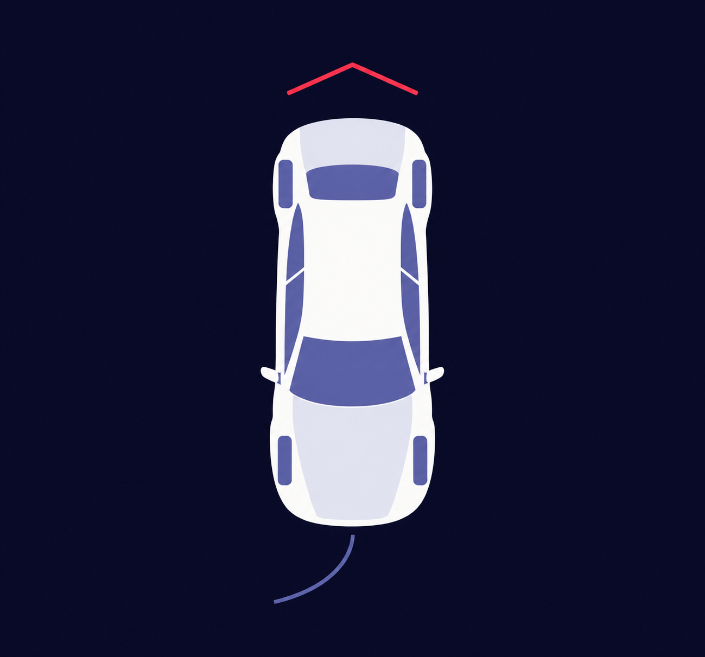
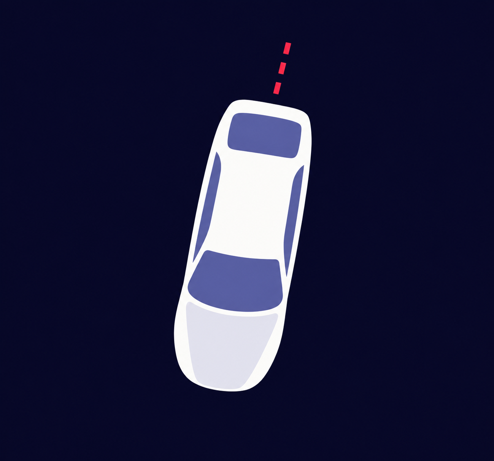
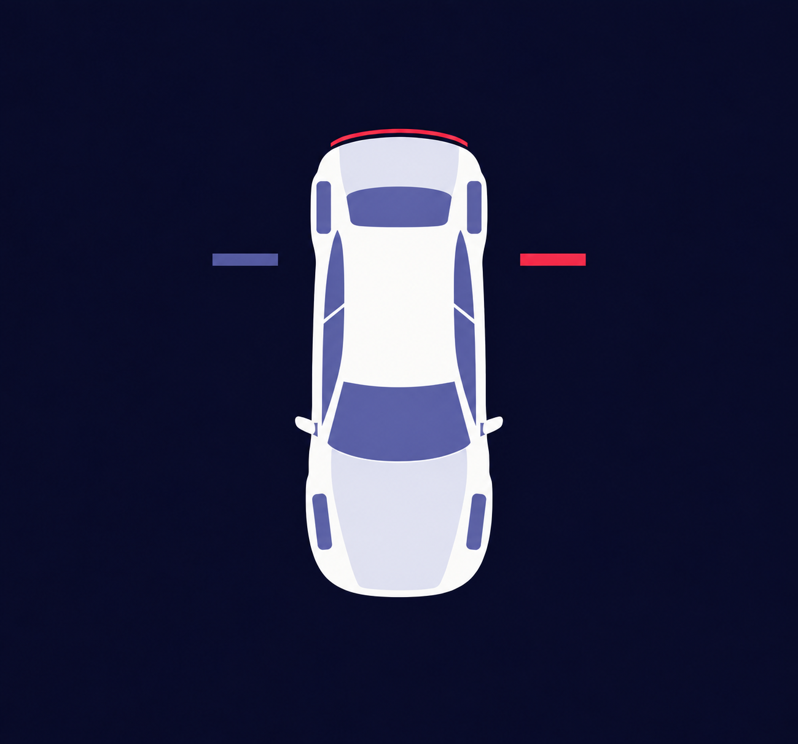
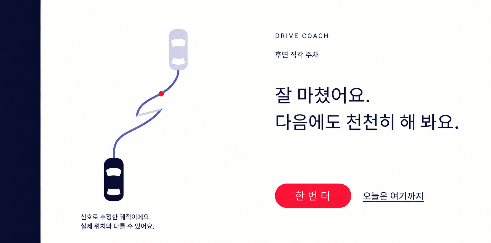

사용자 선택 결과: **B · 고정 바퀴 + 방향 호 + 얇은 후진 셰브론** (2026-09-27 확정). Done 궤적 시안은 그대로 진행.

# 라운드 3 — 탑뷰 차 도식과 Done 추정 궤적

2026-09-27 · [디자인 발주서](../../handoffs/2026-09-27_codex_design_topview.md) · [영상 피드백 #7·#8·#16](../03_round2_feedback.md) · [기하학 포스터 시각 규칙](../geometric-poster-development/README.md)

내장 `image_gen`으로 만든 디자인 비교용 PNG다. 앱 코드·Compose·계측·리소스는 수정하지 않았다. 차 도식은 Canvas로 옮길 형태를 고르는 단계이고, Done의 경로는 배치를 검토하기 위한 예시다. 실측 주차 경로나 앱 캡처가 아니다.

## 파일과 프롬프트

| 안 | PNG | 생성·수정 프롬프트 | 실제 PNG 크기 | 설계 영역 |
|---|---|---|---|---|
| B · 고정 바퀴와 방향 호 | [b-steering-arc.png](b-steering-arc.png) | [전체 프롬프트](b-steering-arc-prompt.txt) | 1299 × 1211 | 1360 × 1268, 주차 화면 왼쪽 약 53% |
| C · 기울어진 캡슐 | [c-tilted-capsule.png](c-tilted-capsule.png) | [전체 프롬프트](c-tilted-capsule-prompt.txt) | 1299 × 1211 | 동일 |
| D · 좌우 방향 마커 | [d-direction-markers.png](d-direction-markers.png) | [전체 프롬프트](d-direction-markers-prompt.txt) | 1299 × 1211 | 동일 |
| Done · 추정 궤적 | [done-estimated-path.png](done-estimated-path.png) | [전체 프롬프트](done-estimated-path-prompt.txt) | 1780 × 883 | 2560 × 1268, 전체 앱 영역 |

생성 원본의 해상도를 보존했다. 위 설계 영역에 비례 배치하는 시안이며 픽셀 단위의 구현 도면은 아니다. 프롬프트에는 요청한 치수·각도와 최종 결과로 이어진 수정 지시를 함께 보존했다.

## 탑뷰 비교

공통 방향은 **뒤가 위, 앞이 아래**다. B·D는 같은 차체 계열로 보닛·트렁크·앞뒤 창과 측면 유리·사이드미러를 구분한다. C는 바퀴와 미러를 생략한다. 남색 배경에 차 하나만 두었고 글자·숫자·화살표 글리프는 없다.

발주서가 허용한 3–4안 중 **B·C·D 세 안을 납품 후보로 선정**했다. A의 앞바퀴 직접 회전도 생성·수정했지만 두 앞바퀴가 서로 반대 방향으로 기울어지는 오류가 반복되어 후보에서 제외했다. 잘못된 회전 도식을 완성안으로 전달하지 않는다. 공통 차체를 만드는 데 사용한 초기 생성과 수정 지시는 B·D의 프롬프트에 보존했다.

| 안 | 조향과 후진 표현 | Canvas 도형 예상 수¹ | 왼쪽 끝 / 오른쪽 끝 판독 검토 | 텍스트 없는 후진 판독 | 판단 |
|---|---|---:|---|---|---|
| **B** | 바퀴 고정. 차 앞 보랏빛 호 하나. 뒤쪽 얇은 셰브론 하나 | 약 17–21 | 앞 호를 화면 오른쪽 / 왼쪽으로 휜다. 작은 바퀴보다 큰 곡선의 좌우 차이가 빨리 보인다 | 위를 향한 열린 셰브론이 이동 방향을 가장 직접적으로 암시한다. 화살표 줄기 없이 균형을 잡음 | **우선 추천**. 조향은 보랏빛, 후진은 빨강으로 역할이 분리됨 |
| C | 바퀴 없음. 차체 전체 ±8° 기울기. 뒤에 짧은 빨간 점선 | 약 9–11 | 앞쪽 끝이 화면 오른쪽 / 왼쪽으로 이동한다. 실루엣 차이는 크지만 ‘조향 입력’보다 ‘이미 돌아선 차’로 읽힐 위험이 있다 | 뒤쪽 점선은 움직임을 암시하지만 잔상인지 진행 방향인지 모호하다 | 도형 수가 가장 적음. 실제 차 자세로 오해할 수 있어 추천 순위 낮음 |
| D | 고정 바퀴. 좌우 짧은 마커 중 활성 쪽 빨강. 뒤 가장자리 빨간 선 | 약 18–22 | 명령 ‘왼쪽’이면 왼쪽 마커, ‘오른쪽’이면 오른쪽 마커를 활성화. 활성 위치 자체는 즉시 구분된다 | 뒤쪽은 드러나지만 제동등·경계 강조로도 읽힐 수 있다. 조향 마커도 빨강이라 두 역할이 경쟁한다 | 명령 판독은 쉽지만 좌표 기준과 빨강의 의미가 복잡해짐 |

¹ 배경·글자 제외. 차체 Path, 보닛·트렁크 면, 유리 면, 미러 두 개, 바퀴 네 개, 방향 도형 등을 각각 한 번의 그리기로 잡은 대략값이다. 구현하거나 성능을 측정한 수치는 아니다.

PNG는 오른쪽 조향 예시다. B·C의 좌우는 **운전자 기준**이므로 앞이 아래인 화면에서는 반전된다. 왼쪽 끝은 호·차 앞쪽이 화면 오른쪽, 오른쪽 끝은 화면 왼쪽이다. D는 발주서대로 **명령의 좌우를 화면 좌우 마커에 직접 대응**한 별도 비교안이다. 이 참조축 차이도 B를 추천하는 이유다. 좌우 전환 규칙을 정적 검토했으며 실제 운전자 판독 시험이나 애니메이션 검증을 한 것은 아니다.

‘끝까지’의 정확한 상태는 앱의 기존 조향 문장이 전달한다. C의 ±8°는 후속 구현에서 입력을 보여 줄 시각 범위이며 핸들 450°를 차체에 그대로 적용하는 뜻이 아니다. 생성 시안의 기울기를 각도 측정 도면으로 사용하지 않는다. B의 호 역시 **조향 방향 기호**이며 예측 경로·주차 유도선이 아니다.

### B · 방향 호 + 얇은 셰브론 — 추천

### C · 캡슐 기울기 + 짧은 점선

### D · 좌우 방향 마커 + 뒤 가장자리 선

## Done · 추정 궤적

흰 바탕과 왼쪽 세로 남색 띠를 유지하면서 왼쪽에 경로 영역을 확보했다. 시작 차는 옅게, 끝 차는 진하게 표시한다. 후진 선은 Periwinkle, 짧은 전진 보정 선은 Lavender이며, 중간 두 번의 되돌림으로 후진 → 전진 보정 → 후진을 표현했다. 급정지 예시 지점은 작은 빨간 점 하나다. 주차 칸·도로·장애물·지도·척도는 그리지 않았다.

Maneuver의 차는 뒤가 위지만, Done은 **시작 방향이 위**인 좌표계를 따른다. 따라서 이 시안의 시작 차 앞쪽은 위이며, 두 화면의 위아래가 다른 것은 의도한 구분이다. 실제 구현에서는 전달받은 `(x, y, heading)`과 전후진 구간 정보를 그대로 표시해야 한다. 겹치는 경로를 잘 보이게 하려고 좌표를 임의로 벌리거나 시안의 곡선으로 대체하지 않는다. 이 PNG의 경로는 실제 샘플 열로 계산한 결과가 아니다.

추정 안내 문구는 경로 아래에 다음 두 줄로, **2560 × 1268 기준 32sp** 자리를 확보했다.

> 신호로 추정한 궤적이에요.
> 실제 위치와 다를 수 있어요.

오른쪽은 응원과 조언 두 문장, 빨간 `한 번 더`, 밑줄 텍스트 `오늘은 여기까지`의 위계를 유지했다. 시연 패널·회차 수치·점수·이동 횟수·시간은 없다. 생성 이미지의 글꼴과 자간은 견본이며 앱은 시스템 글꼴을 사용한다.

Done의 경로와 차 실루엣은 텍스트를 제외하면 약 10–14개 도형으로 옮길 수 있다(차 두 개 약 6–10, 연속 기어 구간별 Path 세 개, 빨간 원 하나). 실제 Path 내부 점 개수는 입력 데이터에 따라 늘어난다. 급정지 점은 발주서가 요청한 예시이며 현재 `PathPoint` 자체에 급정지 플래그가 있다고 가정하지 않는다. 이벤트를 입력점과 연결하는 일은 후속 앱 구현 범위다.

## 제작과 검증

- 내장 `image_gen` 사용. CLI/API 대체 경로, 수동 도식 합성, 앱 코드 생성은 사용하지 않았다.
- A 차체를 먼저 생성·단순화하고 B·D의 비교 기준으로 사용했다. C는 별도 생성했다. Done은 [라운드 2 캡처](../../screenshots/lesson/lesson-done.png)를 배치·행동 위계 참고로 사용하고 경로를 수정했다.
- 프롬프트의 색 지정은 `#070827`, `#FCFCFA`, `#5B60A1`, `#E5E6F0`, `#F52D48` 다섯 가지다. 평면 도형을 기준으로 검토했다. 생성 래스터에는 미세한 색 편차와 가장자리 보간이 있으므로 Canvas 색은 PNG에서 추출하지 않고 이 다섯 토큰을 사용한다.
- 각 PNG를 열어 차 앞뒤·바퀴/호/마커·후진 도형·글자 유무, Done의 안내 문구·시작/끝·보정 구간·급정지 점·주차 칸 없음·패널 없음을 확인했다. 실제 좌우 판독 속도·실차 시인성·경로 정확도 검증은 하지 않았다.
- `origin/main`의 `955adfa`에서 `codex/design-topview` 생성. 변경 범위는 이 폴더의 PNG·짝이 되는 프롬프트·README뿐이다.
- 저장소 공통 완료 기준: `./gradlew.bat assembleDebug testDebugUnitTest` 성공. 단위 테스트 141개, 실패·오류·건너뜀 0(Gradle 테스트 결과 캐시 사용). 디자인 이미지의 동작 검증을 의미하지 않는다.
- 이번 PR은 디자인 시안 전달이다. `lesson_shots`와 `emu_flow`를 재실행하거나 앱 캡처를 교체하는 일은 선택안의 화면 구현 단계에서 진행한다.
