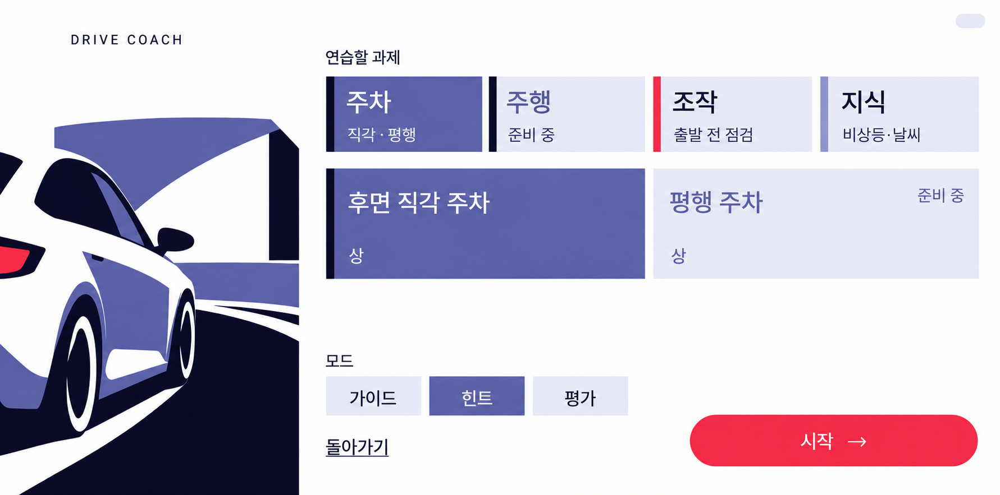
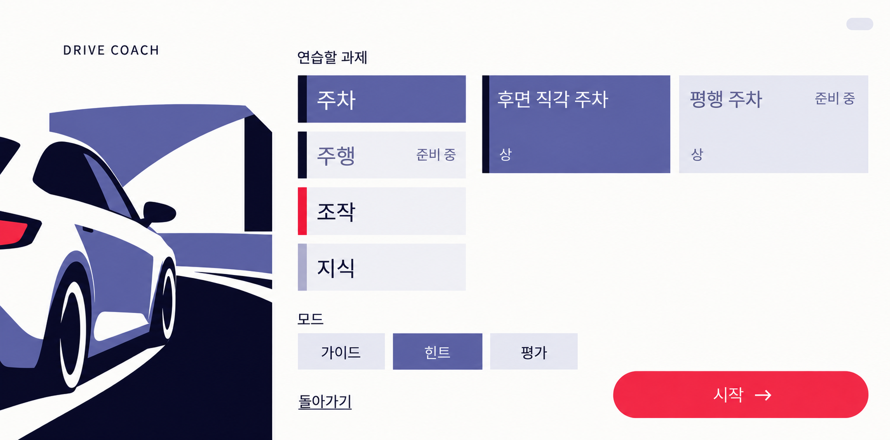
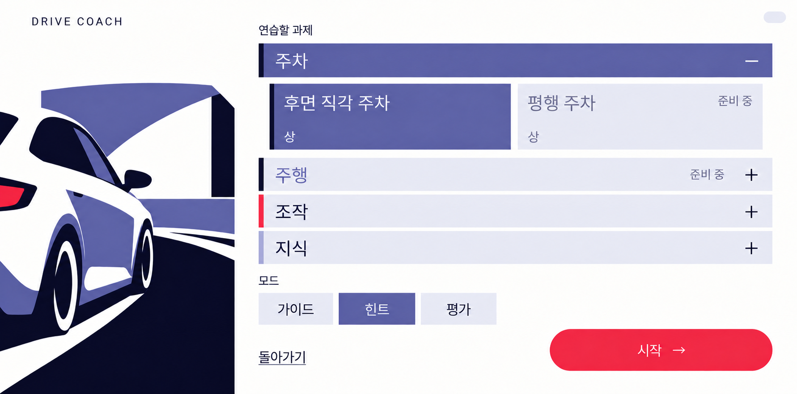
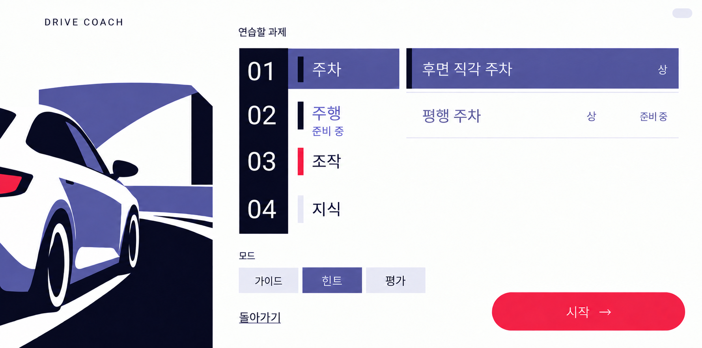

사용자 선택 결과:

# 과제 시트 — 카테고리 → 세부 과제 시안

**현재 검토할 시안: [A 구조 기반 새 디자인 3안](a-refinements/README.md).** 사용자는 초기 A의 접근성과 가로 2단 구성을 선호했고, 선택 대비·계층 구분·세부 항목 4개·확연히 다른 블록 디자인을 요청했다. 후속 세 안은 폴더와 목록 / 원형과 주차 칸 / 큰 글자와 티켓이다. 아래 A~D는 초기 비교 이력이며, 최종 디자인 선택은 아직 정하지 않았다.

2026-09-28 · `codex/design-sheet` · 기준 `origin/main=a6c0421`.

[디자인 발주서](../../handoffs/2026-09-28_codex_design_sheet.md)와 [라운드 6 구조·불변](../../handoffs/2026-09-28_codex_ui_round6.md)을 바탕으로 만든 **선택용 이미지 4안**이다. 첫 줄의 선택 결과는 비워 두었으며 사용자 선택 뒤 Claude가 채운다.

모두 **주차 펼침 → 후면 직각 주차 선택 → 힌트 선택** 상태다. 카테고리는 주차·주행·조작·지식 순서이며, 주행과 평행 주차에만 `준비 중`을 표시한다. 모드·돌아가기·시작은 화면 아래에 항상 보인다. 왼쪽 자동차 영역 약 30%, 오른쪽 시트 약 70%를 유지했다.

## 비교·검토

| 안 | 계층이 한눈에 읽히는가 | 과제가 15개로 늘면 | 첫 렌더의 힌트·시작 | Compose로 옮길 부품 | 기하학 포스터와의 정합 |
|---|---|---|---|---|---|
| **A · 두 줄 카드** | 위의 작은 카테고리 카드와 아래의 큰 과제 카드가 두 층을 만든다. 선택색이 두 번 반복되어 층 간 간격이 중요하다. | 카테고리 4장은 고정, 아래 과제만 `LazyRow`. 한 번에 최대 3장, 다음 카드 일부로 가로 스크롤을 알린다. | 둘 다 보임. 과제 목록과 분리한 고정 하단 영역. | 카테고리 카드 4 + 과제 카드 2. 카드 2종, 가로 목록 1개. | 현재 시트와 가장 자연스럽게 이어진다. 카드가 늘면 관리 화면처럼 보이기 쉬워 빈 슬롯을 그리지 않는다. |
| **B · 왼쪽 세로 탭** | 시트 안의 왼쪽 카테고리와 오른쪽 과제가 공간적으로 분리되어 대응이 명확하다. | 탭은 고정하고 오른쪽 `LazyVerticalGrid` 2열만 스크롤. 많은 과제와 긴 제목을 가장 안정적으로 수용한다. | 둘 다 보임. 그리드의 높이를 제한해 하단을 고정한다. | 세로 탭 4 + 과제 카드 2. 탭 1종, 카드 1종, 그리드 1개. | 정돈되어 있지만 설정·관리 화면에 가장 가깝다. 카드 테두리와 빈 자리 표시를 추가하지 않는 편이 맞다. |
| **C · 아코디언** | 열린 주차 행 바로 밑에 들여쓴 과제가 있어 부모·자식 관계가 직접 읽힌다. | 펼친 과제 행을 가로 스크롤한다. 카테고리를 하나만 열어 두고 모드·하단은 고정한다. 긴 목록을 세로로 전부 펼치면 불변을 깨뜨릴 수 있다. | 주차 카드 2장 상태에서 모두 보임. 카테고리 4행도 한 화면에 들어온다. | 펼침 헤더 4 + 과제 카드 2. 헤더 1종, 카드 1종, 펼침 영역 1개. | 수평 색면의 리듬이 포스터와 잘 맞는다. 반복 띠가 조밀해지는 것이 약점이라 행 높이와 여백을 지켜야 한다. |
| **D · 포스터 번호** | 남색 번호 띠와 카테고리, 오른쪽 제목 목록으로 층을 나눈다. 번호가 과제 수로 오해되지 않도록 검토가 필요하다. | 번호·카테고리는 고정, 오른쪽 `LazyColumn`만 스크롤. 카드보다 세로 밀도를 높이기 쉽다. | 둘 다 보임. 번호 영역과 과제 목록 아래에 고정한다. | 번호 포함 카테고리 행 4 + 과제 목록 행 2. 행 2종, 구분선, 목록 1개. 과제 카드 없음. | 큰 숫자·남색 면·넓은 여백이 가장 포스터답고 조용하다. 장식 번호의 규칙 예외가 필요하다. |

각 안의 공통 부품은 모드 칩 3개, 돌아가기 텍스트 행동, 시작 알약, 무텍스트 시연 알약이다. 표의 스크롤·부품 설명은 구현 검토이며 이번 PR에서 구현한 동작이 아니다.

**D의 `01 02 03 04`는 ‘숫자 없음’ 규칙의 예외 후보**다. 과제 수·점수·회차 값이 아니라 카테고리 장식 인덱스다. 사용자가 D를 고른 뒤에만 규칙 예외를 기록한다. A·B·C 화면에는 숫자가 없다.

## 시안과 프롬프트

| 안 | PNG | 실제 PNG 해상도 | 최초 생성·수정 프롬프트 |
|---|---|---|---|
| A · 두 줄 카드 | [a-two-row-cards.png](a-two-row-cards.png) | 1781 × 883 | [a-two-row-cards-prompt.txt](a-two-row-cards-prompt.txt) |
| B · 왼쪽 세로 탭 | [b-vertical-tabs.png](b-vertical-tabs.png) | 1782 × 883 | [b-vertical-tabs-prompt.txt](b-vertical-tabs-prompt.txt) |
| C · 아코디언 | [c-accordion.png](c-accordion.png) | 1782 × 883 | [c-accordion-prompt.txt](c-accordion-prompt.txt) |
| D · 포스터 번호 | [d-poster-numbers.png](d-poster-numbers.png) | 1780 × 883 | [d-poster-numbers-prompt.txt](d-poster-numbers-prompt.txt) |

### A · 두 줄 카드

### B · 왼쪽 세로 탭

### C · 아코디언

### D · 포스터 번호

## 제작 기준과 확인 범위

내장 **`image_gen`**으로 최초 생성과 국소 수정을 수행하고 최종 PNG를 그대로 복사했다. 각 `-prompt.txt`에는 실제 사용한 최초 프롬프트와 수정 프롬프트를 순서대로 보존했다. 최초 입력 순서는 [기존 시트 캡처](../../screenshots/lesson/lesson-setup-sheet.png) → [poster_car](../../../automotive/src/main/res/drawable-nodpi/poster_car.webp)이며, 수정은 직전 생성 이미지만 입력했다. [기하학 포스터 시각 규칙](../geometric-poster-development/README.md)을 따랐다.

설계 좌표는 **2560 × 1268**, 시트는 **1792 × 1268**이다. 생성 도구가 반환한 실제 PNG는 위 표의 축소 해상도이며 2560 × 1268 원본이 아니다. PNG의 크기·색상 픽셀·글자 크기를 실제 앱의 dp/sp 검증으로 간주하지 않는다. 생성 과정의 미세한 색면 편차와 글자 두께는 구현 규격이 아니다.

구현 기준은 Ink `#070827`, Paper `#FCFCFA`, Periwinkle `#5B60A1`, Lavender `#E5E6F0`, Signal `#F52D48`의 5토큰, 지식 띠의 Periwinkle 40%다. 그라데이션·질감·그림자는 도입하지 않는다. Regular 글꼴을 기본으로 눈썹·보조 최소 32sp, 본문 40sp, 제목 56~72sp를 적용한다. A의 카테고리 160dp·과제 220dp, 모드 칩 220 × 96dp, 시작 높이 140dp·폭 720dp 이상, 시연 알약 64 × 32dp는 선택 뒤 Compose에서 정확히 적용할 값이다.

눈으로 카테고리 순서, 주차 펼침, 선택 상태, 한글 문구, 준비 중 표시, 하단 행동의 노출을 검토했다. B의 잘못 생성된 지식 준비 중 표시와 B·C의 중복 유형 문구를 제거했고, 카테고리 띠·D 선택색과 준비 중 표시도 보정했다. 실제 터치·접근성·잠금·스크롤은 후속 구현에서 계측한다. 이번 제출은 주차 상태 4장이며 선택적인 주행 펼침 추가 이미지는 포함하지 않는다.

초기 비교 자료는 PNG 4장 + 같은 이름의 `-prompt.txt` 4개 + 이 README다. 후속 비교 3장과 프롬프트·검토는 `a-refinements/`에 보존했다. 앱 코드·Compose·계측·리소스·상위 문서는 변경하지 않았다. 저장소 기본 확인으로 PowerShell `assembleDebug testDebugUnitTest` 성공(단위 테스트 155개, 실패·오류 0; 로그 `build/design-sheet-build.txt`). 이는 시안 UI가 구현되어 테스트되었다는 뜻은 아니다.
