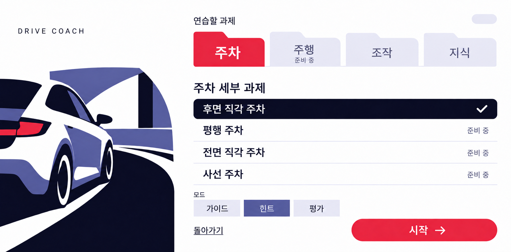
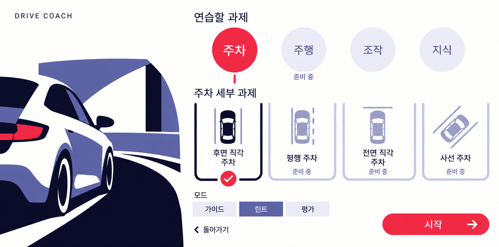
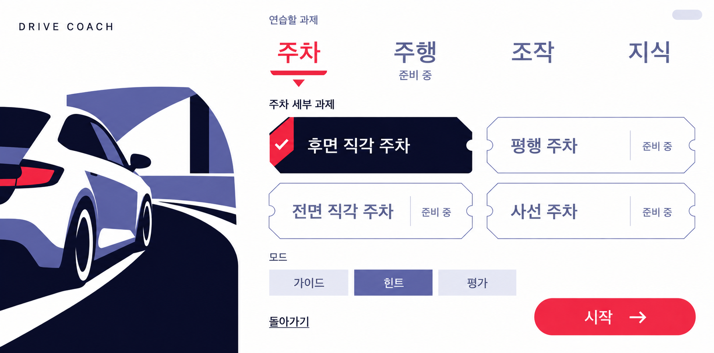
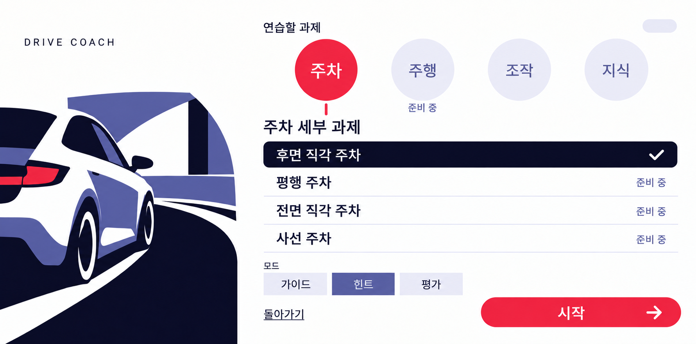

사용자 선택 결과: 5번 · 큰 글자와 주차 칸 — 3번 상단 + 2번 하단 (`05-type-bays.png`, 2026-09-28 확정).

# A 구조를 바탕으로 한 새 디자인 3안과 조합안

**최종 선택: 3번의 큰 글자형 상단 + 2번의 주차 칸 도식형 하단을 합친 5번 조합안.** 상위는 빨간 글자·밑줄·아래 화살표로 주차 선택을 표시하고, 하위는 남색 주차 칸 윤곽과 체크로 선택을 표시한다. 세부 과제 4개·힌트·시작을 한 화면에 유지했다. 사용자가 이 조합을 확정했으며 라운드 6 구현의 디자인 기준으로 삼는다.

### 5 · 큰 글자와 주차 칸 — 최종 선택안

[전체 생성 프롬프트](05-type-bays-prompt.txt) · 입력 순서: [3번 상단 참고](03-type-tickets.png) → [2번 하단·전체 프레임](02-round-bays.png).

배경 없는 큰 글자 메뉴와 자동차 도식이 있는 주차 칸을 형태로 구분한다. 주차만 빨강으로 강조하고 다른 카테고리는 톤을 낮췄다. 하위 네 칸은 2번의 가로 배치를 유지했다. 항목이 늘면 과제 영역만 가로 스크롤하고 하단 컨트롤을 고정하는 구성이다. 실제 구현에서는 긴 제목의 줄바꿈과 미선택 메뉴의 글자 대비를 확인해야 한다.

2026-09-28 · 사용자 피드백: 기존 A의 접근성과 가로 2단 구조를 선호. 상위 카테고리와 세부 과제의 구분, 선택한 주차의 포인트 컬러, 미선택 카테고리의 낮은 불투명도, 세부 과제 4개, 확연히 다른 블록 디자인을 요청했다. 이후 **3번 상단 + 2번 하단 조합을 최종 선택**했다.

## 공통 변경

- 상위 `주차`만 Signal 빨강으로 강조하고, 다른 카테고리의 바탕과 글자 톤은 낮췄다. 글자는 읽을 수 있는 대비를 남기는 방향이다.
- 아래에 `주차 세부 과제` 제목과 별도 영역을 두었다. 선택한 세부 과제는 Ink 남색 + 체크로 표시해 상위 선택과 구분한다.
- 후면 직각 주차·평행 주차·전면 직각 주차·사선 주차 **네 항목을 한 화면에 표시**한다. 전면 직각·사선은 항목 수 확장을 비교하기 위한 **시안용 예시**이며 현재 앱 시드에 존재하지 않는다. 평행·전면 직각·사선은 준비 중으로 표현했다. 앱 데이터는 추가하지 않았다.
- 주차·주행·조작·지식의 상위 순서, 힌트 선택, 모드·돌아가기·시작 노출을 유지했다. 그림의 형태도 손쉽게 구별되도록 기존 직사각 카드·색 띠 규칙에서 벗어난 세 방향을 제안한다.

## 세 안 비교

| 안 | 상위 / 하위의 디자인 차이 | 선택 상태가 읽히는 방식 | 장점과 검토점 | 항목 증가·구현 검토 |
|---|---|---|---|---|
| **1 · 폴더와 목록** | 폴더 모양 탭 / 넓은 가로 목록 행 | 빨간 폴더 / 남색 선택 행과 체크 | 부모 안의 목록이라는 관계가 가장 직접적이다. 긴 제목을 한 줄로 읽기 쉽고 시각 장식이 적다. 네 항목이 세로 공간을 많이 쓴다. | 폴더 탭 + 목록 행 2종. 목록 영역만 세로 스크롤하고 모드·시작을 고정한다. |
| **2 · 원형과 주차 칸** | 원형 카테고리 / U자 주차 칸과 작은 도식 | 빨간 원 / 짙은 칸 윤곽과 체크 | 상·하위 형태 차이가 가장 크고 자동차 주제와 연결된다. 도식이 선택 의미를 돕지만 네 열에서 긴 제목이 두 줄이 된다. | 원형 탭 + 도식 과제 항목 2종. 과제 열만 가로 스크롤. 도식은 설명 그림이며 실측 주차 위치나 차량 신호를 나타내지 않는다. |
| **3 · 큰 글자와 티켓** | 배경 없는 글자 메뉴 / 모서리를 잘라낸 티켓 2×2 | 빨간 글자·밑줄·화살표 / 남색 티켓과 체크 | 네 과제를 큰 글자로 비교하기 쉽고 색면이 적다. 티켓의 잘린 모서리와 홈이 장식으로 과해지지 않도록 확인한다. | 글자 탭 + 티켓 행 2종. 세부 영역의 2열 그리드만 스크롤하고 하단을 고정한다. |

읽는 흐름을 우선하면 **1안**이 가장 명확하다고 판단한다. 모양 자체의 차이를 원하면 **2안**, 네 과제의 큰 글자와 카드 형태를 함께 원하면 **3안**이 맞는다. 이는 시안에 대한 검토 의견이며 실제 운전자 접근성 테스트 결과가 아니다.

### 1 · 폴더와 목록

[전체 생성·수정 프롬프트](01-folder-rows-prompt.txt)

### 2 · 원형과 주차 칸

[전체 생성·수정 프롬프트](02-round-bays-prompt.txt)

### 3 · 큰 글자와 티켓

[전체 생성·수정 프롬프트](03-type-tickets-prompt.txt)

### 4 · 원형과 목록 — 정정 전 조합 이력

2번 상단과 1번 하단을 합친 이전 조합이다. 사용자 정정과 최종 선택에 따라 구현 기준은 위의 5번이다.

[전체 생성 프롬프트](04-round-rows-prompt.txt) · 입력 순서: [2번 상단 참고](02-round-bays.png) → [1번 하단·전체 프레임](01-folder-rows.png).

## 제작·확인

내장 `image_gen`을 사용했다. 처음에는 [poster_car](../../../../automotive/src/main/res/drawable-nodpi/poster_car.webp)만 자동차 참고로 주어 새 블록 디자인을 생성했고, 정돈 단계에서 생성 시안과 [기존 A](../a-two-row-cards.png)를 넣어 공통 하단 컨트롤과 브랜드 글자를 맞췄다. 최종 PNG는 생성 결과를 그대로 복사했으며, 같은 이름의 `-prompt.txt`에 실제 프롬프트를 순서대로 보존했다.

설계 기준은 전체 앱 2560×1268, 왼쪽 자동차·오른쪽 시트의 약 30/70 구도다. 실제 PNG는 아래 크기의 생성 시안으로, 정확한 dp/sp·알파·터치 크기 검증을 대체하지 않는다. 5색 토큰과 그 불투명도 혼합을 사용하도록 지시했으며 실제 구현에서는 글자 Regular, 최소 32sp, 시작 높이 140dp·폭 720dp 이상 등 기존 규격을 다시 정확히 적용해야 한다.

| 파일 | 실제 PNG 크기 |
|---|---|
| `01-folder-rows.png` | 1781 × 883 |
| `02-round-bays.png` | 1781 × 883 |
| `03-type-tickets.png` | 1781 × 883 |
| `04-round-rows.png` | 1781 × 883 |
| `05-type-bays.png` | 1780 × 883 |

네 과제의 문구, 빨간 상위 선택, 남색 하위 선택과 체크, 준비 중 표시, 힌트·시작 노출을 이미지로 확인했다. 이 폴더에는 기본 세 안과 조합안 두 개의 PNG 5장·프롬프트 5개·이 README가 있다. 조합안도 내장 `image_gen`으로 생성했으며 다른 시안은 그대로 보존했다. 5번은 3번의 글자 메뉴와 2번의 주차 도식·전체 프레임을 입력으로 사용했다. 코드·계측·리소스 변경은 없다. PowerShell 빌드·단위 테스트 명령 성공(69개 작업 UP-TO-DATE; 기존 155개 테스트 결과 실패·오류 0). 최신 로그는 `build/design-sheet-corrected-hybrid-build.txt`에 있다.
