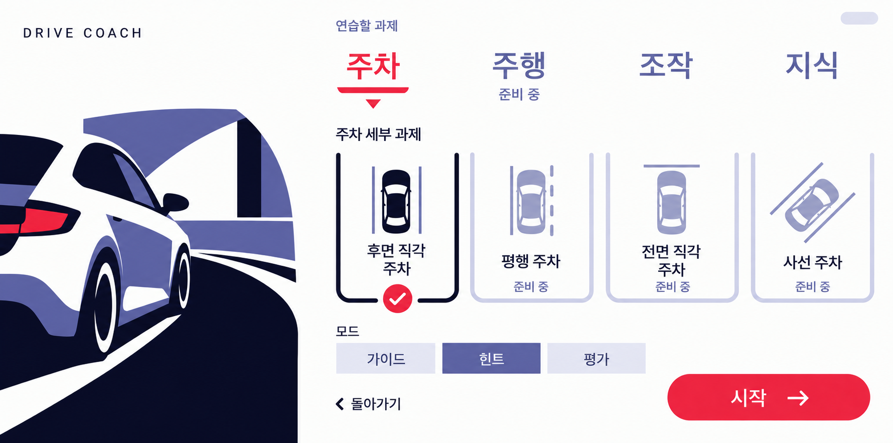
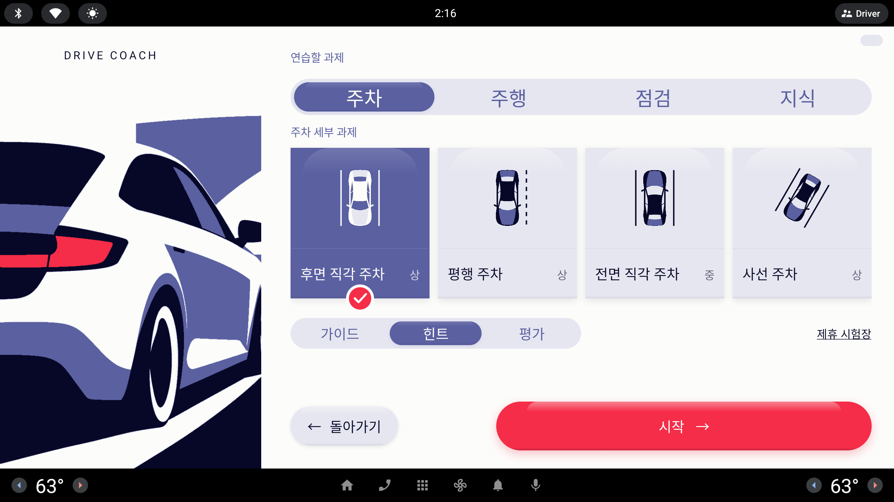

# 화면 검증 캡처

## UI 라운드 22 — 선택 트랙·완료 위치·상세 지표 (2026-10-05)

`codex/ui-round22` · 기준 `origin/main=75dbdf8`(#178) · [발주서](../../handoffs/2026-10-05_codex_ui_round22.md) ①~⑥. 외부 Fake, 배율 1.0, 2560×1440. 공용 에뮬의 다른 자동화 접속과 앱 종료가 반복돼 동일한 `CSTDe_API_34` 시스템 이미지·화면·메모리 설정으로 만든 임시 AVD(`emulator-5556`, user 10)에서 최종 검증했다. `ANDROID_SERIAL`만 지정하며 원본 tools는 수정하지 않았다.

| 항목·시안 | 캡처 | 확인한 것 |
|---|---|---|
| ① 시험장 선택 | [선택·시간·코스](lesson-venue-slots.png), [예약됨](lesson-venues-booked.png) | 선택 바탕 Periwinkle/SelectedCard, 이름·코스 Paper, 상태 Paper 80%/예약됨 Signal. 빨간 테두리 제거, Ink 지도·Signal 경로와 selected 시맨틱·바탕 픽셀 검사 |
| ② Done 알약 | [주차 3프레임](lesson-done-settle-strip.png), [점검 3프레임](lesson-done-checklist-settle-strip.png), [코스 3프레임](lesson-done-course-settle-strip.png) | 원인: 이전 단계 자막 푸터가 사라지며 가중치 영역이 늘어남. 조치: 발주서 (나)대로 Done에서는 이전 자막을 그리지 않고 회차 멘트를 표시. 실제 Compose 시계 0/500/1000ms의 y 좌표 동일 검사. 기존 완료 버튼 두 번 펄스와 궤적 재생 유지 |
| ③ 지표 목록 · [6-B](../../design/round22-proposals/6-details-badge.html) | [실제 두 회차](lesson-details-session.png), [두 회차](lesson-details.png), [변화량](lesson-details-comparison.png), [한 회차](lesson-report-parking-perfect.png), [셋 이상](lesson-details-history.png), [미측정](lesson-details-multiple-missing.png), [코스](lesson-report-exam-details.png) | 시안 B의 숙련/안전 머리와 라벨 32sp Muted·값 36sp Ink 목록. 이동·시간·조향·기어·근접·급정지·편차를 행별로 정렬하고 변화량은 값 왼쪽. 미측정은 값 자리에 표시. 코스 감점 표·이전/다음 회차 보존 |
| ④ 하단 공통 규칙 | [진단서](lesson-certificate.png), [시험 진단서](lesson-certificate-exam.png), [과제 시트](lesson-setup-sheet.png), [예약](lesson-venue-slots.png), [퀴즈 결과](lesson-quiz-done-results.png) | BottomActions에서 보조 왼쪽·주 오른쪽·최소 64dp. 주 알약의 선호 최소 폭 1075.2dp는 남은 폭에 맞춰 양보. 진단서는 돌아가기 옆 출처 줄과 그 오른쪽 아래 다시 시작으로 배치. 글자 링크 유지 |
| ⑤ [3-C 알약 트랙](../../design/round22-proposals/3-mode-spacing.html) | [주차](lesson-setup-sheet.png), [전면](lesson-setup-sheet-front.png), [주행](lesson-setup-sheet-driving.png), [점검](lesson-setup-sheet-checklist.png), [지식](lesson-setup-knowledge.png), [시험장](lesson-venue-slots.png) | 분류·모드·시간·코스를 SelectionTrack으로 공유하되 색 인자를 분리. 모드 눈썹 제거, 카드 행 아래 24dp·높이 88dp·절반 폭, 같은 줄 오른쪽 제휴 시험장. 시간/코스는 전체 폭·88dp·사이 16dp. 시트 버튼 위치·크기, 숫자 0, selected·자리 없는 시간 클릭 불가 유지 |
| ⑥ [6-B 한 줄 출처](../../design/round22-proposals/6-details-badge.html) | [상세](lesson-details-session.png), [진단서](lesson-certificate.png), [시험 상세](lesson-report-exam-details.png), [시험 진단서](lesson-certificate-exam.png) | 돌아가기 오른쪽 32sp Periwinkle 출처와 아래 28sp Muted 설명. 정확한 배지 접근성 텍스트 유지. 요약 페이지의 기존 출처 블록·실신호/시뮬/미측정 구분 유지 |

[빌드 로그](build-round22.txt): PowerShell `assembleDebug testDebugUnitTest :automotive:assembleDebugAndroidTest` 성공. 단위 테스트 **297개(실패·오류·건너뜀 0)**. 같은 최종 APK로 수정 없는 `tools/lesson_shots.sh` **3회 연속 Lesson contract passed**:

| 실행 | 로그 | 결과 |
|---|---|---|
| 1 | [contract-round22-1.txt](contract-round22-1.txt) | Lesson contract passed |
| 2 | [contract-round22-2.txt](contract-round22-2.txt) | Lesson contract passed |
| 3 | [contract-round22-3.txt](contract-round22-3.txt) | Lesson contract passed |

주차·점검·코스 Done 알약의 첫 세 프레임 y는 **1152 / 1152 / 1152 px**다. 시트 `시작`의 Signal 단색 경계는 변경 전후 모두 **(1421,1152)–(2495,1283)**로 같았다. 한 회차·두 회차·셋 이상·미측정·긴 문구·잠금 숫자/터치 0·선택/비활성·알약 간격을 검사했다. 새 수동 시계 캡처는 기존 상호작용 검사 뒤에서 실행하며 별도 Compose 루트를 정리한다. 반복 검증에서 발견한 기존 `quizQuitFlow`의 단계/접근성 트리 갱신 경합과 코스 계측의 시트 전환(400ms) 중 링크 조회는 기존 `afterUiSettles`로 원래 문항·선택지·링크가 보일 때까지 기다린 뒤 한 번만 클릭하도록 보완했다.

[코스 전용 계측](contract-round22-course.txt) **Round18 contract passed**: 코스 감점 표·미측정·잠금·출처, 코스 Done의 3프레임, 세 시험장의 장내기능 예약을 확인했다. [서초](lesson-venue-exam-venue-seocho.png)·[강남](lesson-venue-exam-venue-gangnam.png)·[분당](lesson-venue-exam-venue-bundang.png)의 4/3/3 코스 트랙과 예약 콜백을 유지한다.

원본 `tools/emu_flow.sh` **PASS·clashes 0·110초**([로그](flow-round22-rear.txt)): **60/55·4구간 → 100/100·2구간**, 필수 힌트 3종·둘째 추가 힌트 0·도어→Report·배지 `실신호 0 · 시뮬레이션 8 · 미측정 0`을 확인했다. 같은 실제 세션의 요약과 상세도 다시 캡처했다.

`adb install -r` 뒤 원본 `tools/course_flow.sh`도 **PASS·종료 코드 0**([로그](flow-round22-course.txt)): **70 불합격·감점 3 → 100 합격·감점 0 → 도어→Report**. 스크립트는 기존 라벨로 Done의 `한 번 더`를 찾아 실행했다.

PNG **42장(39 교체·3프레임 스트립 3 추가)**을 반영했다. 최종 전체 계측의 첫 실행·코스 전용 계측·실제 후면 세션에서 가져왔으며, 변경된 대표 화면과 긴 문구·미측정·한 회차/여러 회차·코스·예약을 확인했다. 내용이 같은 기존 캡처와 왼쪽 도식의 안티앨리어싱 차이만 있는 Done 캡처는 유지했다. 긴 상세 기록·진단서 공유 범위는 기존 스크롤로 접근하고 하단 액션·출처는 고정된다.

APK SHA-256: 앱 `F5616AD4D3E70CCC4DC97DDE1432782CF86273AB5620D4959BFD9F48016BD84B`, 계측 `A5E174EDDD042A3B3B4F89782C1110E9ECB555C79E02888141B3A8B8989DBCED`. 에뮬에 설치된 앱의 해시도 일치했다. 정적 확인: `ui/` Bold 0, `Color(0x`는 기존 CoachStyle의 다섯 토큰만 사용. 분류의 준비 중 글자색·문자열 리소스·라벨 13개·tools·NEXT·차량/포트/채점/상태기계/데이터/빌드 파일 변경 없음.

## 덱용 실제 세션 리포트 (2026-10-05 밤, 라운드 22 최종 APK)

수정 없는 `tools/emu_flow.sh build/round22-rear`를 라운드 22 최종 APK로 실행한 **실제 세션의 0/8/0 · ✓✓✓✓ 리포트**다. 덱용 두 장도 새 지표 목록·한 줄 출처로 갱신했다. 외부 Fake 시나리오이며 실차 관찰이 아니다. 시간·방향 편차는 이번 실행의 실측값이다.

| 캡처 | 화면 |
|---|---|
| [lesson-report-session.png](lesson-report-session.png) | Report — 연습한 회차 02 · 마지막 회차 판정 ✓✓✓✓ · 두 문장 총평 · 배지 `실신호 0 · 시뮬레이션 8 · 미측정 0` |
| [lesson-details-session.png](lesson-details-session.png) | 같은 세션의 `자세히 보기` — 두 회차 카드 나란히(60/55 · 4회 · 51초 · 편차 16° → 100/100 · 2회 · 35초 · 편차 1°, 변화량 칩) |

## UI 라운드 21 — 선택 시안 ①~⑨ (2026-10-05)

`codex/ui-round21` · 기준 `origin/main=c91fc21`(#167 머지 뒤 #171 포함) · 외부 CSTDe_API_34 2560×1440 · 기본 Fake, 배율 1.0. [발주서](../../handoffs/2026-10-05_codex_ui_round21.md)와 [시안 목록](../../design/round21-proposals/index.html)의 사용자 선택을 구현했다. 아래 파일명 링크로 시안과 앱 캡처를 나란히 비교할 수 있다.

| 항목·선택 시안 | 교체·추가 캡처 | 구현·검사 |
|---|---|---|
| ① [시험장 B 지도](../../design/round21-proposals/1-venue-cards.html) | [lesson-venue-slots.png](lesson-venue-slots.png), [lesson-venues-booked.png](lesson-venues-booked.png), [lesson-reservation.png](lesson-reservation.png) | 실제 `TrackCourses.exam` 축소 도면, 선택 카드 빨간 테두리·경로, 거리·코스·자리 안내 확대. 긴 코스 목록과 세 시험장 4/3/3 코스·시간 선택·예약 인자 유지 |
| ② [분류 A 알약 트랙](../../design/round21-proposals/2-category-menu.html) | [lesson-setup-sheet.png](lesson-setup-sheet.png), [lesson-setup-sheet-driving.png](lesson-setup-sheet-driving.png), [lesson-setup-sheet-checklist.png](lesson-setup-sheet-checklist.png), [lesson-setup-knowledge.png](lesson-setup-knowledge.png) | 같은 폭 네 칸, Lavender 트랙·Periwinkle 선택·Paper 글자. 제목 간격과 고정 시작 위치·숫자 0 유지 |
| ③ [돌아가기 B 면](../../design/round21-proposals/3-back-button.html) | [lesson-back-pill.png](lesson-back-pill.png), [lesson-back-pill-pressed.png](lesson-back-pill-pressed.png), [lesson-certificate.png](lesson-certificate.png) | 시트·예약·상세·진단서의 공통 112dp 보조 알약. 주 알약보다 작고 눌림 때 외부 그림자 대신 안쪽 그림자, 기존 `CoachTexture` 값 재사용 |
| ④ [점검 B 막대 + E 순서 점](../../design/round21-proposals/4-checklist-cards.html) | [lesson-maneuver-checklist-pending.png](lesson-maneuver-checklist-pending.png), [lesson-maneuver-checklist-bad.png](lesson-maneuver-checklist-bad.png), [lesson-maneuver-checklist-missing.png](lesson-maneuver-checklist-missing.png), [lesson-maneuver-checklist-mixed.png](lesson-maneuver-checklist-mixed.png) | 숫자 없는 일곱 진행 칸과 세로 점. 가이드 순서·기록된 완료·미수행/미측정/잘못된 시동 구분, 첫 미수행만 떠오르는 카드 |
| ⑤ [상세 A 나란히](../../design/round21-proposals/5-details.html) | [lesson-details-comparison.png](lesson-details-comparison.png), [lesson-details-history.png](lesson-details-history.png), [lesson-report-exam-details.png](lesson-report-exam-details.png), [lesson-details.png](lesson-details.png) | 주차·코스 두 회차와 화살표·변화량 칩. 한 회차는 한 카드, 셋 이상은 마지막 둘과 이전/다음 회차. 코스 점수·합격선·감점 표·감점 없음·미측정 전문 유지 |
| ⑥ [크기 B](../../design/round21-proposals/6-parking-result.html) + [6b B-1·흐린 옆 줄](../../design/round21-proposals/6b-parking-result-minimal.html) | [lesson-done-seed-bad.png](lesson-done-seed-bad.png), [lesson-done-seed-good.png](lesson-done-seed-good.png), [lesson-done-front-good.png](lesson-done-front-good.png), [lesson-done-parallel-good.png](lesson-done-parallel-good.png), [lesson-done-angle-good.png](lesson-done-angle-good.png), [lesson-done-front-empty.png](lesson-done-front-empty.png) | Ink 왼쪽 50%·판정 2×2. 목표 칸 세 변과 Lavender 25% 옆 경계만 표시, 주차장 면 없음. 목표 각도 축 고정·입구는 차량 앞뒤에 맞춤. 차 모양·실측 궤적·재생·급정지·캡션 보존 |
| ⑦ [지식 E 판정 + D 인용](../../design/round21-proposals/7-quiz-answer.html) | [lesson-quiz-answered.png](lesson-quiz-answered.png), [lesson-quiz-correct.png](lesson-quiz-correct.png), [lesson-quiz-done-results.png](lesson-quiz-done-results.png), [lesson-quiz-long.png](lesson-quiz-long.png) | 답한 뒤 큰 판정과 문구, 보기 안쪽 내 답/정답 배지, 큰따옴표 해설 카드·넓은 다음 문제. 열 문항·긴 문구·중도 종료·잠금 터치 0 유지 |
| ⑧ [지도 차](../../design/round21-proposals/8-map-car-size.html) 사용자 지정 ×1.3 | [lesson-drive-exam.png](lesson-drive-exam.png), [lesson-drive-exam-parking.png](lesson-drive-exam-parking.png), [lesson-done-exam-good.png](lesson-done-exam-good.png) | Drive·Done 공통 도면에서 `MAP_CAR_SCALE=1.3` 적용. 기존 데이터의 칸 크기 유지, 잠금·신호등·감점 마커 계약 유지 |
| ⑨ [플레이크 네 곳](../../handoffs/2026-10-05_codex_ui_round21.md) | 아래 연속 실행 로그 | 차선 축소 도면, 시험장 전환, 잠금 해제 Done 멘트, 시트 재열기 하단을 idle 뒤 검사. 원래 단언을 최대 여섯 번·100ms 간격으로 재시도하며 클릭·콜백은 반복하지 않음 |

[최종 빌드](build-round21.txt): PowerShell `assembleDebug testDebugUnitTest :automotive:assembleDebugAndroidTest` 성공, 단위 테스트 **292개(실패·오류·건너뜀 0)**. 기존 Gradle 데몬/캐시 오류를 피하기 위해 `--no-daemon --no-build-cache --no-configuration-cache --no-watch-fs`로 실행했으며 빌드 설정은 변경하지 않았다. 점검의 다음 미수행 선택과 주차 옆 경계의 화면 내 배치를 단위 테스트로 추가했다.

동일한 최종 앱·계측 APK로 수정 없는 `tools/lesson_shots.sh`를 **3회 연속 통과**했다.

| 실행 | 로그 | 결과 |
|---|---|---|
| 1 | [contract-round21-1.txt](contract-round21-1.txt) | Lesson contract passed |
| 2 | [contract-round21-2.txt](contract-round21-2.txt) | Lesson contract passed |
| 3 | [contract-round21-3.txt](contract-round21-3.txt) | Lesson contract passed |

[코스 전용 계측](contract-round21-course.txt) **Round18 contract passed**: 신호등 OFF/null/색·잠금·실제 코스 궤적/마커·차 ×1.3·코스 상세 감점/미측정·평행/사선·세 시험장 예약을 확인했다. 전체 계측은 두 회차 변화량·이전/다음 회차·돌아가기 눌림·전면 D/R 재생도 검증한다. 고정 목표 칸을 기울어진 차와 급정지 점이 가릴 수 있어 전면 입구 점선은 도착 전에도 검사하고, 도착 후에는 보이는 칸 경계와 측정된 차 방향·유리·셰브론을 검사한다. 후면/전면 그리기 위아래 여백은 119/119, 119/119, 118/118px였다.

원본 `tools/emu_flow.sh` **PASS·clashes 0**([flow-round21-rear.txt](flow-round21-rear.txt)): 첫 회차 **60/55·4구간 → 100/100·2구간**, 힌트 세 종류·둘째 추가 힌트 0·도어→Report·배지 `실신호 0 · 시뮬레이션 8 · 미측정 0` 유지. `adb install -r` 뒤 숨김 백그라운드 프로세스의 원본 `tools/course_flow.sh`도 **PASS·종료 코드 0**([flow-round21-course.txt](flow-round21-course.txt)): **70 불합격·감점 3 → 100 합격·감점 0 → 도어→Report**.

PNG **87장(76 교체·11 추가)**을 최종 전체 첫 실행·코스 전용 계측·실제 후면 시연에서 반영했다. 앱 영역 (0,76)–(2560,1344)이 같은 기존 캡처는 유지했으며, 고립된 안티앨리어싱 차이만 있는 화면도 제외했다. 대표 화면과 긴 문구·미측정·점검 출처·시트·예약·눌림 상태를 확인했다. 긴 상세 기록/제약은 기존 세로 스크롤로 접근하고 돌아가기·출처 배지는 고정된다.

APK SHA-256: 앱 `EB15BF88702BBB29E3AD62036AEC755AC48FD32373D8BAA41B76543CB70A5CA5`, 계측 `46BA831E453FAD75F774991EC3DA00A66A16A55E97EE9908370AA0E51CFB21BA`.

정적 확인: `ui/` Bold 0, `Color(0x`는 기존 `CoachStyle.kt`만 사용. 새 색 토큰·문자열 리소스 0. 차량·포트·채점·상태기계·데이터·build 파일·tools·NEXT·시연 라벨 13개 변경 없음.

## UI 라운드 20 — 카드 그림자·간격·퀴즈 종료 (2026-10-05)

`codex/ui-round20` · 기준 `origin/main=6be5be1`(PR #164 포함) · 외부 CSTDe_API_34 2560×1440 · 기본 Fake, 배율 1.0. [발주서](../../handoffs/2026-10-05_codex_ui_round20.md) ①~⑧의 UI 변경을 반영했다. 화면 구조·도식·카드 크기와 기존 `CoachTexture` 값을 유지했다.

| 항목 | 대표 교체·추가 캡처 | 확인 |
|---|---|---|
| ① 카드형 면 | [예약 확인](lesson-reservation.png), [예약된 시험장](lesson-venues-booked.png), [시험장·시간·코스](lesson-venue-slots.png), [점검](lesson-maneuver-checklist-pending.png), [선택지](lesson-quiz-answered.png) | 기존 Card/SelectedCard/Chip 질감. 비활성 시간 칩도 같은 그림자, 클릭 불가·Muted 유지 |
| ① 판정·회차 묶음 | [Done](lesson-done.png), [코스 Done](lesson-done-exam-bad.png), [주차 상세](lesson-details.png), [코스 상세](lesson-report-exam-details.png) | 주차·점검 판정의 기존 Panel 유지, 코스 Done/요약에도 Panel 적용. 회차별 Paper 카드에 기존 그림자, 기존 행/숫자/정렬 유지 |
| ②~④ 과제 시트 | [주차](lesson-setup-sheet.png), [주행](lesson-setup-sheet-driving.png), [점검](lesson-setup-sheet-checklist.png), [지식](lesson-setup-knowledge.png) | 제목→메뉴 8→40dp, 세부 제목→카드 24dp. 세부 제목·모드 32sp Periwinkle. 메뉴 아래 빈 공간과 예약 링크 여백을 조정해 카드 464dp·고정 하단·제휴 시험장 전문 유지 |
| ⑤~⑥ 점검·코치 | [점검 대기](lesson-maneuver-checklist-pending.png), [신호 누락](lesson-maneuver-checklist-missing.png), [코치](lesson-maneuver-guides.png) | `아직`→`미수행`, 기존 상태 판정 유지. 코치/단계 두 라벨의 실제 텍스트 기준선 차이 1px 이내 |
| ⑦ 중도 종료 | [세 문제 뒤 그만하기](lesson-quiz-done-quit-three.png) | 실제 `LessonRoute`·VM으로 세 답 전부 정답→그만하기→QuizDone에 결과 세 개 보존→다시 시작→Setup. 답변 전/후 종료 콜백 각각 한 번도 유지 |
| ⑧ 주 알약 | [다음 문제](lesson-quiz-answered.png), [결과](lesson-quiz-done.png), [Done](lesson-done.png), [진단서](lesson-certificate.png) | Setup 시작의 1075.2dp를 공통 최소 폭으로, 높이 140dp·글자 40sp 통일. 옆 액션이 있는 Done은 남는 폭으로 제한 |

⑦의 발주서 표현 `QuizDone 3/3`과 현재 상태기계에 차이가 있다. `endSession()`은 **정답 세 개와 전체 열 문항**을 전달하므로 실제 화면 분모와 총평은 **3/10**이다. 지시된 연결(`vm::restart`→`vm::endSession`)과 `feature/lesson/` 수정 금지를 따르고, 분모·미응답·총평은 변경하지 않았다. 이 차이를 INTEGRATION C절에 명시했다. 완료한 세 답은 모두 보존되며 미응답은 기존대로 남는다.

[지정 빌드](build-round20.txt): PowerShell `assembleDebug testDebugUnitTest :automotive:assembleDebugAndroidTest` 성공, 단위 테스트 **290개(실패·오류·건너뜀 0)**. 중간 증분 실행에서 Gradle 캐시 포장 오류(`size in header of 0`)가 발생해 [캐시 없는 클린 빌드](build-round20-clean.txt)로 복구한 뒤 최종 지정 명령을 통과했다. 첫 새 계측에서 브리핑 중 Quiz로 캐스팅하던 실패는 단계 전환 폴링으로 고쳤다. 첫 간격 시안에서 예약 링크 잘림을 확인해 메뉴 행의 빈 공간 32dp와 링크 위아래 여백 16dp를 회수했다. 최종 카드 크기·화살표 모양·모드·시작 위치는 유지된다.

[코스 전용 계측](contract-round20-course.txt) **Round18 contract passed**. 기존 OFF/null/신호 색·빈 감점 회차 전문·고정 돌아가기·미측정 규칙, 실제 코스 재생/마커·평행/사선 칸·예약 인자 계약도 통과했다.

같은 최종 APK로 수정 없는 `bash tools/lesson_shots.sh build/round20-final-N`을 **3회 연속 통과**했다.

| 연속 실행 | 전체 계약 로그 | 결과 |
|---|---|---|
| 1 | [첫 실행](contract-round20-1.txt) | Lesson contract passed |
| 2 | [두 번째](contract-round20-2.txt) | Lesson contract passed |
| 3 | [세 번째](contract-round20-3.txt) | Lesson contract passed |

원본 `bash tools/emu_flow.sh build/round20-rear-flow` **PASS·clashes 0·리포트까지 129초**([후면 로그](flow-round20-rear.txt)). 첫 회차 60/55·이동 4구간 → 둘째 100/100·2구간, 안전벨트·뒤 근접·급제동 힌트 3종, 둘째 추가 힌트 0, 도어→Report·배지 `실신호 0 · 시뮬레이션 8 · 미측정 0`을 확인했다.

`adb install -r` 성공 뒤 원본 `bash tools/course_flow.sh build/round20-course-flow`를 숨김 백그라운드 프로세스로 실행해 **PASS·종료 코드 0**([코스 로그](flow-round20-course.txt)). 못한 시험 70점·불합격·뒤로 밀림/검지선 접촉/비상등 미점등 3건 → 잘한 시험 100점·합격·감점 0건 → 도어→Report를 확인했다. 원본 흐름 캡처는 `build/round20-course-flow/`에 보관한다.

PNG **108장(교체 107·추가 1)**: 최종 전체 첫 실행 93장, 코스 전용 11장, 실제 후면 시연 4장. 새 파일은 세 문제 중도 종료 캡처다. 공통 알약·그림자·기준선이 영향을 주는 각 상태와 과거 라운드의 오래된 대표 캡처를 현재 화면으로 교체했다. 본문의 대표 화면과 긴 문구·미측정·예약·모핑을 확인했으며 글자 잘림·버튼 겹침이 없다. Done/점검 Done/QuizDone/Report 세 화면/질감 잠금의 **일곱 PNG는 앱 영역 (0,76)–(2560,1344)이 픽셀 동일**하다. Quiz 잠금은 한 픽셀에서 채널값 3 이하 차이만 있어 교체하지 않았다. Maneuver 잠금도 기존 평면 배경·터치 0 계약을 유지한다.

APK SHA-256: 앱 `855B17733B8A3086633D2CB28AA977123FD4865F816A3648D5282EB769A328B3`, 계측 `9612A85756FF86C64CF40CF60F3C024EBC01EDA0D583DFF78338C82A2D94F006`.

정적 확인: `ui/` Bold 0, `Color(0x`는 기존 `CoachStyle.kt`만 사용한다. 새 색 토큰·문자열 리소스 0. 차량·포트·채점·상태기계·데이터·build 파일·tools·NEXT·시연 라벨 13개 변경 없음.

## 라운드 17 Done 실루엣 통일·전면 카드 양옆 선 (2026-10-04)

`codex/ui-round17` · 기준 `origin/main=cfba077`(#135 포함) · 외부 CSTDe_API_34 2560×1440 · Fake 기본 배율 1.0. [발주서](../../handoffs/2026-10-04_codex_ui_round17.md)의 두 변경을 한 ui PR로 반영했다.

| 대상 | 교체 캡처 | 확인 |
|---|---|---|
| 후면 Done | [대표 Done](lesson-done.png), [고정 궤적](lesson-done-path-contract.png), [도착 전](lesson-done-arrival-empty.png) | 끝 차·재생 차·시작 자세 모두 카드와 같은 실루엣. 차길이 4.5 m·몸체 폭 .43×길이, 후면 표시 방향 유지 |
| 후면 실제 시연 | [못한 주차](lesson-done-seed-bad.png), [잘한 주차](lesson-done-seed-good.png), [궤적](lesson-done-path.png), [기존 시연 파일](16_done_2.png) | 원본 `emu_flow.sh`의 1·2회차 Done. 60/55 → 100/100, 판정·회차 멘트 유지 |
| 전면 Done | [못한 주차](lesson-done-front.png), [잘한 주차](lesson-done-front-good.png) | 큰 앞 유리·미러가 측정된 차체 앞 방향. Ink 몸체·Periwinkle 패널·Lavender 유리, 기존 도착 칸·입구 점선·셰브론·캡션 유지 |
| 전면 재생 | [D 구간](lesson-done-front-replay-d.png), [R 보정](lesson-done-front-replay-r.png) | 같은 차 모양을 유지하며 D는 앞쪽·R은 뒤쪽에 기존 셰브론. 외부 2점 레이아웃 fixture이며 실측 주행 캡처가 아님 |
| 다른 Done 조건 | [긴 문구](lesson-done-long.png), [한 번에](lesson-done-seed-one-go.png), [재보정](lesson-done-seed-repeat.png), [보정 판정](lesson-done-verdict-fix.png), [방향 미측정](lesson-done-verdict-unknown.png), [신호 없음](lesson-done-verdict-missing.png) | 기존 판정·문구·동작을 유지하면서 같은 실루엣과 세로 중심 적용 |
| 전면 카드 선 | [후면 선택 시트](lesson-setup-sheet.png), [전면 선택 시트](lesson-setup-sheet-front.png), [READY fixture](lesson-setup-sheet-ready-contract.png) | 전면의 위 가로선 제거. 후면처럼 양옆 두 줄이며 전면 차 앞이 위인 방향과 선택 색 유지 |
| 시트 전환 | [열기](lesson-setup-morph-strip.png), [닫기](lesson-setup-morph-return-strip.png) | 기존 400 ms 전환·카드 C 배치·질감 B·하단 컨트롤 위치 유지 |

PNG **22장**을 교체했다(최종 첫 계약 PASS의 계측 18장 + 후면 실제 시연 4장). 차가 없는 `seed-many-fixture`·`no-path`와 점검·잠금 캡처는 유지했다. 차·미러·유리·캡션·판정·버튼의 배치를 직접 확인했다. 시작 자세는 선으로 된 차 대신 **Lavender 몸체·Paper 패널/유리 채움**이다. `SmallCarMark.kt`와 `SmallCarGeometry`를 삭제했고, 모든 Done 차가 `vehicleSilhouette`를 호출한다. 공유 경로는 뒤가 위이므로 Done에서만 180° 회전한 뒤 `PathPoint.headingDeg`를 적용한다. 실제 이동 방향과 차체 방향을 구분해 R 보정에서도 앞뒤가 뒤집히지 않는다.

몸체·미러의 기존 경로 명령과 좌표를 `VehicleSilhouetteGeometry`로 옮겨 그리기와 경계 계산이 공유한다. 숫자·순서 불변을 대조했다. `pathVerticalBounds`는 미러 제어점 x −8…108을 포함하며, 회전한 곡선의 실제 극점을 계산하므로 빈 사각 모서리가 여백에 더해지지 않는다. 기존 가로 맞춤·원좌표·3초 재생·도착 칸·셰브론 크기·급제동 점·캡션 간격 64 dp는 유지했다. 계측은 새 미러를 포함한 폭과 기존 도착 칸 안쪽 배치, 시작 채움, 큰 앞 유리 방향·팔레트를 검사한다.

| 최종 장면 계측 | 위 / 아래 여백 | 앞 / 뒤 유리 폭 |
|---|---|---|
| 후면 고정 궤적 | **108 / 109 px** | **47 / 34 px** |
| 전면 못한 주차 | **82 / 83 px** | **46 / 35 px** |
| 전면 잘한 주차 | **114 / 114 px** | **52 / 38 px** |

변경 전 비교는 라운드 16 최종 첫 실행 캡처를 사용했다. `088b8a7`에서 이번 기준 `cfba077`까지 앱·계측·tools 소스 차이는 없다. 앱 영역 `(0,76)–(2560,1344)`에서 후면 Maneuver·좌/우/중립 보조선·전면 D/R 도식·잠금이 **픽셀 동일**하다. 대표 후면/전면 Report는 글자 가장자리 35/43 px에서 채널값 최대 3/2 차이만 있다. 점검의 활성화 버튼 등 실행 시점에 따른 프레임 차이는 도식 비교와 구분했다. Maneuver·Report 캡처는 교체하지 않았다.

지정 PowerShell `assembleDebug testDebugUnitTest :automotive:assembleDebugAndroidTest` 성공, 단위 테스트 **242개(실패·오류·건너뜀 0)**. [빌드 로그](build-round17.txt). 기존 경계 단위 검사는 채워진 시작 차·90° 회전한 미러 극점·180° 앞뒤 극점으로 갱신했다. 앱 SHA-256 `7230D3598DA651C27517E96BF36598714123EDB753B3B8B9CE84229200BF13E6`, 계측 SHA-256 `3A4D0406E40B45BEDF4CCDFB5912ED3154D38B50460394BC3DCECF5294828E50`.

동일 APK로 수정 없는 원본 `tools/lesson_shots.sh build/round17-final-{1,2,3}` **3회 연속 Lesson contract passed**([전체 계약 로그](contract-round17.txt)). 기존 라벨 13개·잠금 숫자/터치 0·판정·퀴즈·예약·질감·카드 배치 계약과 새 실루엣/열린 카드 칸 검사를 모두 통과했다.

| 연속 실행 | 결과 |
|---|---|
| `round17-final-1` | Lesson contract passed |
| `round17-final-2` | Lesson contract passed |
| `round17-final-3` | Lesson contract passed |

| 실제 흐름 | 결과 | 점수·힌트·배지 |
|---|---|---|
| 원본 후면 `bash tools/emu_flow.sh build/round17-rear-flow` | **PASS · clashes 0 · 118초** | 60/55·4구간 → 100/100·2구간, 벨트·뒤 근접·급제동 힌트, 잘한 주차 추가 힌트 0, 배지 **0/8/0** ([로그](flow-round17-rear.txt)) |
| 전면 전체 흐름 1회 | **PASS · clashes 0 · 121초** | 60/55·4구간 → 100/100·2구간, 벨트·앞 근접·급제동 힌트, 잘한 주차 추가 힌트 0, 배지 **0/7/0** ([로그](flow-round17-front.txt)) |

전면은 원본 흐름을 무시 경로 `build/front_flow.sh`에 복사해 과제 선택·앞 근접 힌트·배지 7 기대만 바꾼 어댑터로 실행했다. 원본 `tools/` 파일은 수정하지 않았다. 두 흐름 모두 도어 열림으로 리포트까지 완료했으며 동일 최종 APK를 사용했다.

차량·포트·채점·상태기계·데이터·build 파일·tools·NEXT 변경 없음. `VehicleDiagram.kt`·색 토큰·문자열 리소스 변경 0, `ui/` Bold 0, `Color(0x`는 기존 `CoachStyle.kt`만 사용한다.

## 라운드 16 주차 카드 차량 실루엣 (2026-10-03)

`codex/ui-round16` · 기준 `origin/main=519f4e0`(#130 이후, 발주 #131 포함) · 외부 CSTDe_API_34 2560×1440 · Fake 기본 배율 1.0. [발주서](../../handoffs/2026-10-03_codex_ui_round16.md)와 [시안 아래 줄](../../design/round13-front/card-silhouette-preview.html)의 카드 차를 반영했다.

| 대상 | 교체 캡처 | 확인 |
|---|---|---|
| 후면 선택 | [주차 시트](lesson-setup-sheet.png) | 큰 앞 유리·앞쪽 미러·긴 보닛을 가진 Maneuver 실루엣. 후면·평행은 뒤가 위, 전면은 앞이 위, 사선은 뒤가 위에서 30° 회전 |
| 전면 선택 | [전면 시트](lesson-setup-sheet-front.png) | 전면 차 앞이 칸의 닫힌 쪽. 선택은 Paper/Lavender/Periwinkle, 일반은 Ink/Periwinkle/Lavender(몸체/패널/유리 순) |
| READY fixture | [비선택 READY](lesson-setup-sheet-ready-contract.png) | 평행 주차만 READY로 복사한 기존 계측 데이터. 실제 시드의 준비 중 상태·55% 불투명도 유지 |
| 시트 전환 | [열기](lesson-setup-morph-strip.png), [닫기](lesson-setup-morph-return-strip.png) | 기존 400 ms 전환·카드 C 배치·질감 B·선택 체크·모드/시작 위치 유지 |

PNG **5장**은 최종 첫 PASS 실행에서 교체했다. 네 도식·제목·난이도·모드·하단 버튼의 잘림/겹침이 없음을 직접 확인했다. 차길이 160 dp·차폭 비율 .43, 사선 맞춤 축소, 칸 선의 위치·종류는 그대로다.

`VehicleSilhouette.kt`는 `VehicleDiagram`의 100×250 경로·그리기 순서를 그대로 추출한 공통 함수다. 원본의 몸체·패널·유리·미러 좌표 및 옆 유리 구분선이 문자 단위로 같음을 확인했다. 바퀴·보조선·셰브론은 Maneuver에 남겼고, Done의 `SmallCarMark`·추정 궤적 코드는 수정하지 않았다. 선택/비선택 두 상태 모두 후면 앞 유리가 **아래(46/34 px)**, 전면 앞 유리가 **위(45/34 px)**이며 앞 유리 폭이 뒤보다 크고 몸체/패널 색도 맞는지 캡처 픽셀로 검사한다.

같은 기준 커밋에서 직접 실행한 변경 전 계약 캡처와 앱 영역 `(0,76)–(2560,1344)`을 비교했다. 후면 Maneuver·좌/우/중립 보조선·전면 D/R 도식, 대표 후면 Done·고정 궤적·전면 못한/잘한 Done, 전면 Report는 **픽셀이 완전히 동일**하다. 후면 Report는 글자 가장자리 46 px에서 채널값 최대 3 차이만 있다. 재생 중 캡처와 눌림/활성화 애니메이션은 실행 시점에 따른 프레임 차이가 있어 정지 장면 비교와 구분했다. 기존 Maneuver·Done·Report PNG는 교체하지 않았다. 주차 시트의 변화는 차 그림 영역에만 있으며 칸 선·선택 체크·텍스트·버튼은 기존 픽셀 그대로다.

지정 PowerShell `assembleDebug testDebugUnitTest :automotive:assembleDebugAndroidTest` 성공, 단위 테스트 **242개(실패·오류·건너뜀 0)**. [빌드 로그](build-round16.txt). 앱 SHA-256 `C596A10D500250B510328C4E2C63A1423565DAD5333049EE250CEA39E038389A`, 계측 SHA-256 `15901C1F35BB808C63CBDB67091A7CB773661BA47881419ECE51E2F4C38645C8`.

동일 APK로 수정 없는 원본 `tools/lesson_shots.sh build/round16-final-{1,2,3}` **3회 연속 Lesson contract passed**([전체 계약 로그](contract-round16.txt)). 기존 본편 라벨 13개·잠금 숫자/터치 0·판정·퀴즈·예약·질감·카드 배치 계약과 새 카드 앞뒤/색 계측을 모두 통과했다.

| 연속 실행 | 결과 |
|---|---|
| `round16-final-1` | Lesson contract passed |
| `round16-final-2` | Lesson contract passed |
| `round16-final-3` | Lesson contract passed |

원본 `bash tools/emu_flow.sh build/round16-rear-flow` **PASS·clashes 0·118초**([후면 로그](flow-round16-rear.txt)). 60/55·4구간 → 100/100·2구간, 필수 안전벨트/뒤 근접/급제동 힌트 3종·좋은 주차 추가 힌트 0·운전석 문 열기→Report·배지 0/8/0을 유지했다.

전면 전체 흐름 **PASS·clashes 0·119초**([전면 로그](flow-round16-front.txt)). `주차 → 전면 직각 주차 → 힌트 → 시작 → 못한 주차 → 다 됐어요 → 한 번 더 → 잘한 주차 → 다 됐어요 → 문 열기` 순서다. 원본 tools를 수정하지 않고 무시되는 `build/front_flow.sh` 사본에 과제 선택·앞 근접 힌트·배지 7 검사만 적용했다. 60/55·4구간 → 100/100·2구간, 필수 안전벨트/앞 근접/급제동 힌트·좋은 주차 추가 힌트 0·도어→Report·배지 0/7/0을 확인했다.

차량·포트·채점·상태기계·데이터·build 파일·tools·NEXT 변경 없음. 새 색 토큰·문자열 리소스·`ui/` Bold 추가 0, `Color(0x`는 기존 `CoachStyle.kt`만 사용한다.

## UI 라운드 8 (2026-09-29)

`codex/ui-round8` · 기준 `origin/main=c013d39`(PR #54) · CSTDe_API_34 2560×1440 · 기본 Fake, 배율 1.0. [발주서](../../handoffs/2026-09-28_codex_ui_round8.md)의 ①②③을 구현했으며, ③은 §3 (나) 도착 칸이다.

- [과제 시트](lesson-setup-sheet.png): U자 테두리를 삭제하고 선택 `Periwinkle`·준비 `Lavender`·계획 `Lavender` 40% 면으로 바꿨다. 선택 글자·도식·난이도는 `Paper`, 준비는 `Ink`, 계획은 `Muted`. 차의 창은 카드 바탕색으로 뚫어 흰 실루엣에서도 구분된다. 카드 아래 변은 기존 체크 원 중심(전체 높이 − 32 dp)에 맞추고 흰 테·빨간 원·크기·간격·스크롤·고정 하단은 유지했다. [준비 상태 검사용 캡처](lesson-setup-sheet-ready-contract.png)는 비선택 READY 색 검사를 위해 평행 주차만 READY로 복사한 계측 데이터이며 시드는 변경하지 않았다.
- [열기 5프레임](lesson-setup-morph-strip.png)·[돌아가기 5프레임](lesson-setup-morph-return-strip.png): 실제 Compose 애니메이션 시계를 0·100·200·300·400 ms로 전진시키고 각 시점의 에뮬 화면을 캡처했다. 왼쪽 폭은 열기 `1357 → 1217 → 900 → 792 → 768 px`, 돌아가기 `768 → 907 → 1225 → 1333 → 1357 px`. `FastOutSlowInEasing` 400 ms, `CenterStart` 크롭, 같은 비율에서 확대·왼쪽 이동을 보간한다. 오른쪽 본문은 300 ms fade/40 dp slide이며 시트 첫 프레임부터 모드·시작 노드가 있다. 시계 제어는 계측에만 있고 앱은 정상 프레임 시계를 사용한다.
- [Done](lesson-done.png)·[빈 도착 칸](lesson-done-arrival-empty.png): 시작 윤곽 대신 지름 12 dp `Lavender` 점, 도착 자세에 폭 ×1.25·깊이 ×1.15의 `Periwinkle` 4 dp U자 칸을 그린다. 열린 변은 차 앞이다. 원본 경로·뷰포트·시간 순서·3초 재생·뒤가 위 관습·후진 셰브론·급정지 점은 유지한다. [경로 없는 Done](lesson-done-no-path.png)도 기존 폴백을 검증한다.
- [Done 재생 클립](lesson-round4-done.mp4)과 [프레임 스트립](lesson-round8-done-strip.png)을 확인했다. 빈 칸으로 진입해 칸 안에서 끝나며 마지막 프레임에는 셰브론이 없다. 스트립의 마지막 정지 프레임은 빈 셀을 없애기 위해 연장했다. 영상 이름은 기존 계측 계약을 유지한다.

`build-round8.txt`: PowerShell `assembleDebug testDebugUnitTest :automotive:assembleDebugAndroidTest` 성공. 단위 테스트 **179개, 실패·오류 0**.

`contract-round8.txt`: 수정 없는 `tools/lesson_shots.sh build/round8-contract-final`에서 **Lesson contract passed**. 카드 안쪽/옛 윤곽 위치 색·선택 글자/도식·체크 원, 양방향 200 ms 중간 폭·첫 프레임 컨트롤, 도착 전 칸 선·열린 앞쪽·도착 차량의 네 모서리·시작 윤곽 부재를 검사했다. 퀴즈 답 클릭 후 클릭 가능 노드 두 개 검사는 최대 1초 동안 50 ms 간격으로 폴링한다. 기존 주 버튼·잠금·숫자·미측정·점검·리포트·실제 VM 예약/취소 계약도 통과했다. 전체 원본 캡처는 `build/round8-contract-final/`에 있다.

정적 확인: `ui/`의 `FontWeight.Bold` 0, `Color(0x`는 `CoachStyle.kt`에만 있다. 새 문자열 리소스 0. `PathPresentation.kt`·`pathViewport`·차량·포트·채점·상태기계·데이터·빌드·`tools/`·`docs/NEXT.md` 변경 없음.

`flow-round8.txt`: 수정 없는 `tools/emu_flow.sh build/round8-flow` **PASS·uiautomator 충돌 0**. 시트 첫 렌더의 `힌트` → `시작`, 필수 힌트 세 종류, 못한 주차 **60/55·이동 4회** → 잘한 주차 **100/100·이동 2회·추가 힌트 없음**, 도어 열림 → 리포트·`실신호 0 · 시뮬레이션 8 · 미측정 0`을 확인했다. 리포트까지 **139초**. 실제 두 번째 회차의 [도착 칸](lesson-done-path.png)·`16_done_2.png`도 교체했다.

## 출발 전 점검 7단계 (2026-09-28)

`codex/predrive-7` · 기준 `origin/main=97d81c8`(PR #47 선행 포함) · CSTDe_API_34 2560×1440 · 기본 Fake, 배율 1.0. [발주서 §2](../../handoffs/2026-09-28_codex_predrive_7steps.md)의 화면을 구현했다.

- `lesson-maneuver-checklist.png`: 도어·안전벨트·기어·브레이크/시동은 왼쪽, 좌/우 지시등·비상등은 오른쪽. 완료는 Periwinkle, 아직은 Ink 60%, 미측정은 Lavender·Muted. 각 칩은 240 dp 높이이며 스크롤 없이 일곱 개가 보인다.
- `lesson-maneuver-checklist-missing.png`: 새 신호가 없는 차. 브레이크가 미측정이어도 시동의 시뮬레이션 출처를 따로 표시한다. 기존 세 신호뿐 아니라 여덟 신호의 출처가 모두 같을 때만 공통 배지로 묶는다.
- `lesson-done-checklist.png`: 기존 두 문장 멘트·주 버튼 유지. 숫자 지표·주차 도식은 없다.
- `lesson-report-checklist.png`·`lesson-report-checklist-bad.png`·`lesson-report-checklist-missing.png`: 회차별 일곱 항목을 ✓ / ✗ / 미측정으로 표시. 벨트·시동 시각과 벨트 순서를 보이고, 주차 이동 횟수·전체 시간 행은 점검 표에서 제외했다. 기존 점수·회차 머리말은 유지한다.

Maneuver는 `ManeuverDisplayState`의 **현재 값**을 그대로 표시한다(등화를 끄면 `아직`, 브레이크를 떼면 `시동 켜짐`). 이를 화면 하단에 `현재 상태`로 명시했다. Report는 `PreDriveSummary`의 **회차 확인 이력**을 사용하므로 켰다 끈 등화도 ✓로 남는다. 브레이크 없이 시동을 켰거나 벨트가 시동보다 늦으면 해당 행은 ✗다. 신호가 없거나 순서를 확인할 수 없으면 미측정이다.

비상등 확인은 실제 조건인 **켜짐**에 맞춰 `비상등 확인. 이제 끄고 버튼을 눌러 주세요.`로 다듬었다. 시동 확인 조건은 브레이크를 검사하지 않으므로 확인 문장에 브레이크 성공을 단정하지 않았다. 기존 도어·브레이크 힌트는 유지했다.

`build-predrive-7.txt`: PowerShell `assembleDebug testDebugUnitTest :automotive:assembleDebugAndroidTest` 성공. 단위 테스트 **179개, 실패·오류 0**. 추가한 UI 매핑 테스트는 실제 점검 시나리오를 사용해 일곱 완료 항목·도어/순서/브레이크/비상등 실패·신호 누락을 확인하며, 기존 `ChecklistScenarioTest`의 100/100·30/40 고정값도 통과했다.

`contract-predrive-7.txt`: 수정 없는 `tools/lesson_shots.sh build/predrive-contract`에서 **Lesson contract passed**. 일곱 칩의 4+3 배치, 완료/대기/미측정 픽셀, 브레이크·시동의 서로 다른 출처, 미측정 리포트 행, 조향·거리 비노출을 검사했다. 기존 잠금 터치 0·주 버튼·시연 패널·Done/Report·퀴즈 계약을 유지했다. 위 여섯 캡처를 직접 확인했고 글자 겹침·잘림은 없다. 전체 계측 캡처는 `build/predrive-contract/`에 있다.

`flow-predrive-7.txt`: 수정 없는 `tools/emu_flow.sh build/predrive-flow` **PASS**, uiautomator 충돌 **0**. 못한 주차 60/55·이동 4회·필수 힌트 세 종류 → 잘한 주차 100/100·이동 2회·추가 힌트 없음 → 도어 열림 후 리포트. 주차 배지는 `실신호 0 · 시뮬레이션 8 · 미측정 0` 그대로이며, 리포트까지 **134초**다.

## UI 라운드 7 (2026-09-28)

`codex/ui-round7` · 기준 `origin/main=2173242`(PR #44) · CSTDe_API_34 2560×1440 · 기본 Fake, 배율 1.0. [라운드 7 발주서](../../handoffs/2026-09-28_codex_ui_round7.md)를 구현했다.

- `lesson-quiz-answered.png`: 정답은 Periwinkle 바탕·Paper 글자와 `정답` 눈썹, 내가 고른 오답은 Lavender 바탕·Ink 글자·Signal 4dp 윤곽과 `내 답` 눈썹. 맞게 고르면 `내 답 · 정답`으로 합쳐진다.
- `lesson-quiz.png`·`lesson-quiz-locked.png`: 정차 중 하단 왼쪽의 `그만하기`, 잠금 시 선택지·그만하기·다음 액션 제거.
- `lesson-quiz-done.png`: 틀린 문제의 내 답(Signal) → 정답(Periwinkle)과 이유. 맞은 문제는 `맞았어요`, 미응답은 `안 풀었어요`를 유지한다.
- `lesson-maneuver-guides.png`: 운전자 기준 오른쪽 조향에서 오른쪽 앞바퀴(화면 왼쪽)가 더 꺾인다. 점선 두 개는 앞 차축 옆의 회전 중심을 공유하며 아래로 진행한다. 도식 밖의 호는 잘라 조향각 글자에 겹치지 않게 했다.
- `lesson-report.png`·`lesson-setup.png`: 동승자 탭·응원 눈썹이 없는 화면. `lesson-companion*.png`·`lesson-setup-cheer.png`를 삭제했다. 이전 동승자 구현·검증 이력은 PR #40~#43과 `build-companion.txt`·`contract-companion.txt`·`flow-companion.txt`에 남아 있다.

`build-round7.txt`: PowerShell `assembleDebug testDebugUnitTest :automotive:assembleDebugAndroidTest` 성공. 단위 테스트 **169개, 실패·오류 0**. `wheelAngles`의 중립·미측정·좌우 반전·안쪽 각 우위와 ±45°/±38° 제한을 네 테스트로 확인한다.

`contract-round7.txt`: 수정 없는 `tools/lesson_shots.sh build/round7-contract`에서 **Lesson contract passed**. 정답·오답 눈썹/글자색·4dp 윤곽, 정차 중 답변 전후 그만하기 콜백 각 1회와 Setup 표시, 잠금 터치 0, QuizDone의 색상 구분·정답/미응답 행을 확인했다. 좌/우 회전 점선의 아래쪽 간격이 위쪽보다 넓고 두 선이 같은 방향으로 휘며, 중립에서는 두 직선임을 캡처 픽셀로 검증한다. 반투명 합성의 채널값 차이는 ±1만 허용한다. 기존 패널·주 버튼·시트·미측정·Done/Report 계약도 통과했다. 클릭 뒤에는 접근성 이벤트가 안정될 때까지 기다려 이전 과제 시트의 캐시를 읽지 않게 했다.

조향 영상 [lesson-round4-steering.mp4](lesson-round4-steering.mp4)(기존 계측 파일명 유지)와 [프레임 스트립](lesson-round7-steering-strip.png)을 확인했다. 중립 → 오른쪽 조향에서 좌우 바퀴 각 차이 → 중립 복귀가 보인다. 전체 원본 캡처·Done 영상은 `build/round7-contract/`에 있다.

정적 확인: `ui/`의 `FontWeight.Bold` 0, `Color(0x`는 `CoachStyle.kt`에만 있다. 문자열 리소스는 `lesson_quit` +1, `lesson_companion` −1. 차량·포트·채점·상태기계·데이터·빌드 파일·`tools/` 변경은 없다.

`flow-round7.txt`: 수정 없는 `tools/emu_flow.sh build/round7-flow` **PASS**, uiautomator 충돌 **0**. 못한 주차 60/55·이동 4회·필수 힌트 세 종류 → 잘한 주차 100/100·이동 2회·추가 힌트 없음 → 운전석 도어 열림 후 리포트·신호 출처 배지를 확인했다. 세션 시작부터 리포트까지 **130초**. 동승자 탭이 없어 원본 스크립트가 해당 단계를 자동으로 건너뛰었다. 원본 캡처는 `build/round7-flow/`에 있다.

## UI 라운드 6 검증 캡처

2026-09-28 · `codex/ui-round6` · 기준 `origin/main=7b5e3f2` · CSTDe_API_34 2560×1440 · 기본 Fake, 배율 1.0. [라운드 6 발주서](../../handoffs/2026-09-28_codex_ui_round6.md)의 사용자 선택 시안 05를 구현했다.

| 시안 05 | 에뮬레이터 캡처 |
|---|---|
|  |  |

- `lesson-setup-sheet.png`: 주차가 펼쳐진 시트. 제안 과제인 후면 직각 주차가 선택되어 있고, 주차 네 칸과 가이드·힌트·평가·시작이 함께 보인다. 비교를 위해 첫 렌더에서 힌트만 선택한 뒤 캡처했다.
- `lesson-setup-sheet-driving.png`: 준비 중인 주행 과제 네 칸과 다음 칸의 일부. 모드와 시작은 없다.
- `lesson-setup-sheet-driving-end.png`: 가로 스크롤 끝의 회전교차로까지 확인한다. 준비 중 다섯 과제 모두 클릭 액션 없이 disabled로 노출된다.
- `lesson-setup-knowledge.png`: 지식 카테고리로 이동해 과제를 고르고 닫았다가 다시 연 화면. 지식 테스트 모드만 보이며 시작은 `(knowledge-hazard-weather, QUIZ)`를 전달한다.

주차에만 160dp 차량 도식을 그리고, 다른 카테고리에는 같은 높이의 빈 도식 공간을 둔다. 글자 메뉴 56sp, 과제 제목 40sp·최대 두 줄, 상태·난이도 32sp, 각진 U자 윤곽 4dp(선택 6dp), 체크 원 64dp를 사용한다. 제목 영역은 한글 두 줄의 실제 글꼴 여백까지 담도록 120dp다. 예약 예시는 공간에 맞춰 접히며, 펼친 본문만 스크롤하고 토글과 하단 컨트롤은 고정된다.

`build-round6.txt`: PowerShell `assembleDebug testDebugUnitTest :automotive:assembleDebugAndroidTest` 성공. 단위 테스트 **157개, 실패·오류 0**. 카테고리 순서, 준비 중 주차 시드 두 개의 순서·난이도·상태, READY 세 개 유지 검사를 포함한다.

`contract-round6.txt`: 수정 없는 `tools/lesson_shots.sh build/round6-shots-delivery`에서 **Lesson contract passed**. 첫 렌더·카테고리 순서·준비 중 클릭 차단·주행 스크롤·조작/지식 시작 전달·재개방 선택·모드 필터·예약 펼침 후 고정 하단을 검사했다. 준비 중 목록을 둘러본 뒤 돌아가도 직전 READY 과제·모드를 유지한다. Signal 글자·밑줄·아래 화살표, 선택 칸의 Ink 윤곽과 빨간 체크 원·흰 체크를 픽셀로 확인했다. 원 외곽의 안티앨리어싱 때문에 정확한 단색 픽셀 범위는 양쪽 한 픽셀씩의 여유를 둔다.

기존 네 주 버튼 140dp × 720dp 이상, 시연 알약·패널 접힘, 잠금 터치 0, 미측정·자막·퀴즈·Done/Report 계약도 통과했다. 전체 이번 캡처는 `build/round6-shots-delivery/`에 있으며, 이 폴더의 다른 화면 PNG와 기존 라운드 로그는 이전 검증 이력이다.

정적 확인: `ui/`의 `FontWeight.Bold` 0, `Color(0x`는 `CoachStyle.kt`의 다섯 토큰뿐, 문자열 리소스 변경 0. `tools/`, 빌드 파일, 상태기계·차량·포트·채점과 데이터 구조는 변경하지 않았다. 시드 내용에 준비 중 주차 두 개만 추가했다.

`flow-round6.txt`: 수정 없는 `tools/emu_flow.sh build/round6-flow` **PASS**, uiautomator 충돌 **0**. 시트를 연 직후 기존 `힌트` → `시작` 조작으로 세션에 들어간다. 못한 주차 60/55·이동 4회와 안전벨트·근접·급제동 힌트, 잘한 주차 100/100·이동 2회·추가 힌트 없음, 도어 열림 → 리포트·배지를 확인했다. 세션 시작부터 리포트까지 **124초**이며 원본 캡처는 `build/round6-flow/`에 있다.

## 제휴 시험장 예약 (2026-09-28)

`codex/reservation` · 기준 `origin/main=97d81c8`(PR #48) · CSTDe_API_34 2560×1440 · 기본 Fake, 배율 1.0. [예약 발주서 §2](../../handoffs/2026-09-28_codex_reservation.md)를 구현했다.

- 시트 아래 `제휴 시험장`을 누르면 같은 본문 영역에 사각 카드 세 개가 나타난다. 카드 높이 220 dp, 이름 40 sp·지역/거리/코스/상태 32 sp. 시험장 시드 이름은 `서초 시험장`·`강남 시험장`·`분당 시험장`으로 다듬었다.
- 시험장을 고르면 시간·코스 칩이 나타난다. 자리 없는 시간대는 회색이며 클릭 액션이 없다. 두 선택을 모두 마쳐야 140 dp × 720 dp 이상의 `예약` 버튼이 보이며, 시험장을 바꾸면 선택을 초기화한다.
- 예약 콜백 뒤 받은 `booking`으로 확인 카드를 그린다. 확인 카드의 `돌아가기`는 Setup 요약으로, `취소`는 예약 취소 후 시험장 목록으로 간다. 목록에서 예약된 시험장을 누르면 기존 확인 카드를 연다.
- Setup 배지는 프로필 위의 `예약 · 서초 14:00 · 주차 3종`. 예약·취소가 들어오면 수동 선택을 초기화해 상태기계의 과제·모드·이유를 반영한다. 예약이 없으면 배지와 여백도 없다.
- 목록·시간 선택·확인에서 `Reservation.EXAMPLE_NOTE`를 그대로 표시한다. 시간·거리와 명시된 시드 코스명 `주차 3종`만 숫자 검사에서 허용하며 점수·횟수는 없다. 문자열 리소스는 `예약`·`취소` 두 개만 추가했다.

발주서 §1 구현 메모의 소유 예외에 따라 `ReservationCard`·`Reservation.toCard`·`SeedCatalog.reservation`·`Setup.reservation`·상태기계 생성자 인자 및 호출부/호환 테스트만 삭제했다. `booking` 이름과 예약 동작은 유지한다. 차량·포트·채점·Gradle·tools 변경은 없다. 이 브랜치는 요청대로 `origin/main`에서 시작했으며, 별도 PR #49의 점검 화면 변경을 포함하지 않는다.

`build-reservation.txt`: PowerShell `assembleDebug testDebugUnitTest :automotive:assembleDebugAndroidTest` 성공. 단위 테스트 **177개, 실패·오류 0**. 예약 모델 테스트와 선택한 장소·시간·코스의 표시, 삭제된 항목을 확인 카드로 만들지 않는 처리, 거리 소수/누락 표시를 검증했다.

`contract-reservation.txt`: 수정 없는 `tools/lesson_shots.sh build/reservation-contract-final`에서 **Lesson contract passed**. 220 dp 카드·비활성 시간 클릭 차단/회색·시간과 코스 동시 선택·시험장 변경 시 초기화·예약 콜백 1회 및 인자·확인 카드 재진입·취소 콜백 1회·프로필 위 배지와 취소 후 여백 제거를 검증했다. 실제 `LessonViewModel`을 사용해 지식 과제를 수동 선택한 뒤 주차 코스를 예약하면 상태기계의 주차 제안으로 돌아오는 것도 확인했다. 기존 시트·주 버튼·시연 알약·잠금·숫자 비노출 계약을 유지했다. 회색 픽셀 검사는 반투명 Muted를 Lavender 위에 합성한 값에 채널별 ±1만 허용한다.

필수 캡처 `lesson-venues.png`·`lesson-venue-slots.png`·`lesson-reservation.png`·`lesson-setup-reserved.png`를 추가하고 직접 확인했다. 카드 상태 문구를 포함해 글자 잘림·겹침은 없다. 예약된 카드의 Periwinkle 배경은 `lesson-venues-booked.png`, 새 진입 액션과 기존 힌트·시작은 교체한 `lesson-setup-sheet.png`에서 볼 수 있다. 전체 캡처는 `build/reservation-contract-final/`에 있다.

`flow-reservation.txt`: 수정 없는 `tools/emu_flow.sh build/reservation-flow` **PASS**, uiautomator 충돌 **0**. 시트 첫 렌더의 `힌트` → `시작` 경로, 필수 힌트 세 종류, 못한 주차 60/55·이동 4회 → 잘한 주차 100/100·이동 2회, 도어 열림 → 리포트를 확인했다. 배지는 `실신호 0 · 시뮬레이션 8 · 미측정 0` 그대로, 리포트까지 **136초**다.

## UI 라운드 9 (2026-10-01)

`codex/ui-round9` · 기준 `origin/main=05b7f79` · CSTDe_API_34 2560×1440 · 기본 Fake, 배율 1.0. [발주서](../../handoffs/2026-09-30_codex_ui_round9.md)의 §1 → §2 → §3 → §4 순서로 구현했다.

| 절 | 반영 및 캡처 |
|---|---|
| §1.1 | 퀴즈 잠금 시 하단 누계·그만하기·구분선 제거. 문제 번호 패널 밖 숫자 및 터치 액션 0 검사. `lesson-quiz-locked.png` |
| §2.1–2.2 | 미측정 값마다 텍스트 노드 하나, 잠금 도식 눈썹 제거. `lesson-missing.png`, `lesson-mixed.png`, `lesson-locked.png` |
| §2.3 | 점검 Done 왼쪽 38% 패널에 리포트와 같은 일곱 결과를 기호로 표시. `lesson-done-checklist.png`, `-bad.png`, `-missing.png` |
| §2.4·2.8 | 주행·지식 카드의 빈 도식 칸 제거 및 중앙 정렬, 점검에는 같은 4dp 선의 체크 도식. 조작 → 점검. `lesson-setup-sheet-driving.png`, `-driving-end.png`, `lesson-setup-knowledge.png`, `lesson-setup-sheet-checklist.png` |
| §2.5–2.7 | 퀴즈 연보라 사각형 제거, 예약 뒤 목록 문구 수정, 리포트 눈썹 `연습한 회차`·단위 `회`. 관련 퀴즈·예약·리포트 캡처 교체 |
| §2.9 | 기록된 등화 확인과 시동 순간 브레이크로 완료 상태 유지. 실제 `ChecklistScenarios`를 recorder·snapshot·display mapper에 재생해 검사. `lesson-maneuver-checklist.png`는 등화와 브레이크를 모두 끈 뒤 일곱 칩이 완료색. `-pending.png`, `-bad.png`, `-missing.png`도 보존 |
| §3 | 예약 선택 칩은 기대 상태를 50ms 간격으로 최대 1초 폴링, 미반영 시 한 번 재탭. 예약/취소 콜백은 재탭 대상에서 제외하고 각각 한 번 호출됨을 검사. 취소 뒤 복귀 모핑도 원래 좌표에 정착했는지 최대 1초 확인 |
| §4.1 | 주차 회차마다 상세 수치 한 줄(32sp Muted), null은 미측정, 급가속이 있으면 추가. `lesson-details.png`의 못한 주차는 실제 시나리오 지표 `조향 왕복 3 · 기어 전환 2 · 근접 1 · 급정지 1`. 복수 회차·미측정과 점검 표 유지도 검사 |
| §4.2 | 0·1·2·3·5 항목과 한국어 조사 단위 검사. 주차의 세 항목을 두 줄로 모두 표시. `lesson-briefing.png` |

점검 Done의 미측정은 Ink 바탕과 구분되도록 기존 Maneuver와 같은 **Paper 60%**로 표시한다. `CoachColors.Muted`는 Ink 60%라 Ink 위에서는 보이지 않는다. 새 색 토큰은 추가하지 않았고 픽셀로 가독성을 확인했다.

필수 캡처와 추가 상태 캡처를 직접 확인했다. Done 기호·점검 완료 칩·카드 제목·주차 브리핑 두 줄·상세 수치 한 줄에 잘림이나 겹침이 없다. 32개 관련 PNG(카테고리 이름이 바뀐 모핑 스트립 포함)를 최종 코드 첫 PASS 실행에서 교체/추가했다.

빌드: `build-round9-clean.txt`는 캐시를 끈 clean 빌드(`:automotive:clean :vss-stub:clean assembleDebug testDebugUnitTest :automotive:assembleDebugAndroidTest --no-build-cache --no-configuration-cache --no-parallel`)이며 단위 테스트 183개, 실패·오류 0. 이어 지정 명령 `.\gradlew.bat assembleDebug testDebugUnitTest :automotive:assembleDebugAndroidTest`도 성공(`build-round9.txt`). 중간 증분 실행에서 Kotlin/JUnit의 `NoClassDefFoundError`·`Truncated class file`이 실행마다 다른 클래스에서 발생했고 clean 빌드로 해소했다. 빌드 설정·의존성 변경은 없다.

첫 계측의 `contract-round9-before-settle.txt`는 예약 취소 뒤 복귀 모핑 도중 프로필 좌표를 비교해 실패했다. 원래 좌표를 완화하지 않고 최대 1초 정착 폴링을 추가했다. 이후 실행들은 같은 최종 코드·APK를 사용한다.

정적 확인: `ui/`의 `FontWeight.Bold` 0, `Color(0x`는 `CoachStyle.kt`의 기존 다섯 토큰뿐, 새 문자열 리소스 0. `vehicle/`, `ports/`, `scoring/`, `feature/lesson/`, `data/`, 빌드 파일, `tools/`, `docs/NEXT.md` 변경 0. 시트 첫 렌더·주 버튼·알약·주행 잠금·Done 도착 칸 계약은 기존 계측으로 유지한다.

같은 최종 APK로 수정 없는 `bash tools/lesson_shots.sh build/round9-contract-N`를 **3회 연속 PASS**했다. 각 로그는 기존 계약과 추가 검사를 포함하며 마지막 줄이 `Lesson contract passed`다.

| 연속 실행 | 전체 로그 | 결과 |
|---|---|---|
| 1 | [contract-round9-1.txt](contract-round9-1.txt) | Lesson contract passed |
| 2 | [contract-round9-2.txt](contract-round9-2.txt) | Lesson contract passed |
| 3 | [contract-round9-3.txt](contract-round9-3.txt) | Lesson contract passed |

APK SHA-256: 앱 `9FCBA44C9EDC6636B19D192552CA02D8A899B7D58CEC33B4626E17570D7AA198`, 계측 `7ED473DFD22214992E3695EA4C9A6897ECCF88CFF42AD3F9E595C30BD6134BA8`.

원본 `bash tools/emu_flow.sh build/round9-flow` **PASS**, uiautomator 충돌 **0**([flow-round9.txt](flow-round9.txt)). 첫 회차 60/55·이동 4회, 잘한 주차 100/100·이동 2회, 필수 힌트 세 종류와 두 번째 회차 추가 힌트 없음, 문 열림 → 리포트·배지를 확인했다. 세션 시작부터 리포트까지 **124초**다.

## 라운드 11 ① 시드 톤 (2026-10-01)

`codex/seed-tone` · 기준 `204a404` · 외부 CSTDe_API_34 · Fake 기본 배율 1.0. [발주서 ①](../../handoffs/2026-10-01_codex_ui_round11.md)의 시드 문구와 직접 관련된 검증·캡처다. 제품 화면 코드·데이터 구조·선택 조건·채점·힌트·라벨·예약 정보·퀴즈 정답 및 교육 수치는 그대로다. 모든 이미지는 **외부 fixture**이며 사내 신호를 실측한 캡처가 아니다.

| 원 항목 | 교체 캡처 | 근거 |
|---|---|---|
| A3-01 | `lesson-maneuver-guides.png` | 시드의 오른쪽 조향 요청·후진 확인 문장을 직접 사용 |
| A3-02 | `lesson-maneuver-checklist-pending.png` | 시드의 브레이크·시동 안내, 일곱 칩 대기 상태 |
| A3-03·04 | `lesson-done.png`·`lesson-done-checklist.png` | 실제 `FakeCoachPort`가 바뀐 서두와 지표 기반 조언을 조합한 두 문장 |
| A3-07 | `lesson-setup.png`·`lesson-setup-sheet.png` | 기존 선택 흐름 보존. UI에 있는 제안 띄어쓰기는 ②에서 처리 |
| A3-08 | `lesson-quiz-answered.png` | 비상등 문항의 완결된 새 해설, 오답·정답 구분 유지 |

단위 테스트 **207개, 실패·오류 0**, 지정 `assembleDebug testDebugUnitTest :automotive:assembleDebugAndroidTest` 성공. 서두 33개 모두 문장 부호 하나·해요체·숫자/횟수 0, 주차·점검 실제 상태기계 흐름의 서두+조언 두 문장, 가이드 전체의 기호/숫자 제거를 확인했다. 문자열 리터럴을 제외한 `SeedCatalog.kt` 내용은 기준과 동일하다.

동일 APK에서 원본 `tools/lesson_shots.sh` **3회 연속 Lesson contract passed**: `build/seed-pass-{1,2,3}/contract.txt`. 캡처는 첫 실행에서 가져왔고 점검 Done만 두 번째 실행이다. 첫 실행의 점검 Done PNG는 일부 글자·버튼 픽셀이 누락되어 사용하지 않았으며, 두 번째 원본에서 전문·브랜드·버튼을 직접 확인했다. 최종 7장 모두 잘림·겹침 없이 확인했다.

앱 SHA-256 `C5A31DF43D2A88DD19F7773DFA1270AAE7D702D7FE898A9CE328CFDA75BFBFF3`, 계측 SHA-256 `CBA15350E3BF22868786B7BBADFB13E50BC7A186896AEDCF48065EF7CBF5CAD2`.

별도 `am instrument --user 10 -w -e seedSpeech true com.moah.hackathon.test/com.moah.hackathon.ui.LessonScreenInstrumentation`에서 주차 **6단계**·점검 **7단계**의 요청/확인 **26문장 전부 한국어 TTS 합성 완료** 콜백과 WAV 생성을 확인했다(`build/seed-speech.txt`, `Seed guide speech passed`). 발주서 확인 열의 주차 7단계는 기존 실제 단계 수와 달라 6단계를 유지했다. 이 검증은 합성 성공과 원문 기호 검사이며 사람의 청취 평가는 아니다.

범위 밖 한계: `AdviceRules`의 `MOVED_DURING_CHECK`·`SEGMENTS`는 조언만 두 문장이라 해당 분기에서는 총 세 문장이다. 조언의 횟수 표현과 함께 `INTEGRATION.md` C절에 ports 후속을 요청했다. 첫 PR에서 포트를 변경하거나 모든 조합이 두 문장이라고 판정하지 않는다.

원본 `bash tools/emu_flow.sh build/seed-flow` **PASS·uiautomator clashes 0**, 리포트까지 **105초**. 필수 힌트 3종, 첫 회차 60/55·이동 4회, 두 번째 100/100·이동 2회·추가 힌트 0, 도어 열림 → 리포트와 출처 배지 0/8/0을 확인했다. 도구·기대 로그·채점은 수정하지 않았다. 로그는 `build/seed-flow/log.txt`에 보존했다.

## 라운드 11 ② 결과 화면·계측 (2026-10-02)

`codex/ui-round11` · 기준 `origin/main=f5b5822`(① #82 머지 뒤) · 외부 CSTDe_API_34 2560×1440 · 기본 Fake, 배율 1.0. [발주서 ② 2.1~2.7](../../handoffs/2026-10-01_codex_ui_round11.md)에 한정했다. 아래 이미지는 모두 **외부 fixture**이며 사내 실측 캡처가 아니다. 특히 `live7-sim1-fixture`는 사내 관찰 숫자 7/1/0을 외부 모델에 넣은 배지 표시 검사다.

| 항목 | 교체·추가 캡처 | 확인 내용 |
|---|---|---|
| 2.1 결과 잠금 | 추가 `lesson-done-locked.png`, `lesson-done-checklist-locked.png`, `lesson-report-locked.png`, `lesson-report-locked-details.png`, `lesson-report-locked-certificate.png`, `lesson-quiz-done-locked.png` | `LessonRoute`가 세 단계의 `locked`를 화면에 전달. 잠금 중 결과 subtree를 남색 안내로 교체해 버튼·링크·스크롤·시연 알약과 숫자 0. 해제 후 결과·리포트 페이지·액션 복원, 시연 패널은 닫힘 |
| 2.2 긴 메인 문장 | 추가 `lesson-done-long.png`, `lesson-done-checklist-long.png`, `lesson-report-long.png` | 명시 줄바꿈 네 줄과 Cloud 상한 90자/160자를 동시에 넣음. 결과 전용 글자 배치가 필요할 때 72→64→56→48→40→32 sp로 줄이며 줄 수 제한 없음. 전체 글자 layout·화면에서 보이는 높이·본문 32 sp 하한·주 버튼과 비중첩 검사. 줄바꿈 없는 160자도 검사. 기존 짧은 Headline의 최대 세 줄 규칙은 유지 |
| 2.3 점검 설명 | 교체 `lesson-report-checklist-bad.png`, `lesson-report-checklist-missing.png`; 함께 교체 `lesson-report-checklist.png` | 성공·실패·미측정의 설명 시제를 `checklistResults`에서만 정리. 도어·벨트·기어·브레이크/시동·등화의 값과 기호는 원래 판정 그대로. 벨트·시동 시각은 측정됐을 때만 표시 |
| 2.4 최대 누락 | 추가 `lesson-report-all-missing.png`, `lesson-report-all-missing-details.png`, `lesson-report-all-missing-scrolled.png`; 재현 근거 `lesson-report-all-missing-before.png`, `lesson-report-all-missing-details-before.png` | 변경 전 주차 키 8개·가이드 6개 누락을 먼저 재현. 고정 하단이 본문을 밀어내므로 긴 목록만 본문 스크롤로 이동. 변경 후 더 큰 점검 키 12개·가이드 7개 및 160자 총평을 주입해 마지막 목록까지 표시·스크롤 전후 배지와 돌아가기 좌표 고정 검사. 모든 키 누락 fixture는 **레이아웃 경계값**이며 실제 채점 결과를 뜻하지 않음 |
| 2.5 카테고리 | 교체 `lesson-setup-sheet.png` | 닫힌 주행 메뉴 글자 Muted 픽셀 검사. 준비 중 과제 칸의 면·회색·클릭 불가 유지 |
| 2.6 캡처 공백 | 추가 `lesson-briefing-checklist.png`, `lesson-briefing-knowledge.png`, `lesson-maneuver-hint.png`, `lesson-maneuver-evaluate.png`, `lesson-maneuver-checklist-locked.png`, `lesson-maneuver-checklist-mixed.png`, `lesson-report-parking-perfect.png`, `lesson-report-multiple.png`, `lesson-report-live7-sim1-fixture.png`, `lesson-report-live-missing-fixture.png`, `lesson-quiz-correct.png`, `lesson-quiz-long.png`, `lesson-panel-ai-no-config.png`, `lesson-panel-ai-ready.png`, `lesson-panel-ai-error.png`; 교체 `lesson-done.png` | 실제 시드·시나리오 및 화면용 fixture. 정답·긴 문항, AI 오류 80자도 표시하며 AI 상세의 기존 28 sp 유지. 긴 퀴즈는 기존 상향등 문항의 선택지·정답과 일치 |
| 2.7 정차 조작 | 교체 `lesson-report.png`, `lesson-quiz-done.png`, `lesson-certificate.png`, `lesson-demo-toggle-pill.png` | 리포트 요약·진단서와 QuizDone 재시작을 기존 driver 규칙(높이 140 dp·최소 폭 720 dp)으로. 시연 알약은 64×32 dp 외형·좌표 그대로, 터치 영역만 88×88 dp. 확대 영역 양 끝 모서리에 실제 포인터를 넣어 열기 확인 |

①에서 UI로 남긴 제안 띄어쓰기(`해 볼까요`·`익혀 볼까요`)도 완료해 `lesson-setup.png`를 교체했다. D1 숫자 메타·교육 수치, D2 정차 결과의 Signal 빨강, D3 패널 28 sp는 그대로다. 새 색 토큰·문자열 리소스·`FontWeight.Bold` 추가 없음. 차량·포트·채점·상태기계·데이터·빌드 파일·도구·`docs/NEXT.md`는 바꾸지 않았다.

지정 PowerShell 빌드 `assembleDebug testDebugUnitTest :automotive:assembleDebugAndroidTest` 성공, 단위 테스트 **215개(실패·오류·건너뜀 0)**. 앱 SHA-256 `01F0047193AD58E58846B2BDB5204F2D6E2C7E7DED6CC678B190630935B9D021`, 계측 SHA-256 `C3AB20F8F6F0AB07292FB39D36A9BC8C32042FC17481891E33AD78C2000D2B9B`.

[빌드 로그](build-round11.txt) · [최종 계측 3회 로그](contract-round11.txt). 동일한 최종 APK로 원본 `tools/lesson_shots.sh build/round11-verified-{1,2,3}` **3회 연속 Lesson contract passed**. 최종 캡처는 첫 실행에서 가져왔다(변경 전 재현 두 장 제외). Muted 픽셀은 Paper 배경과 합성해 비교하고, 알약은 확대 영역 양 모서리에서 실제 터치한다. 이전 계측 fixture의 점검 잠금 기본 과제명이 주차로 나오는 것을 바로잡은 뒤 세 번을 다시 실행했다.

원본 `bash tools/emu_flow.sh build/round11-flow` **PASS·uiautomator clashes 0**, 세션 시작부터 리포트까지 **104초**([흐름 로그](flow-round11.txt)). 필수 힌트 세 종류, 첫 회차 60/55·이동 4회, 두 번째 100/100·이동 2회·추가 힌트 없음, 도어 열림 → 리포트와 배지 0/8/0을 확인했다. 스크립트·힌트 기대 로그·채점은 수정하지 않았다. 위 목록은 교체 10장·추가 29장(변경 전 재현 2장 포함), 총 39장이다.

## 라운드 12 ① 주차 서두·시나리오 기하 (2026-10-02)

`codex/seed-verdict` · 기준 `origin/main=9f990a3` · 외부 CSTDe_API_34 · Fake 기본 배율 1.0. [발주서 ①](../../handoffs/2026-10-02_codex_ui_round12.md)의 데이터 **내용**과 관련 검증이다. 화면·계측·선택기·채점 규칙·빌드 파일·도구·NEXT는 바꾸지 않았다.

| 항목 | 교체·추가 캡처 | 근거 |
|---|---|---|
| 1.1 서두 | 교체 `lesson-done.png` | 실제 시드의 새 서두와 지표 기반 조언. 궤적은 기존 화면 계약 fixture |
| 1.2 시나리오 기하 | 추가 `lesson-done-seed-good.png`, `lesson-done-seed-bad.png` | 원본 `emu_flow`에서 실제 시나리오를 재생한 두 회차. 외부 Fake 신호이며 실차 관찰이 아님 |

주차 서두 **18개**를 숙련 밴드에 근거한 긍정/보완 문장으로 정리했다. 전체 33개의 한 문장·횟수/숫자 없음·`요.` 가드, 과제별 분리, 반복 회피 검사는 유지했다. `RemarkTemplate`의 밴드·태그·순서와 `RemarkPool` 선택 로직도 그대로다. 아직 선택기가 verdict를 받지 않으므로 `한 번에 들어갔어요`·`방향도 맞게 섰어요`를 활성 풀에 넣지 않았으며, 판정별 후보·필수 조건 필터·최근 문구 폴백·측정 판정 표현의 가드 예외를 [INTEGRATION C](../../INTEGRATION.md)에 요청했다. 이는 판정 직접 연계가 끝난 상태를 뜻하지 않는다.

좋은 주차는 첫 회전의 저속 유지 시간을 3.5초 늘렸고, 못한 주차는 마지막 회전의 중립 시점을 32초에서 27초로 앞당겼다. 두 회전 구간의 일정 속도도 기존 램프와 같은 0.5초 간격으로 주입해 긴 원호가 큰 직선 구간으로 적분되는 것을 피했다. 속도 크기·가감속 램프·기어 전환·안전 사건은 유지했다. 못한 주차의 변경 전 끝 방향은 현재 기준에서 **108.543°**로, 발주서의 약 71°와 달랐다. 판정 임계값을 바꾸지 않고 시나리오를 요구 범위로 맞췄다.

| 시나리오 | 길이 | 끝 방향 | 목표 대비 편차 | 이동 거리 | 숙련/안전·구간 | 판정 |
|---|---:|---:|---:|---:|---|---|
| 잘한 주차 | 29.5 s | 88.485° | 1.515° | 11.389 m | 100/100 · 2 | ONE_GO · ALIGNED · CLEAN · SAFE |
| 못한 주차 | 44.0 s | 73.421° | 16.579° | 17.144 m | 60/55 · 4 | ONE_FIX · SLIGHT · CLEAN · UNSAFE |

위 수치는 시드 타임스탬프를 실제 `ParkingRecorder`에 넣은 JVM 재생 결과다([원문](geometry-seed-verdict.txt)). `ParkingVerdictTest`에 ALIGNED/SLIGHT, `PathReconstructorTest`에 80~100°/65~80°를 고정했다. 기존 60/55·100/100, 이동 4/2·조향 왕복 3/1·전환 2/0, 근접/급제동, 힌트 단위 검사도 유지된다.

지정 PowerShell 빌드 `assembleDebug testDebugUnitTest :automotive:assembleDebugAndroidTest` 성공, 단위 테스트 **215개(실패·오류·건너뜀 0)**([빌드 로그](build-seed-verdict.txt)). 앱 SHA-256 `2654F1E3F9BC25B070E91047817397AEE5B3707060EE764431FDDEDDBBEA23CE`, 계측 SHA-256 `7760181FFECCA231CD3F25C08ECB84CE18CB2DC2CC8D044AD727A65E767B0564`.

동일 APK로 수정 없는 `tools/lesson_shots.sh build/seed-verdict-pass-{1,2,3}` **3회 연속 Lesson contract passed**([세 실행 로그](contract-seed-verdict.txt)). 기존 잠금·문구 길이·출처 목록·예약·픽셀·조향 도식 계약을 그대로 통과했다. 위 교체 캡처는 첫 실행 결과다.

원본 `tools/emu_flow.sh build/seed-verdict-flow` **PASS·uiautomator clashes 0**, 세션 시작부터 리포트까지 **109초**([흐름 로그](flow-seed-verdict.txt)). 필수 힌트 3종, 못한 주차 60/55·4구간 → 잘한 주차 100/100·2구간·추가 힌트 없음, 도어 열림 → 리포트와 배지 0/8/0을 확인했다. 두 실제 흐름 캡처를 추가하고 세 장 모두 문구·버튼·궤적의 잘림이 없는지 직접 확인했다. 캡처 총 **3장(교체 1·추가 2)**. ②의 네 줄 판정·각도 상세·조향 도식 캡처는 이 PR 범위에 포함하지 않는다.

## 라운드 12 ①′ 판정 서두 활성화 (2026-10-02)

`codex/seed-verdict-lines` · 기준 `origin/main=041155f`(#91·#92 머지 뒤) · 외부 CSTDe_API_34 · Fake 기본 배율 1.0. #91 C 절의 후보 네 문장을 #92의 판정 필수 필터에 연결하는 시드 **내용** PR이다. 제품 화면·선택기·채점·시나리오·빌드·도구·NEXT는 그대로다.

| 문장 | 필수 태그 | 밴드 |
|---|---|---|
| 한 번에 들어갔어요. | `one_go` | EXCELLENT · GOOD |
| 한 번 다시 넣고 들어갔어요. | `one_fix` | GOOD · OK |
| 여러 번 오가며 들어갔어요. | `many` | OK · ROUGH |
| 신호로 추정하면 방향도 맞게 섰어요. | `aligned` | EXCELLENT · GOOD |

8개 템플릿을 추가해 전체 서두는 **41개**다. 기존 33개 문구·밴드·태그와 순서는 유지했다. 전체 풀의 한 문장·숫자 없음·`요.` 종결 가드는 유지하며, 한글 횟수 표현은 요청된 두 진입 문장과 각 필수 태그의 조합에 한해서만 허용한다. 판정이 없거나 다른 경우와 최근 문구 회피 폴백을 실제 전체 시드로 반복 검사한다. 좋은 주차의 `ParkingRecorder → verdict → FakeCoachPort` 경로에서 첫 두 번의 선택은 `one_go`/`aligned` 문장이고, OK 밴드의 못한 주차는 `many`가 아닌 `one_fix` 문장이다.

| 항목 | 교체·추가 캡처 | 확인 내용 |
|---|---|---|
| ①′ / 1.1 | 교체 `lesson-done.png` | 못한 주차의 실제 판정으로 선택한 `one_fix` 서두. 궤적은 기존 화면 계약 fixture |
| ①′ / 1.1 | 추가 `lesson-done-seed-one-go.png`, `lesson-done-seed-aligned.png` | 잘한 주차 시드를 recorder로 재생하고 같은 코치 풀에서 두 판정 서두를 선택. 기존 Done 화면의 전문·버튼 비중첩 검사 |
| ①′ / 1.1 | 추가 `lesson-done-seed-many-fixture.png` | 못한 주차 지표의 이동 구간을 다섯 개로 설정한 **외부 레이아웃 fixture**. 점수와 MANY 판정을 다시 계산하고 선택된 문장을 표시. 실주행 시나리오나 실차 측정이 아니며 궤적은 넣지 않음 |
| ①′ / 실제 흐름 | 교체 `lesson-done-seed-good.png`, `lesson-done-seed-bad.png` | 원본 `emu_flow`의 두 실제 Fake 시나리오 결과. 판정에 맞는 새 서두 표시 |

지정 PowerShell 빌드 `assembleDebug testDebugUnitTest :automotive:assembleDebugAndroidTest` 성공, 단위 테스트 **220개(실패·오류·건너뜀 0)**([빌드 로그](build-seed-verdict-lines.txt)). 앱 SHA-256 `706F7CDD57D30E8F6F5E5185DFE60CDC91C1DD9A4F6EE9369682E68D21F8E812`, 계측 SHA-256 `82476273BB9DA3EFB803443E378DFD2EEECA1F20C063EC73E965B89F9673C483`.

같은 APK로 원본 `tools/lesson_shots.sh build/seed-lines-pass-{1,2,3}` **3회 연속 Lesson contract passed**([전체 로그](contract-seed-verdict-lines.txt)). 새 `Seed verdict openers` 검사와 기존 결과 잠금·긴 문장·출처 목록·예약·조향 도식 검사를 모두 통과했다. 네 문장별 캡처는 첫 실행에서 가져왔으며 전문·버튼·궤적을 직접 확인했다.

원본 `tools/emu_flow.sh build/seed-lines-flow` **PASS·uiautomator clashes 0·리포트까지 109초**([흐름 로그](flow-seed-verdict-lines.txt)). 못한 주차는 `한 번 다시 넣고 들어갔어요.`·60/55·4구간, 잘한 주차는 `신호로 추정하면 방향도 맞게 섰어요.`·100/100·2구간을 표시했다. 필수 힌트 3종·잘한 주차 추가 힌트 없음·도어 열림 → 리포트·배지 0/8/0 유지. 실제 흐름 두 캡처도 직접 확인했으며 총 **6장(교체 3·추가 3)**을 반영했다. ②의 판정 네 줄·방향 편차·조향 도식은 이 PR에 포함하지 않는다.

## 라운드 12 ② 판정 네 줄·조향 도식 (2026-10-02)

`codex/ui-round12` · 기준 `origin/main=76b14fe`(#91·#93 반영) · 외부 CSTDe_API_34 · Fake 기본 배율 1.0. [발주서 ②](../../handoffs/2026-10-02_codex_ui_round12.md)의 UI 범위만 구현했다.

| 항목 | 교체·추가 캡처 | 확인 내용 |
|---|---|---|
| 2.1 판정 네 줄 | 교체 `lesson-done.png`, `lesson-report.png`; 추가 `lesson-done-verdict-fix.png` | 실제 좋은 주차는 ✓ 네 개, 못한 주차는 ONE_FIX·SLIGHT·CLEAN·UNSAFE(△·△·✓·✗). Done은 궤적 아래 Ink 면, Report 요약은 왼쪽 아래 **마지막 회차의 판정** |
| 2.1 미측정·회차 선택 | 추가 `lesson-done-verdict-unknown.png`, `lesson-done-verdict-missing.png`, `lesson-report-verdict-last.png` | 방향 UNKNOWN/null verdict 표시 경계 fixture. 좋은 회차 다음에 못한 회차를 넣어 최고 점수와 마지막 판정을 혼동하지 않는지 확인 |
| 2.2 방향 편차 | 교체 `lesson-details.png`; 추가 `lesson-details-verdict-missing.png` | 실제 시나리오의 16.579°·1.515°를 17°·2°로 반올림, null은 미측정. 요약·Done의 네 줄에는 숫자 없음 |
| 2.3 조향 도식 | 교체 `lesson-maneuver-guides.png`; 추가 `lesson-maneuver-guides-left.png`, `lesson-maneuver-guides-straight.png` | 발주서의 오른쪽/왼쪽/중립 세 장. 기준 main에는 왼쪽/중립 파일이 없어 새로 추적한다. 앞바퀴 점선 둘·중앙 실선·뒷바퀴 점선 둘이 뒷차축 위 같은 회전 중심 사용 |
| 2.3 애니메이션 | 추가 [프레임 스트립](lesson-steering-round12-strip.png), [원본 조향 클립](lesson-steering-round12.mp4) | 첫 계약 실행의 5초 screenrecord. ffmpeg fps=10에서 0.9~1.6초 프레임을 왼쪽 패널로 크롭하고 시간 라벨만 붙였다. 350 ms 보간 중에도 바퀴와 호가 함께 움직임 |

PNG **12장(교체 4·추가 8)** 및 원본 클립 1개. 첫 전체 계약 실행 `build/round12-pass-1`의 캡처를 사용했다. 필수 항목인 Done 좋은/수정, Report, 자세히 보기, 조향 세 방향과 스트립을 눈으로 점검했다. 경계 fixture는 좋은 기록의 verdict만 UNKNOWN/null로 바꿔 표현을 검사하며, 실차 측정 또는 조향 누락 시나리오를 재현한 자료가 아니다.

`verdictLines`는 `AttemptRecord.verdict`의 72개 조합과 null을 네 줄로 옮기는 순수 함수다. 점수를 재판정하지 않는다. 방향이 측정되었을 때만 `신호로 추정` 꼬리표를 단다. ✓ Periwinkle·△ Paper 60%·✗ Signal을 사용하고, —는 Ink 위에서도 보이도록 Lavender 받침 위에 **기존 Muted**로 표시한다. 점검 결과에는 주차 판정을 넣지 않는다. 기존 Done/Report 잠금 분기 안에서 판정을 표시하며, 잠금 시 네 줄과 터치가 모두 사라지고 해제하면 복원된다.

조향 기하는 도식 폭 100 단위·기존 차체 비율에서 계산한다. 중앙 바퀴각을 뒷차축의 회전 반경으로 바꾸고 각 앞바퀴의 접선 각도를 따로 구한다. 최대 조향은 안쪽 45°가 되는 **공통 반경**을 제한해 접선을 유지한다. 타이어는 화면 좌표에서 회전해 차체의 가로/세로 배율 차이가 각도를 왜곡하지 않게 했다. 중립 앞바퀴 중심은 차체 윤곽으로부터 폭의 1/6 안쪽(폭의 약 1/3이 밖), 뒷바퀴 궤적은 Lavender 40%. 모두 설명용 도식이며 실차 치수·보정값은 아니다. 공유 회전 중심·접선·좌우 대칭·중립 근처 연속성은 단위 테스트, 실제 앞쪽 곡률 차이와 뒷바퀴 점선은 픽셀 검사로 확인한다.

지정 PowerShell `assembleDebug testDebugUnitTest :automotive:assembleDebugAndroidTest` 성공, 단위 테스트 **226개(실패·오류·건너뜀 0)**. [빌드 로그](build-round12-ui.txt). 앱 SHA-256 `268446A9F588636C950ADD7F27B9FEC15398510E7EB03708E01C1D11F422CCFF`, 계측 SHA-256 `81DDA588C4679FE4F324FA03A7ADEE5375AB7C87BE384F8A8EF2797F87F7E1AA`.

차량·포트·채점·상태기계·시드·빌드 파일·tools·문자열 리소스·NEXT는 변경하지 않았다. 새 색 토큰·`FontWeight.Bold` 추가 0. 기존 잠금, 90/160자 결과 문장, 140 dp 결과 버튼, 88 dp 시연 알약, 최대 누락 목록 계약도 유지한다.

동일한 최종 APK로 원본 `tools/lesson_shots.sh build/round12-pass-{1,2,3}` **3회 연속 Lesson contract passed**([계약 로그](contract-round12-ui.txt)). 원본 `tools/emu_flow.sh build/round12-flow`도 **PASS·uiautomator clashes 0·리포트까지 110초**([흐름 로그](flow-round12-ui.txt)): 첫 회차 60/55·4구간, 두 번째 100/100·2구간, 필수 벨트/근접/급제동 힌트·좋은 주차 추가 힌트 없음·도어 열림→리포트·배지 0/8/0을 확인했다. 위 고정 캡처의 0/7/1은 시나리오만 직접 재생해 도어 신호를 주지 않은 계측 기록이고, 실제 전체 흐름에서는 도어 신호까지 받아 0/8/0이다.

## 라운드 13 ③ 서두 정리·지식 퀴즈 10문항 (2026-10-03)

`codex/seed-round13` · 기준 `origin/main=11be5f6`(#117 이후) · 외부 CSTDe_API_34 · Fake 기본 배율 1.0. ①·②와 같은 main에서 독립 분기한 시드 **내용** PR이다. 제품 UI·채점·태그 필터·최근 문구 회피·상태기계·타입·필드·차량·포트·build·tools·NEXT는 그대로다. 리뷰·머지 순서는 ① → ② → ③이다.

EXCELLENT/GOOD의 `aligned` 단독 서두 두 개만 제거해 전체 서두는 39개다. `one_go`가 실제 좋은 주차의 첫 선택이며, 좋은 주차가 연속되면 기존 최근 문구 회피에 따라 일반 서두로 돌아간다. 판정 필터·다른 밴드 폴백 검사는 그대로 유지한다. 과거 라운드 12 ①′의 `lesson-done-seed-aligned.png`는 당시 기록이며 현재 선택되는 문장이 아니다.

기존 다섯 문항의 순서·선택지·정답·해설·교육 수치는 유지하고 아래 다섯 개를 뒤에 추가했다. 모두 3지선다·유일 ID·유효 정답·해설 `요.` 종결이며 새 숫자는 없다. 단위 검사는 10문항 완주(9정답)·다섯째에서 계속·열째에서 결과·중도 종료의 전체 수·주행 중 답변 잠금·저장을 확인한다.

| 문항 | 내용 | 확인한 공식 근거(2026-10-03) |
|---|---|---|
| 6 `parking-shift-stop` | 완전히 멈추고 브레이크를 밟은 뒤 D→R | [기아 2026 셀토스 설명서, IVT 변속 위치/잠금](https://ownersmanual.kia.com/full_webhelp/SP2/2026/ko_KR/topics/chapter5_5_1.html) |
| 7 `parking-brake` | 주차 기어와 주차 브레이크 함께 사용 | [같은 설명서, P(주차)](https://ownersmanual.kia.com/full_webhelp/SP2/2026/ko_KR/topics/chapter5_5_1.html) |
| 8 `blocked-green` | 초록불이어도 교차로 안에 멈춰 통행을 막을 상황이면 진입 전 대기 | [도로교통법 제25조 제5항](https://www.law.go.kr/lsLawLinkInfo.do?chrClsCd=010202&lsJoLnkSeq=1000720047) |
| 9 `crosswalk-yield` | 횡단 중이거나 횡단하려는 보행자 앞 일시정지 | [도로교통법 제27조 제1항](https://www.law.go.kr/lsLinkCommonInfo.do?lsJoLnkSeq=1000188979) |
| 10 `highway-entry-priority` | 일반 차량 진입 시 본선 차량에 양보 | [도로교통법 제65조](https://www.law.go.kr/lsLawLinkInfo.do?chrClsCd=010202&lsJoLnkSeq=1000719974) |

법령은 확인 시점에 시행 중인 2026-07-01 시행본을 기준으로 새 문항을 작성했다. 계측은 전체 문항을 선택·해설 확인 후 넘겨 마지막에만 `결과 보기`를 누르며, 새 해설 전문과 버튼의 비중첩도 검사한다.

| 항목 | 교체·추가 캡처 | 확인 내용 |
|---|---|---|
| 퀴즈 진행·해설 | 교체 `lesson-quiz.png`, `lesson-quiz-answered.png`, `lesson-quiz-correct.png`, `lesson-quiz-locked.png` | 전체 수 10, 기존 정오답·해설·잠금 계약 유지 |
| 새 퀴즈 다섯 개 | 추가 `lesson-quiz-round13-6.png` ~ `lesson-quiz-round13-10.png` | 문항·선택지·정답·해설 전문, 마지막 문항의 결과 보기 |
| 퀴즈 결과 | 교체 `lesson-quiz-done.png` | 10문항 결과 목록과 다시 시작, 정답 요약 10문제 중 9개 |
| 서두 선택 | 교체 `lesson-done-seed-one-go.png`, 추가 `lesson-done-seed-repeat.png` | 실제 좋은 시드의 one_go 우선과 같은 코치 풀에서 반복 시 일반 서두로 복귀. 판정 네 줄 유지 |
| 실제 후면 흐름 | 교체 `lesson-done-seed-bad.png`, `lesson-done-seed-good.png` | 못한 주차 one_fix → 잘한 주차 one_go 서두, 고정 점수·판정 유지 |

최종 계약 첫 실행에서 퀴즈 10장과 서두 2장, 원본 후면 시연에서 결과 2장을 반영한다(PNG 총 14장: 교체 8·추가 6). 새 문항 다섯 개의 질문·선택지·해설과 열째 결과 버튼, 기존 정오답/잠금/결과 화면, 일반 서두의 전문을 직접 확인했다. 후면 조향 도식과 Done 잠금의 앱 영역은 기존 캡처와 픽셀이 완전히 동일하다.

지정 PowerShell `assembleDebug testDebugUnitTest :automotive:assembleDebugAndroidTest` 성공, 단위 테스트 **235개(실패·오류·건너뜀 0)**. [빌드 로그](build-seed-round13.txt). 기존 테스트를 10문항과 두 템플릿 제거에 맞게 확장했으며 판정 필터 테스트는 유지했다. 앱 SHA-256 `C4C076A1334DDE9E1031C0D82DE4F46445693FFF0C7B934C50AF3433E55199EF`, 계측 SHA-256 `E22797418D947E59CAFFDC7DD0A0BE6410FDBBF6B5FFDD0DACDDB370F151DC8C`.

동일 APK로 원본 `tools/lesson_shots.sh build/seed-round13-final-{1,2,3}` **3회 연속 Lesson contract passed**([계약 로그](contract-seed-round13.txt)). 전체 10문항, 잠금·터치·결과와 기존 판정·도식·예약 계약을 모두 통과했다.

원본 `tools/emu_flow.sh build/seed-round13-flow` **PASS·clashes 0·112초**([흐름 로그](flow-seed-round13.txt)): 첫 회차 60/55·4구간·one_fix → 둘째 100/100·2구간·one_go, 필수 벨트/뒤 근접/급제동 힌트 3종·좋은 주차 추가 힌트 0·도어→Report·배지 0/8/0 유지. 두 실제 Done 캡처에서도 서두·판정 네 줄·궤적·버튼을 확인했다. ① 질감/② 전면 UI는 이 독립 브랜치에 포함되어 있지 않다.
## 라운드 13 ② 전면 직각 주차 화면 (2026-10-03)

`codex/ui-front-parking` · 기준 `origin/main=11be5f6`(#117 이후) · 외부 CSTDe_API_34 · Fake 기본 배율 1.0. ① 질감 B와 같은 main에서 독립 분기했으므로 아래 캡처는 기존 평면 질감이다. 리뷰·머지 순서는 ① → ② → ③이며, 후면 본편 캡처는 교체하지 않았다.

| 항목 | 추가 캡처 | 확인 내용 |
|---|---|---|
| 시트 | `lesson-setup-sheet-front.png` | 현행 전면 카드·중 난이도·힌트 선택과 시작 콜백 유지 |
| 도식 D/R | `lesson-maneuver-front.png`, `lesson-maneuver-front-fix.png` | 앞 유리가 위, 바퀴와 보조선 함께 회전, 전진 화살표 위·후진 보정 화살표 아래. 뒤 거리 칸·접근성의 뒤 거리 미측정 문구 제거, 기어 칸 폭 재배치 |
| 잠금 | `lesson-maneuver-front-locked.png` | 5.1 km/h에서 도식·터치 없음, 기존 평면 잠금 유지 |
| 완료 판정 | `lesson-done-front.png`, `lesson-done-front-good.png` | 실제 전면 시드를 recorder에 재생한 △△✓✗ / ✓✓✓✓, 원좌표 방향의 추정 궤적과 차 뒤쪽이 열린 도착 칸 |
| 궤적 재생 | `lesson-done-front-replay-d.png`, `lesson-done-front-replay-r.png` | 방향별 외부 2점 레이아웃 fixture에서 D 앞쪽·R 뒤쪽 화살표. 실제 주행 측정 캡처가 아님 |
| 리포트 | `lesson-report-front.png`, `lesson-details-front.png` | 마지막 회차 판정·배지 0/7/0, 상세의 앞 근접 1회/0회. 뒤 거리 항목 없음 |

PNG 10장을 추가하고 전문·차 방향·U자 열린 쪽·버튼·배지의 잘림을 직접 확인했다. 전면용 `LessonScreenInstrumentation` 묶음은 시트 선택→D/R 도식 픽셀·뒤 거리 노드 없음→잠금→Done 판정 네 줄·도착 칸 픽셀→Report 상세까지 검사한다. 뒤 거리의 MISSING은 전면의 공통 출처 판정에서도 제외하며, 적용 대상 신호의 혼합/누락은 기존대로 따로 표시한다. 시드·타입·필드·판정 규칙·차량·포트·상태기계·build·tools·NEXT는 변경하지 않았다. 새 문자열 리소스·색상 토큰·Bold 추가 0.

후면 도식 오른쪽/왼쪽/중립은 기존 캡처와 앱 영역을 비교해 기하·색상·문구가 동일하며, 차체 가장자리에서 채널값 1 이내의 안티앨리어싱 차이만 확인했다(오른쪽 16픽셀). `lesson-done-locked.png` 앱 영역은 완전히 동일하다. 기존 후면 도착 칸·조향·잠금·숫자·터치 계약도 통과했다.

지정 PowerShell `assembleDebug testDebugUnitTest :automotive:assembleDebugAndroidTest` 성공, 단위 테스트 **238개(실패·오류·건너뜀 0)**. [빌드 로그](build-round13-front.txt). 앱 SHA-256 `64232449FA28E60E6BA651228954C88095AD7217E0E4F185D7C847FFB89053F4`, 계측 SHA-256 `E734BB9F8927211B69DC6400DF36F1A710798A1170A4725E38C116E83383EA4B`.

동일 APK로 원본 `tools/lesson_shots.sh build/front-final-{1,2,3}` **3회 연속 Lesson contract passed**([계약 로그](contract-round13-front.txt)). 캡처는 첫 실행 결과다.

원본 `tools/emu_flow.sh build/front-rear-flow` **PASS·clashes 0·113초**([후면 로그](flow-round13-front-rear.txt)): 60/55·4구간 → 100/100·2구간, 필수 벨트/뒤 근접/급제동 힌트·좋은 주차 추가 힌트 0·도어→Report·배지 0/8/0 유지.

전면 전체 흐름도 **PASS·clashes 0·112초**([전면 로그](flow-round13-front.txt)). 시트 `주차 → 전면 직각 주차 → 힌트 → 시작 → 못한 주차 → 다 됐어요 → 한 번 더 → 잘한 주차 → 다 됐어요 → 문 열기` 순서다. 원본 emu_flow를 수정하지 않고 무시되는 `build/front_flow.sh` 사본에 선택 단계·앞 근접 힌트·배지 7 검사만 적용했다. 첫 회차 `attempt 1: skill=60 safety=55 segments=4 badge=AvailabilityBadge(live=0, simulated=7, missing=0)`, 둘째 `attempt 2: skill=100 safety=100 segments=2 badge=AvailabilityBadge(live=0, simulated=7, missing=0)`를 확인했다. 벨트·앞 근접·급제동 힌트 3종과 좋은 주차 추가 힌트 0, 운전석 문 열기→Report가 유지된다. 실제 차량의 방향 없는 근접 경고 해석과 Real 7키 완주는 사내 확인 ⑦ 대상이다.

## 라운드 13 ① 질감 B (2026-10-03)

`codex/texture-b` · 기준 `origin/main=11be5f6`(#117 이후) · 외부 CSTDe_API_34 2560×1440 · Fake 기본 배율 1.0. [발주서 ①](../../handoffs/2026-10-03_codex_ui_round13.md)의 면 질감만 적용했다.

| 대상 | 교체·추가 캡처 | 확인 |
|---|---|---|
| 카드·선택 칩 | 교체 [과제 시트](lesson-setup-sheet.png) | READY 카드 10%·y 6·blur 16, 칩 10%·y 3·blur 8. 선택 칩은 Periwinkle 색 그림자, 선택 카드 하이라이트 14%. 준비 중 카드와 글자만 있는 카테고리 메뉴는 기존 표현 유지 |
| 주 버튼·판정 | 교체 [Done](lesson-done.png), [Report](lesson-report.png) | 버튼 Signal 28%·y 10·blur 22, 판정 Ink 22%·y 12·blur 28와 위선 Paper 12%. 네 판정의 문구·기호·색 유지 |
| 점검 패널 | 교체 [점검 Done](lesson-done-checklist.png) | 일곱 줄과 배치·색을 유지하며 패널 면에만 같은 효과 |
| 눌림 | 추가 [누른 버튼](lesson-texture-button-pressed.png) | 실제 포인터 DOWN 중 외부 그림자 농도가 절반, CANCEL은 콜백 0회 |
| 잠금 | 추가 [평면 잠금](lesson-texture-locked-flat.png) | 잠금 레이어는 원래 Ink 단색·터치 0. 기존 잠금 PNG는 교체하지 않음 |

효과 값은 `CoachStyle.CoachTexture` 한 곳에 모았다. 블러 마스크는 크기가 바뀔 때만 캐시하고 눌림은 그리는 알파만 바꾼다. 하이라이트 영역은 버튼·칩 높이의 46%, 카드 38% 안이며 글자에 닿기 전에 투명해진다. 글자 뒤는 기존 Signal 그대로여서 Paper/Signal 대비 **3.820:1**을 유지한다. 면 아래쪽만 Ink 6%(카드·칩)·18%(버튼)의 얕은 안쪽 그림자다. 바탕색을 바꾸는 추가 그라데이션은 넣지 않았다. 선택 카드는 발주서의 Ink 표기와 달리 현행 Periwinkle이므로, 색 불변 조건을 우선해 그대로 유지했다. 새 글자·리소스·글자 크기·도식·시연 패널 변경 없음.

지정 PowerShell 빌드 `assembleDebug testDebugUnitTest :automotive:assembleDebugAndroidTest` 성공, 단위 테스트 **235개(실패·오류·건너뜀 0)**. [빌드 로그](build-texture-b.txt). 같은 최종 APK에서 수정 없는 `tools/lesson_shots.sh build/texture-final-{1,2,3}` **3회 연속 Lesson contract passed**([계약 로그](contract-texture-b.txt)). 초기 검증에서 기존 단색 윗면 검사와 새 검사 좌표가 각각 실패했으며, D7 상한 검사와 글자 옆 배경 좌표로 수정 후 위 세 실행을 다시 했다.

앱 SHA-256 `2E33CB4C66302B5378253680FA6A82B2406501A166DFBA9B5F74D540D1F73971`, 계측 SHA-256 `8DF71A2805D5DF7E1577BF1827E1B29B451EFD37E94BC7DC05F77419FE437D78`. 최종 6장 모두 첫 PASS 실행에서 가져왔다. 조향 가이드·Done 잠금은 기존 PNG와 앱 영역 픽셀이 동일하다. Maneuver 잠금의 차이는 기존 PNG의 옛 시드 문장 `돌리세요`와 현재 main의 `돌려 주세요` 한 곳이며 잠금 배경·도식 비노출·조작 0은 그대로다. 중간 진단 실행의 Report PNG는 판정 글리프가 빠진 프레임이라 사용하지 않았고, 최종 첫 실행의 네 줄이 모두 보이는 캡처를 확인했다.

차량·포트·채점·상태기계·데이터·빌드 파일·tools·NEXT 변경 없음. 사내 디스플레이에서 질감이 적절한지는 라운드 13 머지 후 다음 태그의 재검증 ⑦ 대상이다.

원본 `bash tools/emu_flow.sh build/texture-flow` **PASS·uiautomator clashes 0·리포트까지 112초**([흐름 로그](flow-texture-b.txt)). 못한 주차 60/55·4구간 → 잘한 주차 100/100·2구간, 필수 벨트/뒤 근접/급제동 힌트 세 종류·좋은 주차 추가 힌트 0·도어→리포트·배지 0/8/0을 유지했다.

## 라운드 14 과제 카드 C 배치·전면 Done 방향 (2026-10-03)

`codex/ui-round14` · 기준 `origin/main=910d720`(#124 이후, 발주 문서 #125 포함) · 외부 CSTDe_API_34 2560×1440 · Fake 기본 배율 1.0. [발주서](../../handoffs/2026-10-03_codex_ui_round14.md)의 두 UI 피드백을 하나의 PR로 구현했다. D7 질감·색 토큰을 재사용하며 차량·포트·채점·상태기계·시드·빌드 파일·tools·NEXT 변경은 없다.

| 대상 | 교체·추가 캡처 | 확인 |
|---|---|---|
| 주차 시트 | 교체 [후면 선택](lesson-setup-sheet.png), [전면 선택](lesson-setup-sheet-front.png) | 폭·네 장 배치 유지, 288 dp 그림 면의 중앙 도식, 144 dp 띠의 한 줄 제목·오른쪽 난이도, 1 dp 구분선, 아래 중앙 선택 체크 |
| 주행 시트 | 교체 [앞 네 카드](lesson-setup-sheet-driving.png), [끝까지 스크롤](lesson-setup-sheet-driving-end.png) | 단색 도로 아이콘, 준비 중 면은 평면·그림 55%, 제목 36–40 sp. 아래 두 항목만 말줄임 |
| 점검·지식 시트 | 교체 [점검](lesson-setup-sheet-checklist.png), 추가 [지식](lesson-setup-sheet-knowledge.png) | 중앙 점검/책 도식, 점검 제목 40 sp·지식 38 sp, 제목과 난이도 같은 기준선 |
| 시트 전환 | 교체 [열기 프레임](lesson-setup-morph-strip.png), [닫기 프레임](lesson-setup-morph-return-strip.png) | 기존 400 ms 전환과 첫 프레임 모드/시작 노출, 바뀐 카드 면 |
| READY fixture | 교체 [가상 READY 네 카드](lesson-setup-sheet-ready-contract.png) | 실제 시드의 준비 중 상태를 바꾸지 않는 계측 fixture. 네 도식과 선택 상태 확인 |
| 전면 종료 | 교체 [못한 주차](lesson-done-front.png), [잘한 주차](lesson-done-front-good.png) | 끝 차 앞 Signal 셰브론 상시, 첫 이동 방향의 시작 셰브론, 뒤가 열린 칸 입구 양쪽 1/4 점선(Periwinkle 40%), `앞으로 들어간 주차예요.` 추가 |
| 전면 재생 | 교체 [D 구간](lesson-done-front-replay-d.png), [R 보정](lesson-done-front-replay-r.png) | 기존 D 앞/R 뒤 화살표와 새 입구·캡션. 시작 셰브론은 재생 종료 뒤 표시 |

카드 면 높이는 432 dp이고, 아래 체크의 기존 32 dp 돌출 공간을 포함한 행 높이는 464 dp다. 세부 과제 소제목 위·아래의 기존 16 dp 여백을 회수해 선택 체크·모드·시작/돌아가기의 세로 위치를 보존했다. 카테고리 행은 160 dp를 유지해 펼친 주행 메뉴의 `준비 중`도 온전히 보인다. 좌우 28 dp 안에서 제목은 40→36 sp 범위로 측정하고 난이도/상태는 32 sp로 오른쪽에 둔다.

**제목 폭 예외(발주서 C 절에도 기록):** 주행 `단순 전진 후 정지`는 36 sp 자연 폭 258 dp, `좌회전 방향지시등`은 273 dp로, 각각 가용 폭 219 dp를 넘는다. 카드 폭 378 dp·제목 원문·36 sp 하한을 유지하므로 이 두 준비 중 항목만 한 줄 말줄임이다. 접근성에는 전체 제목이 남는다. 나머지 아홉 제목은 말줄임이 없으며, `일반 도로 코스`는 36 sp·216 dp, 지식은 38 sp·299 dp로 들어간다.

새 계측은 실제 시드 11개 카드의 한 줄·글자 크기·말줄임 예외·기준선·그림 중앙·예약 링크 표시를 검사한다. 전면 계측은 기존 차 앞 유리/열린 뒤쪽/판정 네 줄 검사에 정지 셰브론·입구 점선·첫 이동 방향·캡션을 추가했다. 첫 이동 방향의 단위 테스트는 정지 표본과 차체 방향/기어에 관계없이 실제 좌표 이동을 사용함을 확인한다.

후면 `lesson-done.png`와 `lesson-done-locked.png`, 전면 잠금 `lesson-maneuver-front-locked.png`는 기존 PNG와 **앱 영역(0,76)–(2560,1344)의 픽셀이 동일**하여 교체하지 않았다. 선택 체크의 Signal 경계도 변경 전·후 모두 **x=1000…1061, y=813…874**로 정확히 같다(안티앨리어싱 경계 제외). 앱 밖의 시스템 시계는 비교에서 제외했다. 교체·추가한 PNG 13장은 최종 첫 PASS 실행에서 가져왔다.
지정 PowerShell `assembleDebug testDebugUnitTest :automotive:assembleDebugAndroidTest` 성공, 단위 테스트 **239개(실패·오류·건너뜀 0)**. [빌드 로그](build-round14.txt). 앱 SHA-256 `FF3143C85693B291D9682EA0EBA7DAA58BB3254CAFB4D702B439FD67DBE66EA7`, 계측 SHA-256 `CF365F09AE0D0DF1569253CD11B950DAFA6620BDA1BFCA580DD000CB2EB107B7`.

동일 APK로 수정 없는 원본 `tools/lesson_shots.sh build/round14-final5-{1,2,3}` **3회 연속 Lesson contract passed**([계약 로그](contract-round14.txt)). 기존 잠금·판정·10문항 퀴즈·예약·시연 조작 계약과 새 카드/전면 표시 계약을 모두 통과했다. 초기 새 검사에서 TextAction의 여유 단락 폭을 잘림으로 읽던 판정을 실제 글줄 경계로 교정했고, 카드 묶음은 기존 명시적 시계/화면 검사 뒤에서 실행하도록 정리한 뒤 위 세 번을 다시 수행했다.

원본 `tools/emu_flow.sh build/round14-rear-flow` **PASS·clashes 0·112초**([후면 로그](flow-round14-rear.txt)). 첫 회차 60/55·4구간 → 둘째 100/100·2구간, 필수 안전벨트/뒤 근접/급제동 힌트 3종·좋은 주차 추가 힌트 0·도어→Report·배지 0/8/0을 유지했다.

전면 전체 흐름 **PASS·clashes 0·112초**([전면 로그](flow-round14-front.txt)). 시트 `주차 → 전면 직각 주차 → 힌트 → 시작 → 못한 주차 → 다 됐어요 → 한 번 더 → 잘한 주차 → 다 됐어요 → 문 열기` 순서다. 원본 tools는 그대로 두고 무시되는 `build/front_flow.sh` 사본에 과제 선택·앞 근접 힌트·배지 7 검사만 적용했다. `attempt 1: skill=60 safety=55 segments=4 badge=AvailabilityBadge(live=0, simulated=7, missing=0)`, `attempt 2: skill=100 safety=100 segments=2 badge=AvailabilityBadge(live=0, simulated=7, missing=0)` 및 벨트/앞 근접/급제동 필수 힌트·좋은 주차 추가 힌트 0·도어→Report를 확인했다. 기존 두 캡션과 새 전면 캡션이 실제 Done에도 표시된다.

## 라운드 15 Done 상하 여백·작은 차 앞뒤 구분 (2026-10-03)

`codex/ui-round15` · 기준 `origin/main=2b2599b`(#127 이후, 발주 문서 #128 포함) · 외부 CSTDe_API_34 2560×1440 · Fake 기본 배율 1.0. [발주서](../../handoffs/2026-10-03_codex_ui_round15.md)의 두 손질을 하나의 ui PR로 반영했다. D7 질감·D8 카드 배치·기존 색 토큰을 유지하며 새 리소스·테마 토큰은 없다.

| 대상 | 교체 캡처 | 확인 |
|---|---|---|
| 후면 Done | [대표 Done](lesson-done.png), [보정 판정](lesson-done-verdict-fix.png), [경계 계측](lesson-done-path-contract.png), [도착 전 칸](lesson-done-arrival-empty.png) | 전체 궤적·도착 칸·회전한 시작 차 윤곽·급제동 점을 포함한 최종 그림의 상하 중앙. 캡션 위 간격 64 dp |
| 전면 Done | [못한 주차](lesson-done-front.png), [잘한 주차](lesson-done-front-good.png) | 시작/끝 셰브론까지 포함한 중앙. 앞 유리 .78·뒤 유리 .58, 밝은 앞쪽 보닛과 서로 다른 앞뒤 모서리 |
| 전면 재생 | [D 구간](lesson-done-front-replay-d.png), [R 보정](lesson-done-front-replay-r.png) | 재생 차도 같은 마크. 기존 D 앞/R 뒤 셰브론 위치·진입 방향 유지 |
| 주차 시트 | [후면 선택](lesson-setup-sheet.png), [전면 선택](lesson-setup-sheet-front.png), [READY fixture](lesson-setup-sheet-ready-contract.png) | 네 카드의 공통 차 마크, 후면은 뒤가 칸 쪽·전면은 앞이 칸 쪽. 240×176 dp 도식의 중앙 유지, 사선 도식은 회전한 선 끝까지 박스에 맞춤 |
| 시트 전환 | [열기](lesson-setup-morph-strip.png), [닫기](lesson-setup-morph-return-strip.png) | 기존 전환·체크·모드/시작 위치를 유지하며 새 주차 마크 반영 |
| 다른 Done 조건 | [긴 문구](lesson-done-long.png), [한 번에](lesson-done-seed-one-go.png), [재보정](lesson-done-seed-repeat.png), [방향 미측정](lesson-done-verdict-unknown.png), [신호 없음](lesson-done-verdict-missing.png) | 기존 판정·문구·재생 조건 유지, 차와 캔버스 배치만 공통 반영 |
| 실제 후면 시연 | [첫 회차](lesson-done-seed-bad.png), [둘째 회차](lesson-done-seed-good.png) | 원본 emu_flow의 60/55 → 100/100 두 회차에서 새 마크 확인 |

PNG **20장 교체**. 앞 여섯 행의 18장은 최종 첫 `lesson_shots` PASS 실행, 마지막 두 장은 이번 원본 후면 흐름에서 가져왔다. 점검 Done·점검 Done 잠금·후면 Done 잠금·전면 Maneuver 잠금·주행/점검/지식 시트의 앱 영역 `(0,76)–(2560,1344)`은 기존 PNG와 픽셀이 같아 교체하지 않았다. 대표 후면·전면 두 Done의 오른쪽 문구/버튼 영역과 아래 판정 영역도 기존과 동일하다. 선택 체크의 Signal 경계는 전후 모두 **x=1000…1061, y=813…874**다(안티앨리어싱 경계 제외).

`SmallCarMark` 하나를 종료 차·재생 차·시작 윤곽·주차 카드 네 곳이 사용한다. 앞 유리 최대 폭은 차폭의 .78, 뒤는 .58이며 앞 1/3 보닛은 Lavender(선택 카드·Ink 차는 Paper 70%)다. 앞/뒤 모서리 반경은 차폭의 .28/.14. 시작점은 현재 main의 12 dp 점에서 발주서가 요청한 Lavender 차 윤곽으로 바꿨다. 윤곽에도 서로 다른 창과 앞뒤 모서리가 있다.

세로 중심은 최종 장면의 실제 그려지는 경계(선 두께·시작 윤곽의 둥근 모서리·급제동 점·도착 칸·전면 셰브론 포함)로 구하며 재생 내내 같은 뷰포트를 사용한다. 가로 맞춤 방식·원좌표·재생 시간은 유지했다. 캔버스 위 64 dp와 캡션 위 64 dp가 같다. 계측은 캔버스 안의 실제 비배경 픽셀을 스캔해 여백을 비교하고 캡션 간격도 검사한다.

| 최종 장면 계측 | 위 / 아래 여백 | 앞 / 뒤 유리 실측 폭 |
|---|---|---|
| 후면 고정 궤적 (`lesson-done-path-contract.png`) | **108 / 108 px** | 기존 도착 칸·차 포함 검사 유지 |
| 전면 못한 주차 | **82 / 82 px** | **51 / 38 px** |
| 전면 잘한 주차 | **113 / 113 px** | **57 / 43 px** |

지정 PowerShell `assembleDebug testDebugUnitTest :automotive:assembleDebugAndroidTest` 성공, 단위 테스트 **242개(실패·오류·건너뜀 0)**. [빌드 로그](build-round15.txt). 새 단위 검사는 끝 셰브론/시작 윤곽·중간 극점의 급제동 점·회전한 비대칭 모서리의 세로 경계를 확인한다. 앱 SHA-256 `C12BCC62E8E2F7CE1681BF24033E0CBA11634ABE6057529D77FBD39A7793F400`, 계측 SHA-256 `18301AAA5FD3E67ADAABF92B659065CC8F5AB1A0365448E629A4FF7D0206F695`.

동일 APK로 수정 없는 원본 `tools/lesson_shots.sh build/round15-{first,second,third}` **3회 연속 Lesson contract passed**([계약 로그](contract-round15.txt)). 기존 본편 라벨 13개·잠금의 숫자/터치 0·판정·퀴즈·예약·질감·카드 계약과 새 여백/유리 폭 계측을 모두 통과했다. `ui/` Bold 0, `Color(0x`는 CoachStyle만 사용한다. 차량·포트·채점·상태기계·데이터·build 파일·tools·NEXT 변경 없음.

원본 `tools/emu_flow.sh build/round15-rear-flow` **PASS·clashes 0·113초**([후면 로그](flow-round15-rear.txt)). 첫 회차 60/55·4구간 → 둘째 100/100·2구간, 필수 안전벨트/뒤 근접/급제동 힌트 3종·좋은 주차 추가 힌트 0·도어→Report·배지 0/8/0이 유지됐다.

전면 전체 흐름 **PASS·clashes 0·115초**([전면 로그](flow-round15-front.txt)). 라운드 13 §2.7의 `주차 → 전면 직각 주차 → 힌트 → 시작 → 못한 주차 → 다 됐어요 → 한 번 더 → 잘한 주차 → 다 됐어요 → 문 열기` 순서다. 원본 tools를 수정하지 않고 무시되는 `build/front_flow.sh` 사본에 과제 선택·앞 근접 힌트·배지 7 검사만 적용했다. 60/55·4구간 → 100/100·2구간, 필수 안전벨트/앞 근접/급제동 힌트·좋은 주차 추가 힌트 0·도어→Report·배지 0/7/0을 확인했다.

## UI 라운드 18 — 코스 지도·결과·READY 카드 (2026-10-04)

`codex/ui-round18` · 기준 `origin/main=1f8e4c7`(PR #151) · CSTDe_API_34 2560×1440 · 기본 Fake, 배율 1.0. [발주서](../../handoffs/2026-10-04_codex_ui_round18.md) ①~⑤를 반영했다.

| 대상 | 캡처 | 확인 |
|---|---|---|
| Drive | [시험 가속](lesson-drive-exam.png), [주차 구간 정차](lesson-drive-exam-parking.png), [도로 빨간불](lesson-drive-road-red.png), [회전교차로](lesson-drive-round.png) | 같은 도면 렌더러의 도로·차선·회전교차로·칸·정지선·횡단보도·경사로·이름표. 현재/지난 구간의 면 강조, 실시간 공용 차량 실루엣, 지금/다음 구간, 신호 상태. 잠금 중 점수·감점·터치 0 |
| Drive 예외 | [돌발](lesson-drive-emergency.png), [위치 미측정](lesson-drive-missing.png), [Hybrid](lesson-drive-hybrid.png) | 돌발 Signal 띠, 위치 미측정 시 차 숨김, availability의 시험장 키만으로 실신호·시뮬레이션·미측정 표기. 완료 버튼은 정차+잠금 해제에서만 공용 맥동 적용 |
| 코스 Done | [시험 불합격](lesson-done-exam-bad.png), [시험 합격](lesson-done-exam-good.png), [좌회전 연습](lesson-done-left-bad.png) | 기록 시각에 맞춘 3초 재생과 끝 차. 실제 시험 감점 위치 셋·좌회전 둘을 픽셀로 검사. 판정과 놓친 것 최대 세 항목, 점수 숫자 없음 |
| 코스 Report | [요약](lesson-report-exam.png), [자세히 보기](lesson-report-exam-details.png), [진단서](lesson-certificate-exam.png) | 최고 회차의 지남/놓침/미측정, 시험장 신호 출처. 상세에만 회차 점수·합격선·구간/사유/감점 표와 확인 못 함. 진단서의 코스 판정 한 줄 |
| 주행 시트 | [앞쪽 카드](lesson-setup-sheet-driving.png), [끝쪽 카드](lesson-setup-sheet-driving-end.png) | 주행 여섯 장 모두 READY·코스 도면 축소판. 모의시험 표식·난이도 상. 전체 열두 과제에 준비 중 없음, 준비 중 표시 구현은 유지 |
| 새 주차 Done | [평행](lesson-done-parallel-good.png), [사선](lesson-done-angle-good.png) | 실제 시나리오 궤적과 targetHeadingDeg의 0°/45° 도착 칸. 칸 양옆·막힌 변의 픽셀을 목표 축으로 검사. 기존 후면/전면 렌더링 보존 |
| 시험장·예약 | [서초](lesson-venue-exam-venue-seocho.png), [강남](lesson-venue-exam-venue-gangnam.png), [분당](lesson-venue-exam-venue-bundang.png), [예약 뒤 제안](lesson-setup-reserved-exam.png) | 코스 칩 4/3/3개 전문·경계 및 정확한 예약 인자. 실제 VM 예약 뒤 모의시험 제안. 긴 코스 목록과 상태 문구를 담도록 시험장 카드만 220→264 dp |

새 코스·평행/사선·예약 PNG 19장은 최종 코스 전용 계측에서 가져왔다. 주차·점검·지식의 기존 캡처 파일은 교체하지 않았다. 첫 전체 검사에서 후면 Done·잠금 Done·전면 Done·점검 Done의 앱 영역 `(0,76)–(2560,1344)`은 기존 PNG와 픽셀이 동일했다.

[빌드 로그](build-round18.txt): PowerShell `assembleDebug testDebugUnitTest :automotive:assembleDebugAndroidTest` 성공. 단위 테스트 **286개, 실패·오류·건너뜀 0**. 새 단위 검사는 실제 시험 결과의 판정/미측정, Hybrid 및 누락 출처, 시간·방향 보간, 목표 각에 따른 도착 칸 경계를 확인한다. `CoursePreviewDump`가 생성한 여섯 JSON도 `automotive/build/course-preview/`에 있다.

[코스 전용 계측](contract-round18-course.txt)은 `adb shell am instrument --user 10 -w -e round18Only true com.moah.hackathon.test/com.moah.hackathon.ui.LessonScreenInstrumentation`로 **Round18 contract passed**. 기존 `lesson_shots.sh`의 300초 제한과 모든 기존 검사를 유지하기 위해 상세 코스 결과·예약 검사는 이 인자로 따로 실행하며, 기본 검사에는 실제 가속/주차 구간의 Drive 잠금·숫자·출처·완료 버튼 계약을 추가했다. Done의 제공 멘트 `감점 없이 합격선을 넘었어요.`는 유지하고 숫자 비노출을 검사한다. Drive는 감점 문구 자체도 금지한다.

같은 최종 APK로 원본 `lesson_shots.sh` **3회 연속 Lesson contract passed**: [첫 실행](contract-round18-1.txt) · [두 번째](contract-round18-2.txt) · [세 번째](contract-round18-3.txt). 주행 시트 두 캡처는 첫 실행에서 가져왔다.

원본 `tools/emu_flow.sh build/round18-rear-flow` **PASS·clashes 0·리포트까지 127초**([후면 로그](flow-round18-rear.txt)). 첫 회차 60/55·이동 4구간 → 둘째 100/100·2구간, 안전벨트·뒤 근접·급제동 힌트 3종, 둘째 회차 추가 힌트 0, 도어→Report·배지 0/8/0을 확인했다.

`adb install -r` 성공 뒤 원본 `tools/course_flow.sh build/round18-course-flow`를 백그라운드 실행해 **PASS**([코스 로그](flow-round18-course.txt)). 시트에서 모의시험·평가 선택 → Drive → 못한 시험 70점·불합격·감점 3건(뒤로 밀림/검지선 접촉/비상등 미점등) → 한 번 더 → 잘한 시험 100점·합격·감점 0건 → 도어→Report를 확인했다. 실행 중 생성한 시연 캡처는 `build/round18-course-flow/20_sheet_driving.png`부터 `28_report.png`까지 보관했다.

APK SHA-256: 앱 `C15A0023722687E18D41621C4BAB77DAC734F2B43ECA97BE17277E201B3FC6CE`, 계측 `AEA5DC0771FB26FF985E2DFF57B0974579BA7E6C8530DD5420BF99E8F483B612`.

정적 확인: `ui/`의 `FontWeight.Bold` 0, `Color(0x`는 기존 `CoachStyle.kt` 토큰만 사용하며 새 토큰·리소스 0. 차량·포트·채점·상태기계·데이터·빌드 파일·tools·NEXT 변경 없음.

## UI 라운드 19 — 신호·빈 감점 회차·차선 변경 카드 (2026-10-05)

`codex/ui-round19` · 기준 `origin/main=c39ad5a`(PR #156) · CSTDe_API_34 2560×1440 · 기본 Fake, 배율 1.0. [발주서](../../handoffs/2026-10-05_codex_ui_round19.md)의 세 항목을 반영했다.

| 대상 | 교체 캡처 | 확인 |
|---|---|---|
| Drive OFF | [시험 가속](lesson-drive-exam.png), [주차 구간 정차](lesson-drive-exam-parking.png) | OFF일 때 신호등 줄과 그 간격 제거. null은 `신호등 미측정`, 빨강·노랑·초록은 기존 문구 유지. 잠금 중 터치·점수·감점 0 |
| 감점 없는 회차 | [자세히 보기](lesson-report-exam-details.png) | 두 번째 회차의 표 머리를 `감점 없음` 한 줄(32sp, Muted)로 대체. 코스 상세 행 간격을 24→20dp로 줄여 마지막 문장이 잘리지 않고 고정 `돌아가기` 위에 들어간다. 감점 있는 회차의 표와 미측정 규칙 문구 유지 |
| 차선 변경 카드 | [앞쪽 카드](lesson-setup-sheet-driving.png), [끝쪽 카드](lesson-setup-sheet-driving-end.png) | 두 차로의 도로 경계 두 줄·중앙 점선은 2dp, 실제 `course.route`는 Periwinkle 3dp. 카드에서 S자가 읽히도록 두 차로 축소판에만 가로 축척 확대. 선택 카드에는 Paper 외곽선을 더해 같은 바탕색에서도 경로가 보인다 |

기대 경로 추가는 두 차로 카드에만 적용했다. 다른 카드의 도식·정지선과 Drive/Done의 실제 도면 축척은 유지했다. 위 다섯 PNG만 교체하며 주차·점검·지식·주차 리포트와 `lesson-drive-road-red.png` 파일은 변경하지 않는다.

[빌드 로그](build-round19.txt): PowerShell `.\gradlew.bat assembleDebug testDebugUnitTest :automotive:assembleDebugAndroidTest` 성공. 단위 테스트 **287개, 실패·오류·건너뜀 0**.

[코스 전용 계측](contract-round19-course.txt): 기존 `-e round18Only true` 실행에서 **Round18 contract passed**. OFF·null·빨강·노랑·초록, 빈 회차의 머리글 부재·32sp Muted·전문 노출·고정 버튼과 비중첩, 감점이 없어도 미측정 규칙 유지 검사를 추가했다. 차선 카드 계측은 도로 경계·점선의 선/공백·기대 경로 픽셀과 좌우 이동 폭을 검사한다.

개발 중 1.5dp 선의 안티앨리어싱으로 단색 픽셀 검사가 실패해 도로 경계와 중앙 점선을 2dp로 통일했다. 연속 신호 변경에서는 화면이 초록불인데 접근성 캐시에 이전 노란불이 남는 것을 캡처로 확인했고, 새 검사에서 노드를 `refresh()`하여 읽는다. 빈 회차의 마지막 줄 잘림도 계측으로 발견해 위 행 간격 조정으로 해소했다. 원본 도구와 기존 검사 기준은 변경하지 않았다.

같은 최종 APK로 수정 없는 `bash tools/lesson_shots.sh build/round19-contract-final-N`을 **3회 연속 통과**했다. 주행 시트 두 PNG는 첫 실행, Drive 두 PNG와 상세 리포트는 코스 전용 실행에서 가져왔다.

| 연속 실행 | 전체 계약 로그 | 결과 |
|---|---|---|
| 1 | [contract-round19-1.txt](contract-round19-1.txt) | Lesson contract passed |
| 2 | [contract-round19-2.txt](contract-round19-2.txt) | Lesson contract passed |
| 3 | [contract-round19-3.txt](contract-round19-3.txt) | Lesson contract passed |

원본 `bash tools/emu_flow.sh build/round19-rear-flow` **PASS·clashes 0·리포트까지 134초**([후면 로그](flow-round19-rear.txt)). 첫 회차 60/55·4구간 → 둘째 100/100·2구간, 안전벨트·뒤 근접·급제동 힌트 3종, 둘째 추가 힌트 0, 도어→Report·배지 `실신호 0 · 시뮬레이션 8 · 미측정 0`을 확인했다.

`adb install -r` 성공 후 원본 `bash tools/course_flow.sh build/round19-course-flow`를 숨김 백그라운드 프로세스로 실행해 **PASS·종료 코드 0**([코스 로그](flow-round19-course.txt)). 못한 시험 70점·불합격·뒤로 밀림/검지선 접촉/비상등 미점등 3건 → 잘한 시험 100점·합격·감점 0건 → 도어→Report를 확인했다. 시연 원본 PNG는 `build/round19-course-flow/`에 보관한다.

최종 전체 첫 실행의 후면 Done·잠금 Done·전면 Done·점검 Done과 코스 전용 실행의 빨간불 Drive는 기존 PNG의 앱 영역 `(0,76)–(2560,1344)`과 픽셀이 동일하다. 교체한 다섯 화면은 직접 확인했으며 글자 잘림·버튼 겹침이 없다.

APK SHA-256: 앱 `3299375BDCA5EEAE00062168198007A47E361C2F59DBF46B88FB35584FB4D278`, 계측 `01D0EC626BEEDB9E4CBC463FC9F5DAC4762C532F7DB41E00745D294C83CFB006`.

정적 확인: `ui/` Bold 0, `Color(0x`는 기존 `CoachStyle.kt`만 사용하며 새 토큰·리소스 0. 차량·포트·채점·상태기계·데이터·빌드 파일·tools·NEXT와 시연 라벨 13개 변경 없음.
